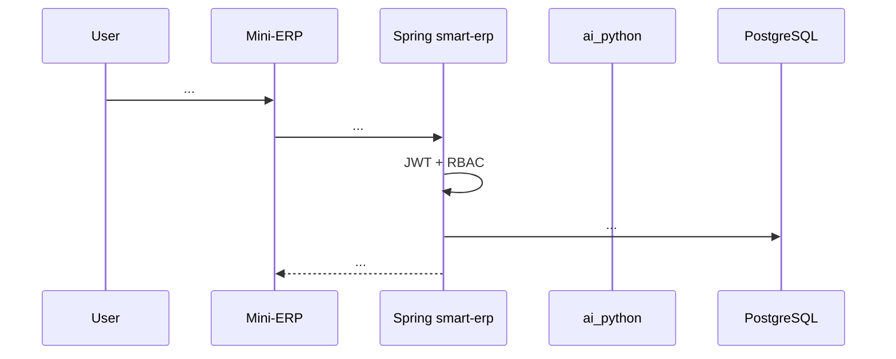

# SRS — <Feature Name> — TaskXXX

> **File:** `<path>`  
> **Scope:** Backend | Frontend | AI Agentic | Full-stack  
> **Author:** BA / Tech Lead / SQL / AI Agent  
> **Date:** <DD/MM/YYYY>  
> **Status:** Draft | Approved  
> **PO approval:** <name>, <date>

---

## 0. Input & Traceability

| Source | Path / note |
| :--- | :--- |
| Brief / ticket | `<link or summary>` |
| API spec | `docs/frontend/api/API_TaskXXX_*.md` |
| Existing SRS | `<path>` |
| UI index | `docs/frontend/mini-erp/features/FEATURES_UI_INDEX.md` |
| Backend code | `backend/smart-erp/src/main/java/...` |
| Flyway / DB | `backend/smart-erp/src/main/resources/db/migration/...` |
| AI flow | `ai_python/app/graph/...`, `ai_python/app/api/...` |
| Decision / ADR | `<path or link>` |

### 0.1 GAP / Source Conflicts

| ID | Conflict | Evidence A | Evidence B | SRS handling |
| :--- | :--- | :--- | :--- | :--- |
| GAP-1 | ... | ... | ... | OQ / selected source / ADR required |

---

## 1. Executive Summary

- **Problem:** ...
- **Business goal:** ...
- **Primary users:** Owner | Admin | Staff | AI Assistant | System
- **Expected outcome:** ...
- **Explicitly not included:** ...

---

## 2. Scope

### 2.1 In Scope

- ...

### 2.2 Out of Scope

- ...

### 2.3 Affected Modules

| Layer | Affected? | Notes |
| :--- | :---: | :--- |
| Frontend Mini-ERP | Yes / No | Route, page, API hook, UI state |
| Backend Spring | Yes / No | Controller, service, repository, security |
| Database | Yes / No | Flyway, table, index, constraint |
| AI Python | Yes / No | Runtime component, tool integration, FastAPI route |
| External service | Yes / No | LLM, STT/TTS, email, storage |

---

## 3. Capability Breakdown

| ID | Capability | Actor | Trigger | Expected outcome |
| :--- | :--- | :--- | :--- | :--- |
| C1 | ... | ... | ... | ... |

---

## 4. Persona, Role & RBAC

| Actor / role | JWT / permission condition | Allowed actions | Denied when | HTTP / UI behavior |
| :--- | :--- | :--- | :--- | :--- |
| Owner | `role=Owner`, `mp.can_*` | ... | ... | ... |
| Admin | `role=Admin` | ... | ... | ... |
| Staff | `role=Staff` | ... | ... | ... |

### 4.1 Auth / Session Rules

- Token type: Bearer JWT.
- Required claims: `sub`, `role`, `mp`, ...
- `401`: ...
- `403`: ...
- Session / concurrent-login behavior: ...

---

## 5. Business Flow

### 5.1 Narrative

1. User ...
2. Frontend ...
3. Backend ...
4. Database ...
5. AI service if applicable ...
6. Response ...

### 5.2 Sequence Diagram



---

## 6. Frontend Specification

> Mark `Not applicable` when there is no UI impact.

### 6.1 Route / Page / Component

| Menu label | Route | Page | Main component | File |
| :--- | :--- | :--- | :--- | :--- |
| ... | `/...` | `...Page` | `...Table`, `...Dialog` | `frontend/mini-erp/src/features/...` |

### 6.2 Required UI States

| State | Requirement |
| :--- | :--- |
| Loading | Skeleton / spinner |
| Empty | Empty state and CTA when appropriate |
| Error 400 | Field-level validation |
| Error 401 | Redirect or ask user to sign in again |
| Error 403 | Permission toast |
| Error 409 | Business conflict message |
| Success | Toast and cache/UI refresh |

### 6.3 API Integration

| UI action | API | Cache/query key | Mutation behavior |
| :--- | :--- | :--- | :--- |
| ... | `GET /api/v1/...` | ... | ... |

---

## 7. Backend API Contract

### 7.1 Endpoint Overview

| Method | Path | Auth | Permission | Purpose |
| :--- | :--- | :--- | :--- | :--- |
| GET | `/api/v1/...` | Bearer | `can_*` | ... |

### 7.2 Request Fields

| Field | Location | Type | Required | Validation | Notes |
| :--- | :--- | :--- | :---: | :--- | :--- |
| ... | body/query/path/header | ... | Yes / No | ... | ... |

### 7.3 Request JSON Example

```json
{
  "example": true
}
```

### 7.4 Success Response Example

```json
{
  "success": true,
  "data": {},
  "message": "Thành công"
}
```

### 7.5 Error Response Examples

**400 — Validation**

```json
{
  "success": false,
  "error": "BAD_REQUEST",
  "message": "Dữ liệu không hợp lệ. Vui lòng kiểm tra lại các trường được đánh dấu.",
  "details": {}
}
```

**401 — Unauthorized**

```json
{
  "success": false,
  "error": "UNAUTHORIZED",
  "message": "Phiên đăng nhập đã hết hạn. Vui lòng đăng nhập lại."
}
```

**403 — Forbidden**

```json
{
  "success": false,
  "error": "FORBIDDEN",
  "message": "Bạn không có quyền thực hiện thao tác này."
}
```

**409 — Conflict**

```json
{
  "success": false,
  "error": "CONFLICT",
  "message": "<Business conflict message>",
  "details": {
    "reason": "..."
  }
}
```

---

## 8. Business Rules

| ID | Condition | Result |
| :--- | :--- | :--- |
| BR-1 | ... | ... |

### 8.1 Concurrency / Transaction

- Transaction boundary: ...
- Rollback rule: ...
- Idempotency rule: ...
- Race condition prevention: ...

---

## 9. Data & SQL

### 9.1 Related Tables

| Table | Read | Write | Notes |
| :--- | :---: | :---: | :--- |
| `...` | Yes | No | ... |

### 9.2 Migration / Constraint / Index

| Item | Requirement |
| :--- | :--- |
| Flyway | `Vxx__...sql` |
| Constraint | ... |
| Index | ... |
| Backfill | ... |

### 9.3 Reference SQL

```sql
-- Use placeholders; never concatenate untrusted input.
SELECT ...
FROM ...
WHERE ...;
```

---

## 10. AI Agentic Flow

> Required when `ai_python`, AI chat, draft generation, SQL agent, chart, STT, or TTS is affected.

### 10.1 Intent & Routing

| Intent | Entry point | Runtime component | Output |
| :--- | :--- | :--- | :--- |
| `system_data_query` | `/ai/chat/stream` | `sql_branch` | Query result / final answer |

### 10.2 Orchestrator / Executor / Tools

| Layer | Component | Responsibility |
| :--- | :--- | :--- |
| Runtime flow | Current approved runtime | State, routing, retry, iterative logic |
| Validation/policy | Current approved boundary | Deterministic execution, validation, audit boundary |
| Tool | SQL executor / Spring client / draft client | Scoped integration with backend or services |

### 10.3 State Contract

| State key | Type | Source | Used by |
| :--- | :--- | :--- | :--- |
| `spring_bearer_token` | string/null | Spring relay | Spring DB/draft calls |
| `tenant_id` | string/null | JWT metadata | SQL/audit |
| `correlation_id` | string | request | logging |

### 10.4 AI Safety & Validation

| Risk | Guardrail |
| :--- | :--- |
| Unsafe SQL | SELECT-only, allowlist, row limit |
| Unauthorized data access | JWT relay + Spring RBAC + tenant scope |
| LLM hallucination | Schema artifact, deterministic validation, retry cap |
| Tool misuse | Validation/policy + audit log |
| Wrong draft commit | Human review before commit |

### 10.5 AI Error Handling

| Error | User message | Internal log |
| :--- | :--- | :--- |
| Auth failed | Phiên đăng nhập hết hạn hoặc bạn không có quyền. | status + correlation id |
| SQL rejected | Không thể truy vấn dữ liệu phù hợp với yêu cầu hiện tại. | policy category |
| LLM unavailable | Trợ lý AI tạm thời chưa sẵn sàng. Vui lòng thử lại sau. | provider error masked |

---

## 11. Non-Functional Requirements

| Group | Requirement | Verify by |
| :--- | :--- | :--- |
| Security | JWT/RBAC enforced server-side | 401/403 tests |
| Performance | Pagination/limits for large data | Load or integration test |
| Reliability | Transaction rollback on failure | Service/integration test |
| Observability | Correlation id in logs | Log inspection |
| UX | Error messages match business state | FE/manual QA |
| Maintainability | Clear controller/service/repository boundaries | Code review |

---

## 12. Testing Strategy

### 12.1 Backend Tests

| Test | Goal |
| :--- | :--- |
| Controller/WebMvc | HTTP status and envelope |
| Service | Business rules |
| Repository | SQL and mapping |
| Security | 401/403/permission |

### 12.2 Frontend Tests / Manual QA

| Case | Expected |
| :--- | :--- |
| Loading | Layout remains stable |
| 403 | Correct toast |
| 409 | Correct business message |
| Success | Cache/UI updated |

### 12.3 AI Tests

| Test | Goal |
| :--- | :--- |
| Graph route | Intent reaches correct node |
| Validation/policy | Tool blocked by policy when needed |
| SQL executor | Bearer forwarded, read-only enforced |
| Retry | Retry cap respected |
| SSE | Stream emits expected events |

---

## 13. Acceptance Criteria

```gherkin
Given ...
When ...
Then ...
```

```gherkin
Given user lacks permission
When the endpoint is called
Then the system returns 403
And the UI displays the agreed permission message
```

```gherkin
Given the AI flow needs a Spring tool call
When the request has a valid Bearer token
Then ai_python forwards that token to the Spring endpoint
And Spring performs JWT/RBAC checks before execution
```

---

## 14. Open Questions

| ID | Question | Impact | Blocker? | Decision |
| :--- | :--- | :--- | :---: | :--- |
| OQ-1 | ... | ... | Yes / No | ... |

---

## 15. Risks & Mitigation

| Risk | Impact | Mitigation |
| :--- | :--- | :--- |
| ... | ... | ... |

---

## 16. Implementation Handoff

### 16.1 Files Expected To Read

- `backend/smart-erp/src/main/java/...`
- `frontend/mini-erp/src/features/...`
- `ai_python/app/graph/...`

### 16.2 Files Expected To Edit

- ...

### 16.3 Rollout Notes

- Migration required: Yes / No
- New env var: Yes / No
- Backward compatibility: ...
- Feature flag: ...

---

## 17. PO Sign-off

- [ ] Blocker OQs answered.
- [ ] API contract approved.
- [ ] UI behavior approved.
- [ ] RBAC/auth approved.
- [ ] Data/SQL impact approved.
- [ ] AI guardrails approved when applicable.

**Signature / PR label:** ...
