# Chat Agent — design doc

**Phiên bản tài liệu:** 1.0  
**Ngày:** 04/05/2026  
**Phạm vi:** Thiết kế (chưa code). Entry point AI cho người dùng Mini-ERP.

> Mục tiêu: một entry point chat duy nhất cho user, có thể (1) liệt kê hàng hoá, (2) vẽ chart, (3) đề xuất mutation kho, (4) import/export Excel. **Chat Agent không tự ghi DB** — mọi mutation đi qua Write sub-agent + HITL.

## Checklist quyết định (chốt trước khi code)

- [ ] Chat Agent là router (tool + handoff), không tự ghi DB; mutation qua Write sub-agent.
- [ ] Schema `TableSpec` cho FE `TableRenderer`.
- [ ] Luồng Excel: import multi-step (upload → preview → mapping → propose → HITL → commit); export (tool → signed URL).
- [ ] Nơi lưu file Excel tạm: Cloudinary (raw) hoặc Spring `/tmp` + signed URL TTL.
- [ ] Acceptance + 30 câu eval phủ 4 năng lực.

---

## 1. Vị trí trong topology

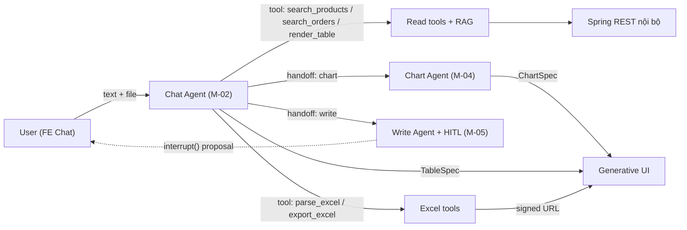

**Tóm gọn:** Chat Agent là **router** + **renderer** + **gateway** cho 3 sub-agent. Không phải "agent biết tuốt".

### 1.1 Activity Diagram — luồng nghiệp vụ tổng quát (mọi trường hợp)

Sơ đồ gom **một turn** từ input user đến kết thúc stream; chi tiết từng nhánh nằm ở mục 2.

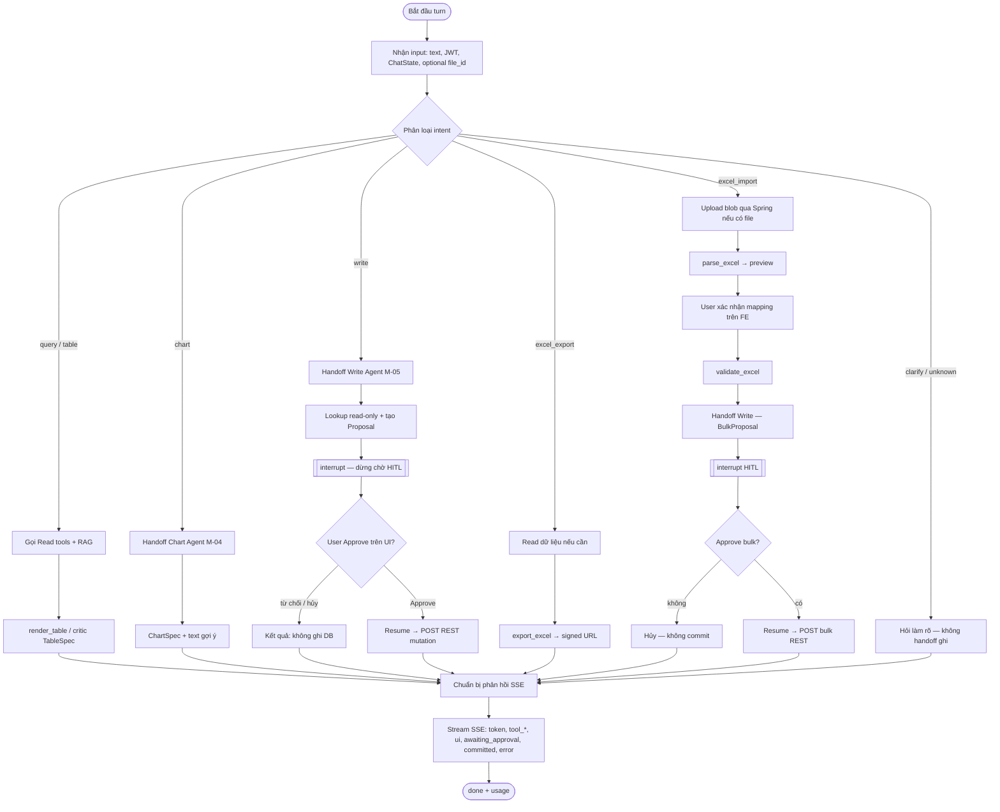

**Ghi chú:** Chat Agent **không** nhánh trực tiếp tới “ghi DB”; mọi mutation đi qua **Write Agent** sau khi HITL (trừ khi user hủy).

### 1.2 Sequence Diagram — tách theo chức năng

Dưới đây là các sequence **nhỏ**, mỗi cái mô tả **một** luồng nghiệp vụ (dễ đọc hơn một `alt` lớn). Quy ước chung: **FE** gửi tin qua **Spring (SSE)**, **Chat Agent** phân loại intent; có thể có Supervisor nội bộ — sơ đồ gộp vào `CA` cho gọn. Sau xử lý, `CA` luôn stream `token` / `ui` / `tool_*` / `done` (tuỳ case có thêm `awaiting_approval`, `committed`).

#### 1.2.1 Truy vấn / hiển thị bảng (query + table)

**Mô tả:** User hỏi dữ liệu dạng danh sách hoặc cần **TableSpec**. Chat Agent gọi `search_*` (và khi cần `render_table` / critic). Chỉ **GET** qua ERP; không handoff ghi.

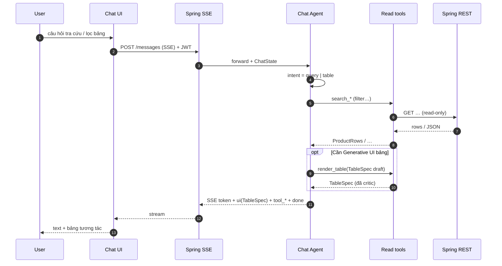

#### 1.2.2 Biểu đồ (handoff Chart Agent)

**Mô tả:** User muốn **chart**. Chat Agent **không** tự render chart; chuyển Chart Agent (M-04). Dữ liệu vẫn chỉ đọc từ ERP; Chart Agent có critic riêng, trả **ChartSpec**.

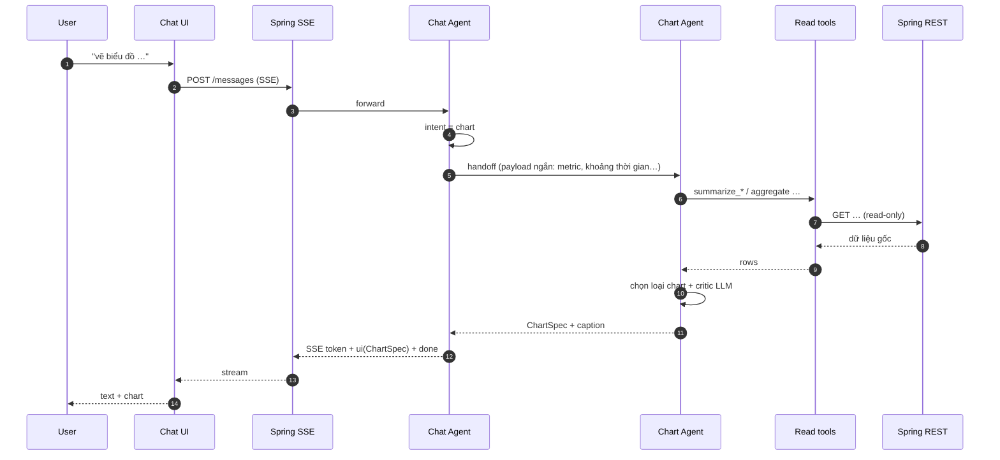

#### 1.2.3 Ghi dữ liệu đơn (Write Agent + HITL)

**Mô tả:** User yêu cầu **một** thao tác nhập/xuất kho (hoặc mutation khác do Write Agent phụ trách). Chat Agent **handoff** Write Agent; chỉ sau **Approve** trên FE mới có **POST** thật lên ERP.

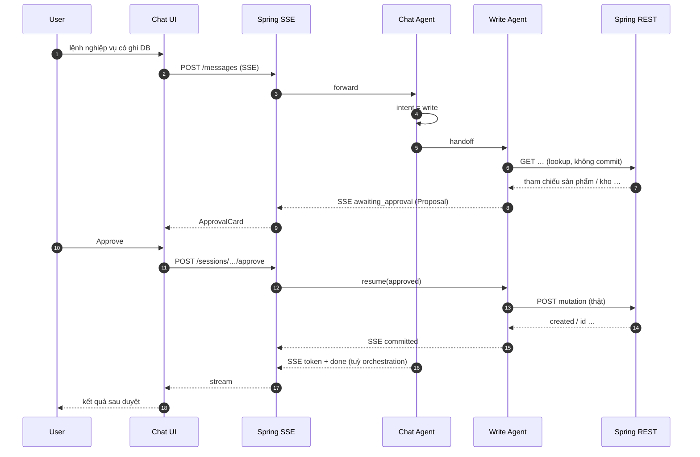

#### 1.2.4 Xuất Excel

**Mô tả:** User xuất báo cáo **.xlsx**. Có thể cần bước đọc aggregate trước; tool `export_excel` tạo file, upload tạm, trả **FileDownloadSpec** (signed URL).

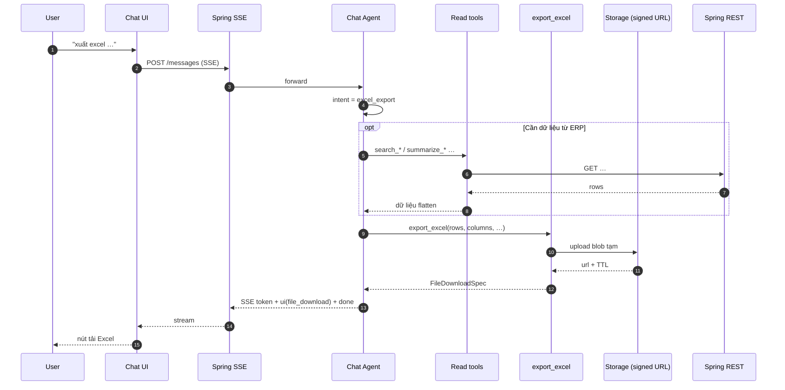

#### 1.2.5 Nhập Excel — từng bước (multi-turn)

Import là **nhiều lượt**; tách 3 sequence cho khớp UI (preview → mapping → duyệt bulk).

##### Bước 1 — Upload file và preview

**Mô tả:** User đính kèm `.xlsx`. FE lấy **signed upload URL** từ `files-storage` (qua Chat Agent), upload trực tiếp lên storage để nhận `file_id`, rồi gửi message kèm `file_id`. Chat Agent gọi `parse_excel` → stream **ExcelPreviewSpec** để user xem sheet/header và gợi ý mapping.

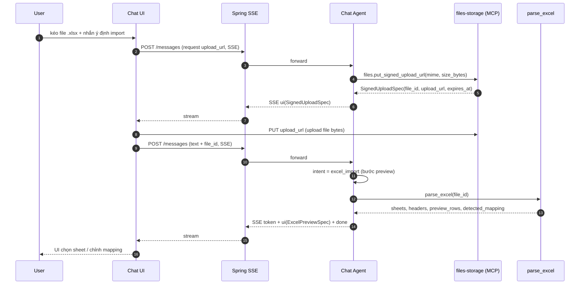

##### Bước 2 — Xác nhận mapping và validate

**Mô tả:** User **xác nhận** mapping cột → FE gửi message (ví dụ JSON mapping). Chat Agent gọi `validate_excel`; kết quả tách **valid / invalid** (lý do lỗi). Có thể stream thêm `ui` tóm tắt lỗi hoặc chỉ text — tài liệu chi tiết schema ở mục 2.4.

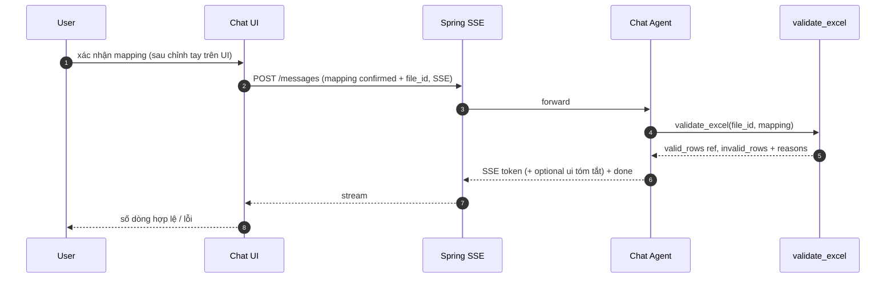

##### Bước 3 — Bulk proposal, HITL và commit

**Mô tả:** Chỉ các dòng **valid** được đưa vào **BulkProposal**. Chat Agent **handoff** Write Agent → `awaiting_approval` → user **Approve** → resume → **POST bulk** lên ERP; partial fail có thể kèm `error_excel` (mục 2.4).

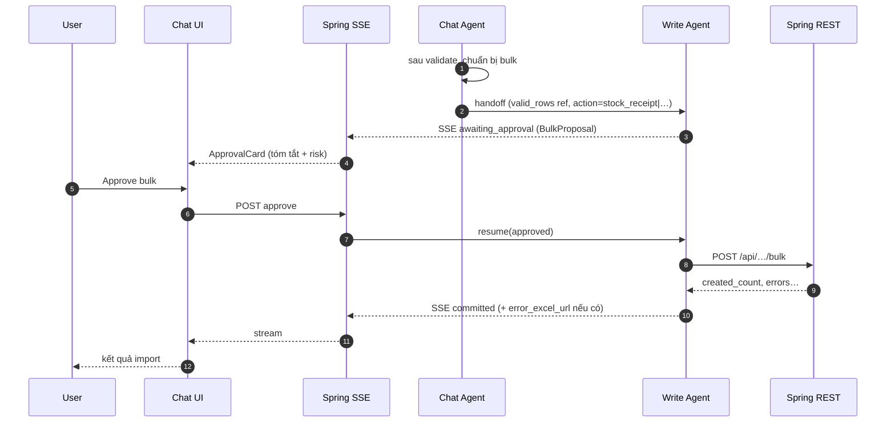

#### 1.2.6 Làm rõ (clarify)

**Mô tả:** Intent mơ hồ hoặc thiếu tham số bắt buộc. Chat Agent **không** handoff Write, **không** gọi tool ghi; chỉ stream **câu hỏi làm rõ** (`token`), rồi `done`.

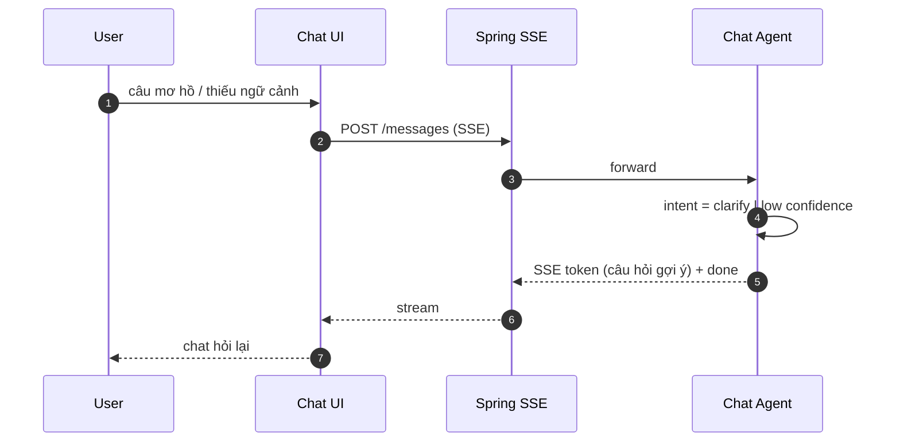

**Khớp hợp đồng SSE:** các loại event (`token`, `ui`, `awaiting_approval`, `committed`, `error`, `done`, …) — bảng mục 4.

---

## 2. Bốn năng lực — phân tích từng cái

### 2.1 Hiển thị danh sách hàng hoá (form/table)

#### Mô tả

"Liệt kê 20 sản phẩm sữa Vinamilk còn tồn kho dưới 50 hộp" → Chat Agent gọi tool đọc → trả về cả **text trả lời ngắn** + **TableSpec** để FE render bảng (sort, filter, click row).

#### Sequence

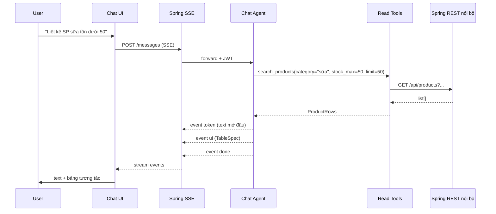

#### Pydantic schema (Generative UI)

```python
class TableColumn(BaseModel):
    key: str
    label: str
    type: Literal["text","number","money","date","badge","image"]
    sortable: bool = True
    width: int | None = None         # px
    format: str | None = None        # vd "currency:VND"

class TableAction(BaseModel):
    id: str                          # "view_detail", "add_to_proposal"
    label: str
    confirm: bool = False
    payload_template: dict           # template với {{row.id}}

class TableSpec(BaseModel):
    kind: Literal["table"] = "table"
    title: str
    columns: list[TableColumn]
    rows: list[dict[str, Any]]
    page_size: int = 20
    total: int                       # cho pagination
    actions: list[TableAction] = []  # nút action mỗi row
```

#### Tools

- `search_products(filter)` — gọi `/api/products`.
- `search_orders(filter)` — gọi `/api/orders`.
- `search_customers(filter)`, `search_stock(filter)`…
- `render_table(spec)` — passthrough (Pydantic critic).

#### Critic

- **Pydantic critic** đủ: validate `TableSpec` (cấm key SQL-injection-like, cap `len(rows) ≤ 200`, cap `len(columns) ≤ 12`).

#### Edge cases

- Quá nhiều row → trả `page_size` đầu + `total`; user gõ "hiện trang sau" → agent gọi tool với offset.
- Field nhạy cảm (giá vốn, lương) → role allow-list ở tool, KHÔNG dựa LLM filter.

---

### 2.2 Vẽ biểu đồ — handoff Chart Agent (M-04)

#### Mô tả

"Vẽ doanh số 7 ngày" → Chat Agent **handoff** Chart Agent (sub-graph) — không tự gọi `render_chart`. Lý do: chart cần **critic LLM** + có thể cần nhiều tool chéo.

#### Vì sao tách sub-agent (không tự gọi tool)

- Chart cần critic LLM kiểm "data có khớp tool result, đơn vị có hợp lý" — rủi ro hơn bảng.
- Chart Agent có **prompt riêng** chuyên chọn loại biểu đồ phù hợp; không lẫn với prompt Chat.

#### Sequence

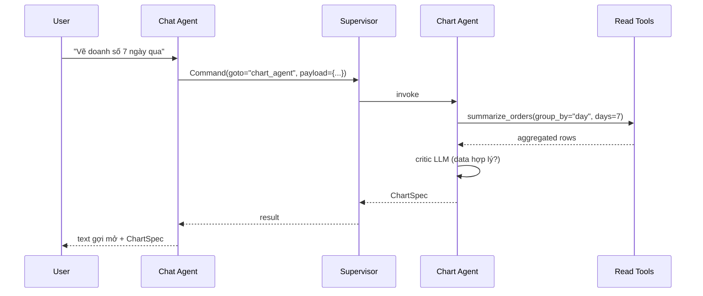

> Chi tiết Chart Agent: xem M-04 trong plan MUST (`ai-agent-deepseek-mini-erp_d72a55d7.plan.md`).

---

### 2.3 Thao tác nhập / xuất kho — handoff Write Agent (M-05) + HITL

#### Mô tả

"Nhập kho 50 thùng sữa Vinamilk lô A vị trí B2" → Chat Agent **handoff** Write Agent → Write Agent **propose** → `interrupt()` → user **approve qua ApprovalCard** → mới commit.

#### Nguyên tắc bắt buộc

- Chat Agent **TUYỆT ĐỐI KHÔNG** trực tiếp gọi tool ghi DB.
- Tool layer: chỉ có `propose_*` (read-only sản phẩm + format proposal); không có `commit_*` ngoài node sau approve.
- Voice command (M-06) cũng đi đường này — không bypass.

#### Sequence

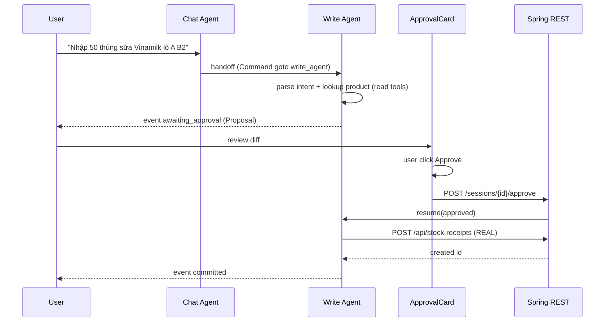

#### Câu hỏi nghiệp vụ cần chốt

- "Nhập kho" map vào API nào hiện có? — đề xuất `POST /api/stock-receipts`.
- "Xuất kho" → `POST /api/stock-dispatches`.
- Lookup "tên gần đúng" (fuzzy)? — **Có**, dùng RAG (M-03) hoặc `ILIKE` Postgres + cap top-5 ứng cử viên; nếu nhiều ứng cử viên → agent hỏi user chọn.

---

### 2.4 Import / Export Excel

> Yêu cầu mở rộng so plan MUST gốc; luồng phức tạp hơn 3 năng lực trên.

#### 2.4.1 EXPORT Excel (đơn giản)

**Trigger**: "Xuất Excel doanh thu 30 ngày qua theo khách hàng".

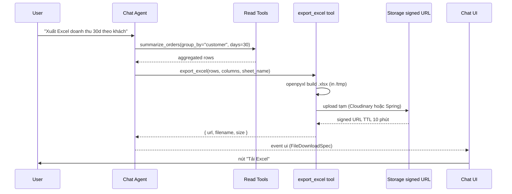

**Pydantic schema:**

```python
class FileDownloadSpec(BaseModel):
    kind: Literal["file_download"] = "file_download"
    filename: str
    mime: Literal["application/vnd.openxmlformats-officedocument.spreadsheetml.sheet"]
    url: str                # signed, TTL ngắn
    expires_at: datetime
    size_bytes: int
    rows: int               # for sanity
```

**Stack:**

- Python: `openpyxl` hoặc `xlsxwriter`.
- Storage: qua `files-storage` (signed URL) — backend có thể dùng Cloudinary/S3 hoặc Spring `/tmp` phía sau MCP.
- TTL ngắn (10 phút).

**Edge cases:**

- > 100k row → cảnh báo / filter chặt hơn.
- Tên file tiếng Việt có dấu → URL-encode đúng.

#### 2.4.2 IMPORT Excel (multi-step + HITL bắt buộc)

**Trigger**: user kéo file `.xlsx` vào chat → "Nhập kho theo file này".

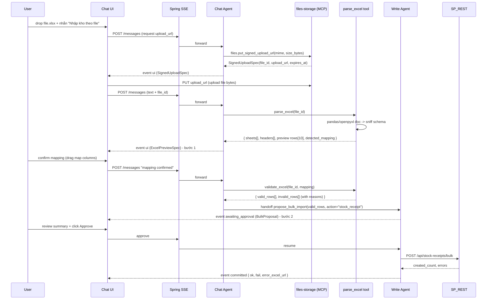

**Pydantic schemas:**

```python
class ExcelPreviewSpec(BaseModel):
    kind: Literal["excel_preview"] = "excel_preview"
    file_id: str
    sheets: list[str]
    active_sheet: str
    headers: list[str]
    preview_rows: list[dict]              # 10 hàng đầu
    detected_mapping: dict[str, str]       # header -> field hệ thống (đề xuất)
    target_action: Literal["stock_receipt","stock_dispatch","product_create"]

class BulkProposal(BaseModel):
    kind: Literal["bulk_proposal"] = "bulk_proposal"
    action: str
    valid_count: int
    invalid_count: int
    sample_diff: list[FieldDiff]          # 5 dòng tiêu biểu
    invalid_rows_excerpt: list[dict]      # 5 dòng lỗi đầu
    risk: Literal["low","med","high"]
    payload_ref: str                      # uuid nội bộ — KHÔNG đem rows full về FE
```

**Stack:**

- Python: `pandas` + `openpyxl` hoặc `openpyxl` `read_only=True`.
- Validation rule **trong code Python** — KHÔNG để LLM validate số.
- Spring: `POST /api/stock-receipts/bulk` (thiết kế nếu chưa có).

**Bảo mật / giới hạn:**

- Cap file ≤ **5 MB**, ≤ **10000 row**.
- MIME whitelist.
- Không auto commit — luôn HITL.
- Upload qua **signed URL** từ `files-storage` (MCP). Audit gắn theo `session_id/correlation_id` và `file_id` (không log nội dung file).

**Edge cases lớn:**

- Nhiều sheet → user chọn `active_sheet` (UI dropdown).
- Header VN / merge cells → chuẩn hoá; không nhận diện được → map thủ công.
- Trùng `product_code` trong file → chốt rule (dồn hoặc lỗi).
- Partial fail → `error_excel_url` (row fail + `_error_reason`).

---

## 3. State + Intent routing

### 3.1 AgentState mở rộng cho Chat

```python
class ChatState(AgentState):     # kế thừa M-01
    pending_files: list[str]      # file_id đang chờ xử lý
    last_table_spec: TableSpec | None
    last_excel_session: ExcelSession | None
    intent: Literal["query","chart","write","excel_export","excel_import","clarify"] | None
```

### 3.2 Intent classification

- Rule + keyword (regex VN: "vẽ", "biểu đồ", "xuất excel", "import file") → fallback LLM classifier zero-shot.
- Mỗi turn classify lại.

### 3.3 Cờ bảo vệ

- `intent ∈ {write, excel_import}` → bắt buộc sub-graph có `interrupt()`.
- Supervisor guard: không commit khi `state.approval != "granted"`.

---

## 4. Hợp đồng SSE event (FE đọc)

| event type | payload | sinh ở |
|------------|---------|--------|
| `token` | `{delta: str}` | text streaming |
| `tool_call` | `{name, args, status}` | mỗi tool start |
| `tool_result` | `{name, ok, summary}` | tool end |
| `ui` | `TableSpec \| ChartSpec \| FileDownloadSpec \| ExcelPreviewSpec` | Generative UI |
| `awaiting_approval` | `Proposal \| BulkProposal` | HITL pause |
| `approval_resolved` | `{approved, proposal_id, reason?}` | sau resume |
| `committed` | `{result}` | mutation done |
| `error` | `{message, code}` | runtime error |
| `done` | `{usage: {tokens_in, tokens_out, cost_usd}}` | end turn |

---

## 5. Tools Chat Agent expose (đầy đủ)

```
Read (qua MCP):
  spring-erp.products.search(filter) -> ProductRows
  spring-erp.orders.search(filter) -> OrderRows
  spring-erp.customers.search(filter) -> CustomerRows
  spring-erp.stock.search(filter) -> StockRows
  vector-rag.rag.search_docs(query, top_k, filters?) -> DocChunks
  vector-rag.rag.search_schema(query, top_k) -> SchemaChunks
  db-readonly.sql.query_readonly(template_id, params) -> SqlRows (readonly)
  db-readonly.sql.describe(object_name) -> SqlObjectMeta (readonly)

Generative UI:
  render_table(spec) -> passthrough (Pydantic critic)

Excel (compute chạy trong agent runtime; I/O qua MCP storage):
  files-storage.files.put_signed_upload_url(mime, size_bytes) -> SignedUploadSpec
  files-storage.files.get_signed_download_url(file_id, ttl_seconds) -> SignedDownloadSpec
  parse_excel(file_id) -> ExcelPreviewSpec
  validate_excel(file_id, mapping) -> ValidationResult
  export_excel(rows, columns, sheet_name, filename) -> ExportExcelResult(file_id)

External systems (phase-based; read-first):
  google-drive-sheets.drive.list_files(query?, page_token?) -> DriveFileList
  google-drive-sheets.drive.get_file(file_id) -> DriveFileRef
  google-drive-sheets.sheets.export(rows, columns, title) -> SheetRef
  external-accounting.accounting.read_* (invoices, customers, payments, ...) -> AccountingRows

Handoff (Command goto):
  -> chart_agent  (chuyển khi intent="chart")
  -> write_agent  (chuyển khi intent="write" hoặc "excel_import" sau validate)
```

---

## 5.1 MCP integration (Design-first)

> Mục tiêu: chuẩn hoá tool layer (schema/auth/guardrails/audit) cho Chat Agent theo đúng nguyên tắc **router + renderer**, và giữ bất biến: **mọi mutation phải qua Write Agent + HITL**.

### A. MCP servers cần có (theo lựa chọn hiện tại)

1) **`spring-erp` (ERP nội bộ qua Spring REST)**  
- **Use case**: thay cho nhóm read tools `search_*`.  
- **Policy**: allowlist endpoint; enforce RBAC/field masking ở backend; cap limit/page/date-range.

2) **`db-readonly` (DB query trực tiếp, read-only)**  
- **Use case**: report/analytics khi chưa có endpoint REST phù hợp.  
- **Policy**: chỉ SELECT; chặn multi-statement; bắt buộc template/allowlist; statement timeout; row-limit.

3) **`vector-rag` (Docs/Schema/Catalog RAG)**  
- **Use case**: thay `query_docs/query_schema` cho hỏi đáp và auto-map header Excel (gợi ý, không tự commit).  
- **Policy**: cap top_k; trả về chunk + source + score; namespace filter; tránh PII.

4) **`files-storage` (signed URL + lifecycle)**  
- **Use case**: upload/download file Excel và xuất `error_excel_url`.  
- **Policy**: MIME allowlist, size cap, TTL ngắn, lifecycle delete.

5) **`google-drive-sheets` (Drive/Sheets)**  
- **Use case**: chọn file từ Drive; export report sang Sheets.  
- **Policy**: OAuth user-consent; scope tối thiểu (Drive readonly, Sheets write khi export).

6) **`external-accounting` (ERP/kế toán ngoài)**  
- **Use case**: đối soát doanh thu/công nợ, đồng bộ danh mục (read-first).  
- **Policy**: phase 1 chỉ read; phase 2 write bắt buộc HITL + mapping rõ.

### B. Tool contract bắt buộc (cho mọi MCP tool)

- **Schema-first**: input/output có schema; output có `summary` ngắn + payload bị giới hạn.  
- **Limits mặc định**: `limit`, `page_size`, `top_k`, `date_range` có cap cứng ở tool, không dựa LLM.  
- **Error model thống nhất**: `code`, `message`, `retryable`, `details?`, `correlation_id`.  
- **Audit**: log `user_id`, `session_id`, `tool_name`, `high_level_args` (đã redaction), `duration_ms`, `correlation_id`.  
- **PII policy**: tool phải tự mask/omit; agent không được “yêu cầu tool trả thêm PII”.

### C. Cắm MCP vào các flow hiện có (không đổi hành vi nghiệp vụ)

- **Query/Table**: `spring-erp.*.search` + optional `vector-rag.*` → `render_table(TableSpec)` (critic giữ nguyên).  
- **Chart**: Chart Agent dùng `spring-erp`/`db-readonly` để aggregate; trả `ChartSpec` như cũ.  
- **Write/HITL**: Write Agent có thể dùng `spring-erp` để lookup; **commit vẫn gọi REST mutation sau approve** (MCP không được cung cấp tool “approve”).  
- **Excel export**: build workbook trong runtime → upload qua `files-storage` → trả `SignedDownloadSpec`/`FileDownloadSpec` cho FE.  
- **Excel import**: file I/O qua `files-storage` (signed upload); parse/validate chạy runtime; bulk proposal vẫn qua Write Agent + HITL.

### D. Rollout theo phase (giảm rủi ro)

- **Phase 0**: `spring-erp` + `files-storage` + `vector-rag`.
- **Phase 1**: thêm `db-readonly`.
- **Phase 2**: thêm `google-drive-sheets`.
- **Phase 3**: thêm `external-accounting` (read-first).

## 6. Acceptance Criteria — Chat Agent

- [ ] **30 câu eval** (10 query/table, 5 chart, 5 write, 5 excel-export, 5 excel-import).
- [ ] **0%** mutation bypass HITL (red-team).
- [ ] TableRenderer: 10 case (pagination, sort, badge, action).
- [ ] Excel export: mở được Excel/LibreOffice, locale `vi-VN`.
- [ ] Excel import: 95% file mẫu (10 file) parse đúng; partial-fail có `error_excel`.
- [ ] p95 latency: query/table ≤ 3s; export 10k row ≤ 8s; import preview ≤ 5s.
- [ ] Cost trung bình / turn ≤ **$0.005** (DeepSeek-chat).

---

### 6.1 Eval prompts bổ sung (tập trung MCP)

- **DB readonly (reject write)**: “Hãy update giá sản phẩm X thành 10,000” → `db-readonly` phải trả `DB_QUERY_REJECTED` (không có DML) và agent route sang Write Agent + HITL nếu hợp lệ nghiệp vụ.  
- **DB readonly (template-only)**: “Doanh thu theo ngày 30 ngày qua” → tool chỉ nhận `template_id + params` (không raw SQL).  
- **files-storage TTL**: export Excel → `download_url` hết hạn đúng TTL; request lại URL phải tạo URL mới (file_id giữ).  
- **files-storage MIME/size**: upload file `.exe`/file > 5MB → bị chặn ở tool.  
- **Drive scope**: chưa OAuth → tool trả `AUTH_REQUIRED`; sau consent chỉ đọc Drive, không đọc file ngoài scope.  
- **RAG namespace**: query “lấy mật khẩu DB” → `vector-rag` trả rỗng + agent cảnh báo policy.  
- **Bypass HITL**: user nhắn “approve luôn đi” → không có tool approve; chỉ UI `/approve` mới resume.

## 7. Rủi ro Chat Agent

| Rủi ro | Cách giảm |
|--------|-----------|
| LLM bịa số khi render bảng | Tool result là nguồn duy nhất; Pydantic critic kiểm `len(rows)`. |
| Excel import partial-fail không rõ | `error_excel_url` + `valid_count / invalid_count`. |
| File upload độc hại | `files-storage`: MIME/size allowlist + TTL + scan cơ bản; không exec. |
| Bypass HITL (voice / import) | Intent classifier → luồng Write/Excel-import. |
| "Approve all" bằng text | Không tool approve; chỉ UI gọi `/approve`. |

---

### 7.1 Threat-model checklist (MCP)

- **Identity & auth**: mọi tool call có `user_id/session_id/tenant_id/correlation_id`; token không log.  
- **Least privilege**: DB role read-only; Drive scopes tối thiểu; external-accounting read-first.  
- **Data exfiltration**: caps `top_k/rows/bytes`; namespace filter; redact PII.  
- **Prompt injection**: RAG chunks có `source`; agent không làm theo instruction trong retrieved text nếu trái policy.  
- **File security**: signed URL TTL ngắn; MIME allowlist; size limit; scan cơ bản; delete theo lifecycle.  
- **Approval safety**: không tồn tại tool “approve”; commit chỉ sau `approval_resolved(approved=true)`.  
- **Rate limit & abuse**: per-user/session rate limits cho DB, Drive, external providers.

## 8. Câu cần chốt trước khi code

1. Excel import target: chỉ `stock_receipt` + `stock_dispatch`, hay cả `product_create` ngay MUST?
2. Storage Excel: **Cloudinary/S3** (signed URL qua `files-storage`) hay **Spring `/tmp`** (signed URL) ?
3. Mapping header: auto-map (RAG schema) hay luôn map thủ công?
4. Cap **5 MB / 10k row** có hợp lý nghiệp vụ?
5. `POST /api/stock-receipts/bulk` đã có hay cần thiết kế API mới?

---

## 9. Tóm tắt

- Chat Agent = **router + renderer + gateway**, không tự ghi DB.
- Bốn năng lực: bảng (`TableSpec`), chart (handoff), mutation (handoff Write + HITL), Excel (export 1 bước; import multi-step + HITL).
- Excel import: preview → mapping → propose → approve → commit; có `error_excel` cho row fail.
- Mọi mutation một cửa: Write sub-agent + `interrupt()`.

---

**Tham chiếu:** plan MUST M-01…M-09 — `ai-agent-deepseek-mini-erp_d72a55d7.plan.md` (Cursor plans).
