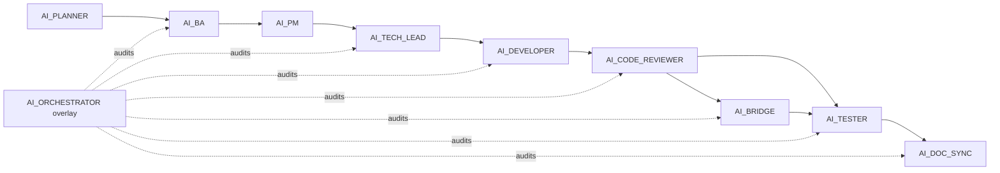

# WORKFLOW_RULE — Agent chain (Python LangGraph / `ai_python`)

> **Version**: 1.0  
> **Source of truth**: file này + [`AGENT_REGISTRY.md`](AGENT_REGISTRY.md).  
> **Design source**: [`../../Design_Agent/CHAT_AGENT_DESIGN.md`](../../Design_Agent/CHAT_AGENT_DESIGN.md) — không lặp lại nội dung.  
> **Scope**: chỉ thư mục [`ai_python/`](../). Không sửa `backend/` hoặc `frontend/`.

---

## 0. Execution model — `/orchestrate` (auto) vs manual

| Mode | Khi dùng | HITL |
| :--- | :--- | :--- |
| **Auto** (mặc định) | Owner gõ `/orchestrate Task=<id?> Brief="..."` (xem [`../../.cursor/commands/orchestrate.md`](../../.cursor/commands/orchestrate.md)) | **Duy nhất** ở bước AI_PLANNER chọn option A/B/C |
| **Manual** | Khi cần debug từng role hoặc rerun một mắt xích | Mỗi handoff Owner kiểm + paste prompt kế tiếp (chuỗi giống §1) |

**Cốt lõi của Auto-mode**:

- Driver = subagent `generalPurpose` đọc file này + role instruction → launch các subagent qua `Task` tool.
- Sau planner, mọi role chạy không-hỏi-user. Ambiguity không CRITICAL → role tự chọn default + log assumption (xem §3 STOP rules).
- Auto-loop khi CR/Tester/Bridge báo `Block` → quay lại AI_DEVELOPER tối đa **3 vòng/role/task**.
- Budget cap: **20 subagent invocation** mặc định. Vượt → escalate Owner.

---

## 1. Chuỗi role (mandatory)

```text
AI_PLANNER → AI_BA → AI_PM → AI_TECH_LEAD → AI_DEVELOPER → AI_CODE_REVIEWER
            → (AI_BRIDGE if SSE thay đổi) → AI_TESTER → AI_DOC_SYNC
```

Lớp giám sát overlay (không nối tiếp): **AI_ORCHESTRATOR** chạy spot-check sau mỗi gate + final audit cuối sprint.  
Ad-hoc: **AI_BUG_INVESTIGATOR** khi có RCA cần (parallel session).



---

## 2. Gates

| Gate | After | Exit condition (machine-checkable) |
| :--- | :--- | :--- |
| `G-AI-PLAN` | AI_PLANNER | PRD ở `ai_python/docs/prd/PRD_<slug>.md` + Owner xác nhận option A/B/C |
| `G-AI-BA` | AI_BA | `ai_python/docs/srs/SRS_AI_TaskXXX_*.md` Approved (SSE events + MCP I/O + eval criteria + HITL flow + ≥1 sample JSON request/response per event) |
| `G-AI-PM` | AI_PM | `ai_python/TASKS/Task<XXX>.md` chain (Unit + Feature + Eval) merged vào `develop`; branch `feature/ai-task<XXX>` từ latest `develop` |
| `G-AI-TL` | AI_TECH_LEAD | `ai_python/docs/adr/ADR-<NNN>-<slug>.md` có 5 NFR mục: p95 latency / cost cap / HITL bypass=0% / file caps / model-provider lock |
| `G-AI-DEV` | AI_DEVELOPER | `pytest -q` xanh trên branch; coverage ≥ 70%; `ruff check` + `mypy` clean theo cấu hình ADR; commit theo Conventional Commits trên feature branch |
| `G-AI-CR` | AI_CODE_REVIEWER | `ai_python/docs/taskXXX/05-code-review/CODE_REVIEW_TaskXXX.md` có 0 `Block` + 0 `Major` chưa giải quyết (hoặc có ADR exception) |
| `G-AI-BRIDGE` | AI_BRIDGE | Bắt buộc khi task tạo/đổi event SSE hoặc MCP tool schema; `ai_python/docs/api/bridge/BRIDGE_AI_TaskXXX_*.md` đầy đủ cột (xem `AI_BRIDGE_AGENT_INSTRUCTIONS.md` §5) |
| `G-AI-TST` | AI_TESTER | Eval pass ≥ 80% (≥30 prompt cover 4 năng lực Design Doc §6); 0% HITL bypass; MCP guardrail red-team pass; latency/cost trong NFR ADR |
| `G-AI-DS` | AI_DOC_SYNC | `ai_python/docs/sync_reports/SYNC_REPORT_<sprint>.md` không drift `Block` |
| `G-AI-OR` (overlay) | AI_ORCHESTRATOR | `ai_python/docs/orchestration/AUDIT_TaskXXX_*.md` không có severity `Block`; `Warn` đã có quyết định Owner |

---

## 3. Severity rubric (chung cho AI_CODE_REVIEWER + AI_ORCHESTRATOR + AI_BRIDGE + AI_TESTER)

| Severity | Ý nghĩa | Hành vi runner |
| :---: | :--- | :--- |
| `Block` | Vi phạm bất biến (Design Doc §1, §2.3, §6.1) hoặc gate exit fail | Auto-loop về role gốc (DEV) tối đa 3 vòng; vượt → escalate |
| `Major` | Phải xử trước merge (perf hot path, error model thiếu, contract drift) | Gộp vào loop hiện tại |
| `Minor` | Follow-up ticket, không chặn (tên biến, comment, micro-perf) | Log + tạo `Task<XXX>-followup.md` |
| `Info` | Ghi chú quan sát | Log only |

### 3.1 STOP rules — escalate ngay (KHÔNG auto-loop)

| Role | STOP nếu | Vì sao |
| :--- | :--- | :--- |
| Mọi role | Owner gõ `/stop` hoặc subagent timeout >5min | An toàn |
| AI_BA | Open Question gắn tag `[CRITICAL]` không có default trong Design Doc / ADR | Quyết định nghiệp vụ thật, không default được |
| AI_TECH_LEAD | Model/provider chưa cấu hình API key hoặc MCP server chưa cài | Không thể implement |
| AI_DEVELOPER | Dependency conflict không tự fix; test infrastructure (pytest) hỏng | Không thể tiếp |
| AI_CODE_REVIEWER | Phát hiện hardcoded secret / API key / `.env` commit | Security incident |
| AI_TESTER | Red-team chứng minh HITL bypass thật (mutation không qua `interrupt()`) | Vi phạm bất biến tuyệt đối Design §1 |
| AI_BRIDGE | Path BE thực tế lệch với spec mà BE đã merge | Data integrity |
| AI_DOC_SYNC | Code đụng chạm `backend/` hoặc `frontend/` (sai scope) | Vượt boundary repo |
| AI_ORCHESTRATOR | Phát hiện gate báo green nhưng artifact thiếu/giả | Fake gate |

---

## 4. Bất biến không được vi phạm

1. **Mutation luôn qua Write Agent + `interrupt()`** — Chat Agent / runner không tự gọi tool ghi DB. Design Doc §1, §2.3.
2. **No commit to `main` / `develop`** — chỉ branch `feature/ai-task<XXX>` từ latest `develop` (do AI_PM tạo).
3. **No HITL ngoài AI_PLANNER** trong auto-mode. Nếu role muốn hỏi user → áp default + log assumption hoặc match STOP rule.
4. **No cross-scope edit** — file Python chỉ trong `ai_python/app/`, doc chỉ trong `ai_python/docs/`. Đụng `backend/` / `frontend/` → STOP.
5. **No secret in code** — API key qua biến môi trường (xem `ai_python/README.md`).
6. **No raw SQL** — DB read-only chỉ qua MCP `db-readonly` template (Design §5.1, §6.1).
7. **No "approve all by text"** — không tool `approve` trong agent runtime; resume chỉ qua endpoint UI `/sessions/.../approve`.

---

## 5. Quick-call snippets (manual mode)

```text
WORKFLOW_RULE: read @ai_python/AGENTS/WORKFLOW_RULE.md @ai_python/AGENTS/AGENT_REGISTRY.md
```

```text
Role: AI_BA. Read @ai_python/AGENTS/AI_BA_AGENT_INSTRUCTIONS.md
Inputs: PRD=@ai_python/docs/prd/PRD_<slug>.md
Output: @ai_python/docs/srs/SRS_AI_Task<XXX>_<slug>.md
```

_(Thay `AI_BA` bằng role khác. Mỗi file role có **§I/O Contract** liệt kê đúng biến cần thay.)_

```text
Role: AI_ORCHESTRATOR (overlay). Read @ai_python/AGENTS/AI_ORCHESTRATOR_AGENT_INSTRUCTIONS.md
Mode: spot-check Gate=<G-AI-DEV|...>
Output: @ai_python/docs/orchestration/AUDIT_Task<XXX>_<gate>.md
```

---

## 6. Quan hệ với backend / frontend

- Hợp đồng API SSE: `ai_python` ↔ `backend/smart-erp` (relay) ↔ `frontend/mini-erp/src` chat UI.  
  AI_BRIDGE chịu trách nhiệm verify cả 2 hop (xem `AI_BRIDGE_AGENT_INSTRUCTIONS.md`).
- DB: do `backend/` sở hữu. AI_DEVELOPER **không** viết Flyway/JPA/SQL. Khi cần read-only data → MCP `db-readonly` (template_id + params, không raw SQL).
- Frontend bridge: kết quả AI_BRIDGE có thể link tới `frontend/docs/api/bridge/BRIDGE_*.md` đã có nếu trùng path; không tạo trùng.

---

## 7. Context7 (MCP — library docs)

- Dùng khi cần xác nhận API/config của framework Python (FastAPI, LangGraph, OpenAI SDK, pydantic v2, openpyxl, …) cho version đã pin trong [`../requirements.txt`](../requirements.txt).
- **Sau** khi đã đọc minimal repo code + SRS/ADR. Không thay business truth.
- Prompt mẫu: `use context7` + 1 câu hỏi hẹp + version (vd "FastAPI 0.115 StreamingResponse with async generator").
