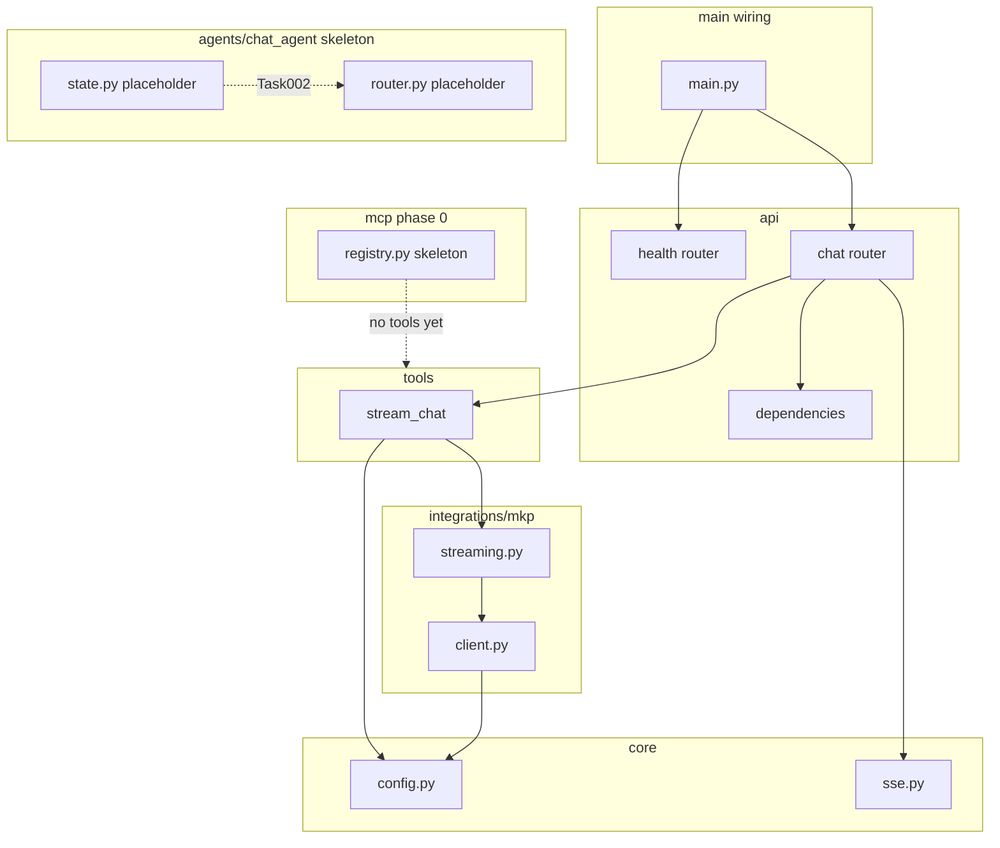

# ADR-001 — App Layer Refactor (Option B)

- Status: Accepted
- Date: 2026-05-08
- Task: Task001
- SRS: ../srs/SRS_AI_Task001_app-layer-refactor.md
- PRD: ../prd/PRD_app-layer-refactor.md

## Context

`ai_python` hiện gom routing, định dạng SSE và gọi MKP trong một `main.py`; MKP đọc `FPT_MKP_*` và stream qua OpenAI-compatible client trong `app/mkp_client.py` (blocking iterator). Slice Task001 chỉ refactor cây package theo PRD Option B, giữ đúng hành vi endpoint/SSE và event `delta` / `done` / `error` như SRS. **LangGraph topology N/A** — chưa có runtime graph; topology sẽ được thiết kế ở task feature đầu tiên (Chat Agent skeleton, dự kiến Task002+).

## Decision

### Topology (mermaid)

Layer architecture Option B (không phải LangGraph runtime). Luồng request: Router → Tools (thin) → Integrations MKP; Core phục vụ SSE + config.

### State schema (pydantic) — placeholder

`skeleton/import-safe`; **không định nghĩa `ChatState` đầy đủ trong Task001**. File `app/agents/chat_agent/state.py` chỉ giữ module tối thiểu (ví dụ docstring + `pass` hoặc empty `BaseModel` stub) để import graph ổn định. Mở rộng field-level (messages, intent, tool results) theo Design Doc §3 trong **Task002+**.

### Model & provider

- **LLM:** FPT MKP (OpenAI-compatible Chat Completions, stream).
- **Env:** `FPT_MKP_API_KEY` (required), `FPT_MKP_BASE_URL` (default `https://mkp-api.fptcloud.com`), `FPT_MKP_MODEL` (default `gemma-4-31B-it`).
- **Implementation path:** Logic hiện tại từ `mkp_client.py` chuyển vào `app/integrations/mkp/` (`client.py` + `streaming.py`); không đổi nghiệp vụ temperature/max_tokens trừ khi SRS/task sau chỉ định.
- **Fallback:** N/A — single provider; multi-provider defer sau MVP.

### MCP servers

- **Phase 0:** skeleton only — `app/mcp/registry.py` placeholder, **không** đăng ký tool hay cài MCP server thật trong Task001.

### NFR (5 mục, định lượng)

1. **NFR-1:** p95 TTFB `/v1/chat/stream` ≤ **1.0 s** vs baseline cùng môi trường; ghi phương pháp đo (warm run, cold MKP).
2. **NFR-2:** Zero regression SSE: cùng `q`, thứ tự và loại event `delta*`, `done` khớp baseline; `error` chỉ khi runtime/MKP lỗi như trước.
3. **NFR-3:** Coverage pytest ≥ **70%** trên `app/` (exclude skeleton pass-through nếu documented).
4. **NFR-4:** `ruff check` + `mypy`: **0** error trên `app/`, `tests/`.
5. **NFR-5:** Không import MKP ad-hoc trong `main.py`; surface công khai qua `from app.api.routers.chat import ...`; không `from .mkp_client` trong entry.

### Coding guardrails

- **ruff:** line-length **100**; rule set `E`, `F`, `I`, `UP`, `B`, `SIM`; format on save nếu team bật.
- **mypy:** `--strict`; cho phép `--ignore-missing-imports` cho tích hợp ngoài (vd. `openai` stubs thiếu); Python **≥ 3.10**.
- **Async:** Toàn bộ I/O HTTP/SSE/MKP phải **async** hoặc giữ iterator/generator không block event loop trong worker (TestClient/integration theo SRS); không thêm `time.sleep`/blocking SDK call mới trong hot path SSE.
- **Layer rule (Option B):**
  - `app/main.py` — wiring + `include_router`.
  - `app/api/routers/` — endpoint.
  - `app/api/dependencies.py` — DI helpers.
  - `app/contracts/` — pydantic schema (events, chat req/resp khi có).
  - `app/tools/` — `stream_chat` wrapper.
  - `app/agents/chat_agent/` — `state.py` + `router.py` skeleton.
  - `app/mcp/` — `registry.py` skeleton.
  - `app/core/` — `config.py`, `sse.py`, `errors.py`, `logging.py` (thin nếu cần).
  - `app/integrations/mkp/` — `client.py` + `streaming.py`.
  - `tests/unit/`, `tests/integration/`.

## Alternatives considered

- **Option A — Minimal modular:** rejected — không có slot `agents/` / `tools/` rõ ràng cho MCP-ready MVP.
- **Option C — Hexagonal:** rejected — over-engineering so với phạm vi MVP và backlog Task001.

## Consequences

- **Positive:** Ranh giới module rõ, mở rộng LangGraph/agent/MCP ở task sau mà không đụng wiring entry; SRS/PRD đã cố định event `delta` (tránh drift consumer).
- **Negative / risks:** Di chuyển file có thể lệch import tạm thời nếu thiếu test; MKP và TTFB phụ thuộc mạng/vendor — baseline TTFB cần ghi nhận sớm (Task001 Eval); `openai` client sync hiện tại có thể cần bọc/async hóa ở task sau để đáp ứng guardrail async đầy đủ.

## Test strategy summary

- **Unit:** `tests/unit/test_sse.py`, `test_config.py`, `test_mkp_streaming.py` (mock MKP/OpenAI stream).
- **Integration:** `tests/integration/test_chat_stream.py` — FastAPI `TestClient`, mock MKP, assert chuỗi SSE (`delta*` → `done`).
- **Eval:** AI_TESTER — smoke `/health` + stream, TTFB so baseline, gate coverage+ruff+mypy (không nhân đôi eval trong ADR chi tiết).
