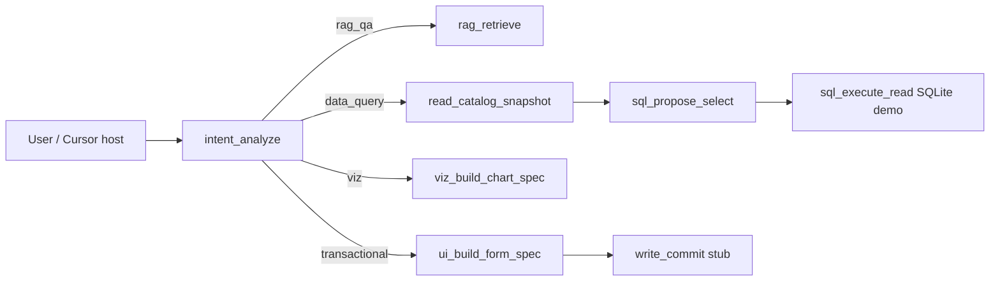

# ADR-002 — Task004 — Smart ERP MCP server (`smart-erp-ai`)

- **Status**: Accepted
- **Date**: 2026-05-09
- **Task**: Task004
- **SRS**: [`../srs/SRS_AI_Task004_smart_erp_mcp_server.md`](../srs/SRS_AI_Task004_smart_erp_mcp_server.md)

## Context

`PLAN_Smart_ERP_MCP_server_v1.md` defines a user-facing MCP plane with intent routing, hybrid **RAG (stale-ok)** vs **live read**, constrained SQL, UI specs, viz, and a **single write** path. `ADR-001` mandates Task003 **chat** path must not submit ad-hoc SQL and uses `db-readonly` templates — a different surface.

## Decision

1. **Host library**: Implement MCP with **`mcp` FastMCP** (`mcp.server.fastmcp.FastMCP`), **stdio** transport for Cursor compatibility.
2. **SQL strategy (v1)**: Use **`sqlglot`** to parse/validate **exactly one** `SELECT`, extract referenced tables, enforce **allowlist** from `read_catalog_snapshot`. Execution uses **in-memory SQLite** with seeded demo tables (`products`, `revenue_daily`). **Không** forward arbitrary SQL strings to Task003 MCP in v1.
3. **Future integration**: **Option B** from PRD — map eligible intents to **`template_id` + params** on `db-readonly` or to Spring HTTP — documented as follow-up; requires backend contract.
4. **Write path**: Only `write_commit` tool; validates **presence/length** of `hitl_token` + `idempotency_key`; returns stub `accepted_stub` — real ERP mutation stays out of this repo slice.

## NFR (numeric)

| ID | Target |
| :--- | :--- |
| NFR-01 | Tool handler median **< 20 ms** local (no network) for `intent_analyze` @ ≤2k chars. |
| NFR-02 | `sql_execute_read` returns **≤ 500** rows; client must paginate if enlarged later. |
| NFR-03 | `rag_retrieve` **≤ 10** chunks, **≤ 1200** chars/chunk. |
| NFR-04 | Startup import **`< 2 s`** on dev laptop (cold). |
| NFR-05 | **100%** unit tests must assert forbidden SQL cases (#E2–#E4) remain rejected (CI gate). |

## Consequences

- **Positive**: Clear separation from Task003 LangGraph; evaluable SQL safety without DB credentials.
- **Negative**: Demo data only until HTTP/template bridge lands.
- **Risks**: Developers might confuse Task004 MCP with Task003 chat — SRS/Bridge stress **surface split**.

## Topology (mermaid)

