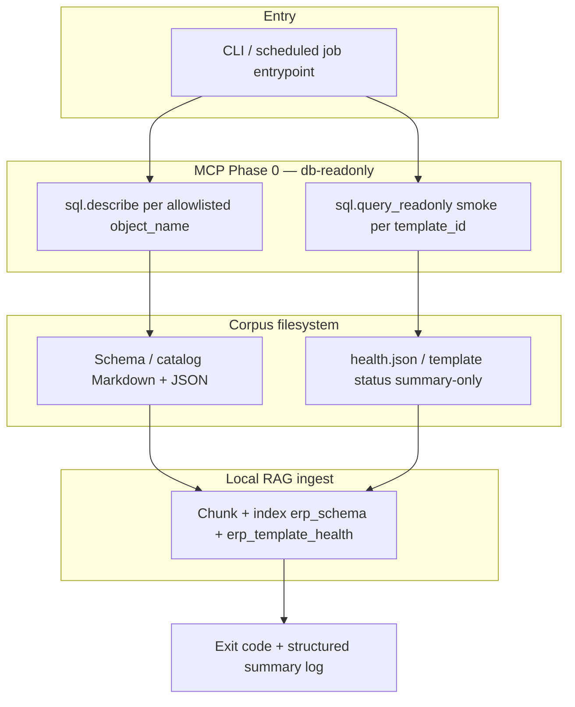

# ADR-003 — Task005: DB read-only corpus + Option B smoke + RAG ingest (`db_rag_agent_context`)

- **Status**: Accepted
- **Date**: 2026-05-09
- **Task**: Task005
- **SRS**: [`ai_python/docs/srs/SRS_AI_Task005_db_rag_agent_context.md`](../srs/SRS_AI_Task005_db_rag_agent_context.md)

## Context

Task005 implements **Option B** inside **`ai_python/`** only: an **offline/batch pipeline** that (1) calls MCP **`db-readonly`** with **`sql.describe`** over an allowlisted object set, (2) runs **smoke **`sql.query_readonly`**** for registry-listed smoke-safe templates with default params (summary-only artifacts, no persisted row payloads), (3) writes **versioned corpus artifacts** under a stable path (default `ai_python/data/rag_corpus/`), and (4) runs **local RAG ingest** into namespaces **`erp_schema`** and **`erp_template_health`**. There is **no** Chat Agent HTTP/SSE/MCP turn, **no** `ChatState` session, and **no** `sql.query_readonly_raw` / free-form SQL from LLM in this slice.

The PM chain is in [`ai_python/TASKS/Task005.md`](../../TASKS/Task005.md) (Unit → Feature → Eval). Runtime topology is a **batch DAG**, not an interactive LangGraph chat graph; vocabulary for future SSE/HITL remains **REFERENCE_ONLY** per SRS §2 and §10.

## Decision (Topology + State + Model + MCP + NFR + Guardrails)

### Topology (mermaid)

Task005 v1 — **batch corpus pipeline** (align SRS §5):

**Operator ↔ observability**: every run carries a **`correlation_id`**; MCP audit fields follow SRS §4 (`user_id` e.g. `batch_corpus_job`, `session_id` = job/correlation id, redacted `high_level_args`).

### State schema (pydantic)

Slice does **not** extend Design `ChatState`. Implement a **`CorpusJobContext`** (name illustrative) equivalent to SRS §3:

| Field | Type | Default / notes |
| :--- | :--- | :--- |
| `correlation_id` | `str` | Required per run |
| `corpus_version` | `str` | Semver or content hash + timestamp on artifacts |
| `run_started_at` / `run_finished_at` | `datetime` | ISO for NFR measurement |
| `objects_allowlist` | `list[str]` | MCP-described objects |
| `describe_results` | `dict[str, Literal["ok","failed"]]` | Partial failure tracking |
| `smoke_templates_tried` | `list[str]` | |
| `smoke_templates_ok` | `list[str]` | |
| `smoke_templates_failed` | `list[dict]` | `{ "template_id": str, "code": str }` — no row payloads |

Reuse SRS **`McpToolError`** for MCP failures.

### Model & provider

- **Primary data plane (Task005)**: **no LLM required** for describe/smoke/artifact IO; only MCP **`db-readonly`**.
- **Optional** future/parallel use of FPT MKP (OpenAI-compatible) for summarization or auxiliary steps: [`ai_python/app/mkp_client.py`](../../app/mkp_client.py) — **`get_mkp_client()`** / **`FPT_MKP_API_KEY`**, **`FPT_MKP_BASE_URL`** (default `https://mkp-api.fptcloud.com`), **`FPT_MKP_MODEL`** (default `gemma-4-31B-it`).
- **RAG ingest**: implementation may be stub or production indexer inside `ai_python`; embeddings provider (if any) must be **env-driven** and documented in module README — no hardcoded secrets.

### MCP servers (phase + per-server)

| Phase | Server | Tools used in Task005 | Notes |
| :---: | :--- | :--- | :--- |
| **0** | **`db-readonly`** | `sql.describe`, `sql.query_readonly` | Template-first; caps per SRS §4 (`columns` ≤ 512, `summary` ≤ 2k chars, smoke `row_count` ≤ 50; persist summaries only). |
| **—** | *(local indexer)* | Read corpus files → chunk/index | Not an MCP server unless repo adds one later (SRS §4 RAG ingest). |

No Phase 2/3 MCP for Task005 v1.

### NFR (5 mục)

1. **p95 latency (measurable)**: **End-to-end batch** refresh (typical dev allowlist + smoke set): **`run_started_at` → `run_finished_at` p95 ≤ 600 s** (10 minutes) per SRS §7 AC5 / §8; adjust with production measurements. **Per MCP call** (`sql.describe`, `sql.query_readonly`): target **p95 ≤ 3 s** per invocation under normal dev DB (Design Doc §6 baseline for interactive query/table — applied here as MCP SLA proxy).
2. **$/turn cost cap**: Any **MKP Chat Completions** request used by this slice (optional path) **≤ $0.005 USD per request** (Design Doc §6 baseline). **Core pipeline** (describe + smoke + filesystem artifacts **without** LLM): **$0** marginal token cost. If embedding/third-party APIs are added for RAG, budget **≤ $0.005 per logical indexing batch step** or document a stricter cap in implementation README — default stays aligned with Design **≤ $0.005** per external LLM-like round-trip.
3. **HITL bypass**: **0%**. Slice has **no** write/mutation tools, **no** `interrupt()`, **no** approval/resume path; no mechanism may bypass human approval for mutations because mutations are **out of scope** and **not implemented** (SRS §5).
4. **File caps**: Align Design Doc §6 / SRS §8: **single processed artifact/registry file ≤ 5 MB**; **tabular exports ≤ 10 000 rows** where applicable; **aggregate corpus text v1 &lt; ~5 MB** or split namespaces (PRD/SRS). **MIME / extension whitelist** for corpus outputs: **`*.md`, `*.json`, `*.yaml` / `*.yml`** (no binaries in v1 unless explicitly approved). MCP payload caps: **`summary` ≤ 2 000 characters**, **`len(columns)` ≤ 512**, smoke **`row_count` ≤ 50** (SRS §4).
5. **Model-provider lock**: LLM (if used) **must** use env **`FPT_MKP_API_KEY`** (required when MKP is invoked), **`FPT_MKP_BASE_URL`** (default **`https://mkp-api.fptcloud.com`**), **`FPT_MKP_MODEL`** (default **`gemma-4-31B-it`**). **Fallback policy**: **fail closed** — missing API key or client error aborts optional LLM steps; batch describe/smoke continues unaffected when LLM is not in the path.

### Coding guardrails

- **Ruff**: line length **100**; rules **E, F, I, UP, B, SIM** (per AI_TECH_LEAD template).
- **Mypy**: strict where practical; **`--ignore-missing-imports`** allowed for MCP/OpenAI client stubs only if needed.
- **Async**: all HTTP/MCP I/O **async**; no blocking calls on the event loop.
- **Layers**: `app/agents/` (if shared helpers), `app/tools/`, `app/mcp/`, `app/contracts/` (pydantic), `app/api/` only for existing health surfaces — Task005 ships **CLI/job** as primary entrypoint per SRS.

## Alternatives considered (≥ 2)

1. **Option A (artifact-first, minimal query)** — PRD §4.4: lighter MCP load, no smoke validation. **Rejected** for Task005: Owner chose **Option B** for template **ground-truth** via smoke `sql.query_readonly`.
2. **Option C (thin manifest, lazy describe)** — PRD §4.4: smaller corpus, less batch describe. **Rejected**: insufficient schema coverage for RAG-first ERP context without stronger batch describe + Option B validation.
3. **Inline LangGraph for batch** — Model the job as a LangGraph graph for consistency with future Chat Agent. **Deferred**: SRS §3 explicitly avoids `ChatState`; a **linear DAG + pydantic job context** is sufficient and clearer for v1; revisit when integrating chat runtime.

## Consequences

- **Positive**: Read-only MCP-only data plane; **audit-friendly** batch logs; **Option B** reduces stale-template risk; artifacts ready for a future Agent to **retrieve + registry map** without redesign.
- **Negative / risks**: Higher MCP load than Option A; smoke params may give **false confidence** if defaults are unrepresentative (PRD); partial describe failures need explicit exit policy (SRS OQ-02 default: continue, exit ≠ 0 if any fail).

## Test strategy summary

- **Unit**: pydantic models (`CorpusJobContext`, caps validators, `McpToolError`).
- **Integration**: MCP client mock or dev stub — describe loop, smoke loop, atomic writes, ingest produces **≥ 1** readable chunk (SRS §6 B6).
- **E2E batch**: CLI entrypoint with test config — correlation_id in logs, exit codes on MCP-down (SRS §6 B5).
- **Eval JSONL**: owned by **AI_TESTER** (`Eval-T005-1/2` in Task005.md); no duplicate formal eval here.
