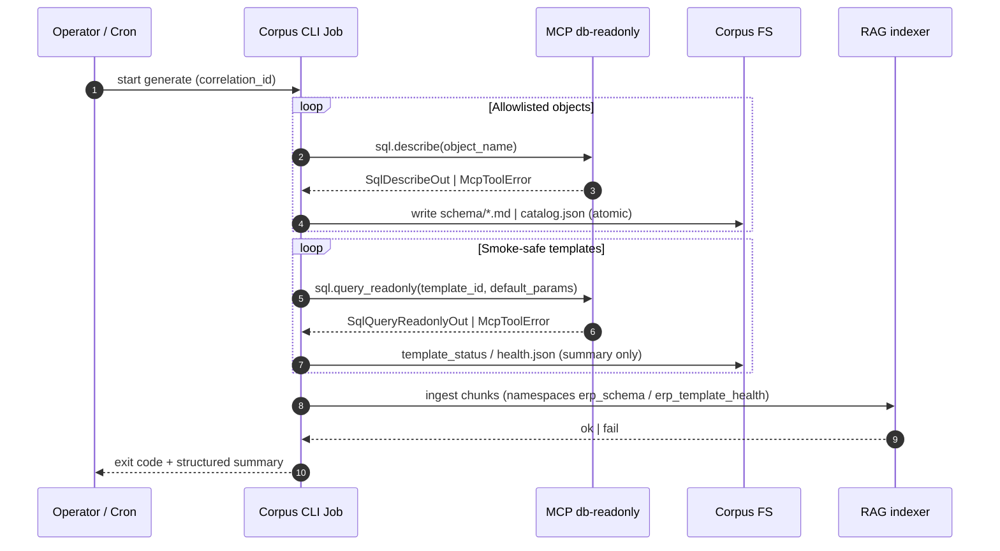

# SRS_AI_Task005_db_rag_agent_context

| Field | Value |
| :--- | :--- |
| **Task ID** | Task005 |
| **Slug** | `db_rag_agent_context` |
| **PRD** | [`ai_python/docs/prd/PRD_Task005_db_rag_agent_context.md`](../prd/PRD_Task005_db_rag_agent_context.md) |
| **Design** | [`Design_Agent/CHAT_AGENT_DESIGN.md`](../../Design_Agent/CHAT_AGENT_DESIGN.md), [`Design_Agent/mcp/DB_READONLY_TOOLS.md`](../../Design_Agent/mcp/DB_READONLY_TOOLS.md) |
| **`MCP_PHASE` (instantiate)** | `0` |

---

## 1. Scope & capability

- **Slice scope**: Chỉ **`ai_python/`** — không chỉnh `backend/`, không chỉnh `frontend/`.
- **Primary capability**: **Pipeline offline/batch** — sinh và làm tươi **corpus file** (schema/catalog, glossary, registry `template_id` → intent/params, artifact **template smoke health**) từ DB **read-only** qua MCP **`db-readonly`**, rồi **chunk/index RAG** trên corpus đó. Khớp PRD **Option B**: **`sql.describe` batch** + **smoke `sql.query_readonly`** (template smoke-safe + params mặc định, LIMIT nhỏ) + ghi artifact trạng thái tóm tắt (**không** dump full row).
- **Explicit non-capabilities (v1)**: Không triển khai **Chat Agent HTTP/API**, **SSE user stream**, **MCP chat turn**, **Spring bridge**, hay **UI chat**. Không bật **`sql.query_readonly_raw`** / SQL thô từ LLM trong slice này.
- **Actors**: Dev/vận hành chạy **CLI/job** generate + indexer; không giả định end-user chat trong phạm vi Task005.
- **Contract cho tương lai (file-only)**: Registry + schema doc phải cho phép Agent sau **retrieve RAG + đọc registry** → map intent → **`template_id` + `params`** và gọi MCP theo [`DB_READONLY_TOOLS.md`](../../Design_Agent/mcp/DB_READONLY_TOOLS.md) — không yêu cầu thiết kế lại corpus trong Task005.
- **SQL policy**: Batch chỉ dùng **`sql.describe(object_name)`** và **`sql.query_readonly(template_id, params)`** theo template đăng ký; không submit SQL tự do.

---

## 2. SSE event list (table)

**Không có luồng runtime SSE** trong Task005 v1: slice là **CLI/batch**, không mở endpoint stream cho UI/Agent. Bảng dưới ghi **Design Doc §4 / topology** (`token`, `tool_call`, `tool_result`, `ui`, `awaiting_approval`, `approval_resolved`, `committed`, `error`, `done`) chỉ để **chuẩn từ vựng** cho task tích hợp Chat Agent **sau này** — **không phát** trong job corpus.

| `event` | Phát trong Task005 v1? | Payload (Design §4 — tham chiếu) | Ghi chú |
| :--- | :--- | :--- | :--- |
| `token` | **Không** | `{ "delta": string }` | N/A runtime — Agent/chat follow-up. |
| `tool_call` | **Không** | `{ "name": string, "args": object, "status": string }` | Job có **structured log** tương đương observability (không bắt buộc semantic SSE). |
| `tool_result` | **Không** | `{ "name": string, "ok": boolean, "summary": string }` | Kết quả MCP được ghi vào artifact/log — không stream. |
| `ui` | **Không** | `TableSpec` / Generative UI | Không có FE trong v1. |
| `awaiting_approval` | **Không** | `Proposal \| BulkProposal` | Không HITL trong slice (§5). |
| `approval_resolved` | **Không** | `{ "approved": boolean, "proposal_id": string, ... }` | N/A. |
| `committed` | **Không** | `{ "result": ... }` | Không mutation DB từ `ai_python`. |
| `error` | **Không (SSE)** | `{ "message": string, "code": string }` | Lỗi MCP/map vào **exit code + log + artifact partial** (§10). |
| `done` | **Không** | `{ "usage": ... }` | Kết thúc job = **process exit** + summary log — không SSE `done`. |

---

## 3. State extension (ChatState delta)

**Không áp dụng `ChatState`** trong Task005 v1 (không session chat). Thay vào đó, implementer giữ **ngữ cảnh job batch** (pydantic-ish) để idempotency + observability:

| Field | Kiểu gợi ý | Mục đích |
| :--- | :--- | :--- |
| `correlation_id` | `str` | Một ID cho cả run generate (PRD observability). |
| `corpus_version` | `str` | Semver hoặc content hash + timestamp ghi trên artifact. |
| `run_started_at` / `run_finished_at` | `datetime` (ISO log) | SLA/NFR ingest batch. |
| `objects_allowlist` | `list[str]` | Danh sách object MCP được describe (views/tables). |
| `describe_results` | `dict[str, Literal["ok","failed"]]` | Partial failure tracking (không block toàn pipeline nếu PRD cho partial). |
| `smoke_templates_tried` | `list[str]` | `template_id` đã chạy smoke. |
| `smoke_templates_ok` | `list[str]` | Smoke pass. |
| `smoke_templates_failed` | `list[{ "template_id": str, "code": str }]` | Smoke fail — không lưu full row. |

Agent/chat sau có thể tái sử dụng Design `ChatState`; slice này **không** mở rộng `ChatState`.

---

## 4. MCP tools used (per-tool I/O contract)

Server: **`db-readonly`** ([`DB_READONLY_TOOLS.md`](../../Design_Agent/mcp/DB_READONLY_TOOLS.md)). Áp Design §5.1.B: audit **`user_id`**, **`session_id`**, **`tool_name`**, **`high_level_args`** (đã redact), **`duration_ms`**, **`correlation_id`**; output có **`summary`** + giới hạn payload.

**Batch mapping audit (Task005)** `[default-OK]`:

- `user_id`: ví dụ `"batch_corpus_job"` hoặc OS user — không dùng JWT end-user.
- `session_id`: ví dụ `job_run_id` / `correlation_id`.
- `high_level_args`: chỉ `object_name` hoặc `template_id` + **tên** param (không giá trị nhạy cảm nếu có).

### Global error model (MCP tool errors)

```python
class McpToolError(BaseModel):
    code: str  # ví dụ DB_QUERY_REJECTED, DB_TIMEOUT, DB_UPSTREAM_ERROR
    message: str
    retryable: bool
    details: dict[str, Any] | None = None
    correlation_id: str
```

### 4.1 `sql.describe`

**Intent**: Schema introspection cho object allowlisted.

**Input**

```python
class SqlDescribeIn(BaseModel):
    object_name: str  # ví dụ "reporting.sales_by_day_v1"
```

JSON tương đương:

```json
{ "object_name": "reporting.sales_by_day_v1" }
```

**Output**

```python
class ColumnMeta(BaseModel):
    name: str
    type: str
    nullable: bool

class SqlDescribeOut(BaseModel):
    object_name: str
    columns: list[ColumnMeta]
    summary: str
    correlation_id: str
```

**Payload cap** `[default-OK]`: `len(columns) <= 512`; `summary` ≤ **2k** chars; không đính kèm sample row.

**Error codes** (tham chiếu pack): `DB_QUERY_REJECTED`, `DB_TIMEOUT`, `DB_UPSTREAM_ERROR`; có thể thêm `DB_OBJECT_NOT_ALLOWED` nếu MCP enforce allowlist — map vào cùng error model.

### 4.2 `sql.query_readonly`

**Intent**: Smoke validation template-first (Option B); không dùng để export bulk data vào corpus.

**Input**

```python
class SqlQueryReadonlyIn(BaseModel):
    template_id: str
    params: dict[str, Any]  # typed theo registry; smoke dùng params mặc định + LIMIT nhỏ server-side
```

**Output**

```python
class SqlColumn(BaseModel):
    name: str
    type: str

class SqlQueryReadonlyOut(BaseModel):
    columns: list[SqlColumn]
    rows: list[list[Any]]
    row_count: int
    summary: str
    correlation_id: str
```

**Payload cap** `[default-OK]`: `row_count` ≤ **50** cho smoke (server có thể siết thấp hơn); batch job chỉ persist **summary + row_count + ok/fail**, không ghi `rows` vào artifact/corpus.

**Error codes**: `DB_QUERY_REJECTED`, `DB_TIMEOUT`, `DB_UPSTREAM_ERROR`.

**RAG ingest**: Đọc file corpus/index là **pipeline nội bộ** `ai_python` (không liệt kê thêm MCP tool trong §4 trừ khi repo đã có tool MCP upsert riêng — `[default-OK]` implementer dùng indexer local).

---

## 5. HITL flow (mermaid)

Task005 **không** có intent `write` / `excel_import` / mutation; **không** `interrupt()` / approve UI.



---

## 6. Eval criteria (≥ 5 prompts)

Tester (`G-AI-TST`) mở rộng matrix; dưới đây ≥5 **kịch bản batch** (input = điều kiện job/config + DB/MCP trạng thái):

| # | Scenario (Given) | Expected sequence / artifacts | Assertion |
| :--- | :--- | :--- | :--- |
| B1 | Allowlist 3 object, MCP OK | `sql.describe` ×3 → file schema/catalog có **version + timestamp** | Idempotent rerun: version bump hoặc hash đổi có kiểm soát; không secret trong file. |
| B2 | 1 object trả `DB_TIMEOUT` | describe A ok, B timeout, C ok | Partial recorded trong `describe_results` / log; job exit ≠ 0 hoặc policy partial do ADR `[default-OK]`. |
| B3 | Registry có 2 template smoke-safe | `sql.query_readonly` ×2 | `template_status` ghi **row_count + OK**; **không** có full row dump trong artifact. |
| B4 | 1 template smoke trả `DB_QUERY_REJECTED` | smoke fail | Artifact đánh dấu template **dead/rejected**; ingest vẫn có thể index namespace health để Agent sau không tin sai. |
| B5 | MCP unavailable (transport down) | không crash ngầm | Fail graceful, exit ≠ 0, log có `correlation_id` + lỗi bước (PRD T005-5). |
| B6 | RAG ingest sau describe+smoke | indexer chạy | ≥ **1** chunk đọc được từ corpus mới (integration test PRD T005-3). |

---

## 7. Acceptance Criteria (G/W/T)

1. **Given** config allowlist object **When** chạy batch describe **Then** artifact schema/catalog được ghi dưới đường dẫn corpus cố định (doc trong module) **và** có metadata version/timestamp **và** rerun không làm hỏng trạng thái (atomic write).
2. **Given** registry smoke-safe templates **When** chạy bước smoke **Then** mỗi template có bản ghi tóm tắt (HTTP/MCP OK, row_count, lỗi nếu có) **và** không persist full rows.
3. **Given** corpus mới **When** chạy ingest **Then** index có namespace (ví dụ `erp_schema` và tùy chọn `erp_template_health`) **và** không yêu cầu gọi Agent/API để chứng minh.
4. **Given** policy Task005 **When** bất kỳ bước nào **Then** không ghi DB từ `ai_python` **và** log/artifact không chứa credential DB **và** không log PII thô từ rows.
5. **Given** một lần generate hoàn chỉnh **When** đo trên DB dev giả lập **Then** hoàn tất artifact điển hình **< 10 phút** `[default-OK]` tinh chỉnh khi có số liệu thực (PRD NFR).
6. **Given** operator chạy daily entrypoint **When** MCP lỗi **Then** exit code ≠ 0 **và** summary log có `correlation_id` và số object/template xử lý.

---

## 8. NFR

| ID | Chi tiết (Task005 / PRD) |
| :--- | :--- |
| **Latency ingest batch** | Refresh artifact điển hình **< 10 phút** trên DB dev giả lập; đo `run_started_at` → `run_finished_at`. |
| **Corpus size** | Tổng text corpus v1 **< ~5MB** hoặc chia namespace để vector store không phình (PRD). |
| **Idempotency** | Ghi file atomic / versioning; rerun không corrupt artifact. |
| **Observability** | Mỗi run có **`correlation_id`**; log dòng: số object describe, số smoke, thời gian, lỗi MCP từng bước (PRD). |
| **Safety** | Read-only MCP only; template-first; no raw SQL path; smoke LIMIT + row cap. |
| **Cost / load** | Batch chấp nhận tải MCP định kỳ (daily); backoff retry timeout/rate limit `[default-OK]` trong implement. |

---

## 9. Open Questions

| ID | Question | Severity | Disposition |
| :--- | :--- | :--- | :--- |
| OQ‑01 | Đường dẫn cụ thể `data/rag_corpus/...` vs tên namespace vector cuối cùng? | `[default-OK]` | **Default**: `ai_python/data/rag_corpus/` + namespaces `erp_schema`, `erp_template_health` như PRD gợi ý; README module ghi rõ. |
| OQ‑02 | Partial describe failure có làm fail cả job hay tiếp tục? | `[default-OK]` | **Default**: tiếp tục + exit ≠ 0 nếu có bất kỳ fail; danh sách failed trong artifact. |
| OQ‑03 | Indexer RAG dùng implementation nào (stub vs production)? | `[default-OK]` | **Default**: tái sử dụng pipeline sẵn có trong `ai_python`; nếu stub, integration test vẫn đọc ≥1 chunk từ corpus file. |

**`[CRITICAL]`**: không có — gate G‑AI‑BA có thể pass.

---

## 10. Sample JSON request/response (SSE)

Task005 **không** có SSE runtime. Mục này cung cấp (a) mẫu **REFERENCE_ONLY** cho từng event Design §4 — giữ khớp vocabulary cho regression/future Agent — và (b) mẫu **job/MCP** thực tế của slice.

### 10.1 SSE — REFERENCE_ONLY (không emit trong Task005)

#### `token`

```json
{ "event": "token", "_note": "REFERENCE_ONLY_NOT_EMITTED_TASK005_BATCH", "payload": { "delta": "(future Chat Agent stream only)" } }
```

#### `tool_call`

```json
{ "event": "tool_call", "_note": "REFERENCE_ONLY_NOT_EMITTED_TASK005_BATCH", "payload": { "name": "db-readonly.sql.describe", "args": { "object_name": "reporting.sales_by_day_v1" }, "status": "started" } }
```

#### `tool_result`

```json
{ "event": "tool_result", "_note": "REFERENCE_ONLY_NOT_EMITTED_TASK005_BATCH", "payload": { "name": "db-readonly.sql.describe", "ok": true, "summary": "cols=4 object=reporting.sales_by_day_v1" } }
```

#### `ui`

```json
{ "event": "ui", "_note": "REFERENCE_ONLY_NOT_EMITTED_TASK005_BATCH", "payload": { "kind": "table", "title": "(no FE in Task005 v1)", "columns": [], "rows": [], "page_size": 20, "total": 0, "actions": [] } }
```

#### `awaiting_approval`

```json
{ "event": "awaiting_approval", "_note": "REFERENCE_ONLY_NOT_EMITTED_TASK005_NO_HITL", "payload": { "kind": "proposal", "proposal_id": "n/a_task005", "summary": "write path out of scope", "diff_preview": [] } }
```

#### `approval_resolved`

```json
{ "event": "approval_resolved", "_note": "REFERENCE_ONLY_NOT_EMITTED_TASK005_NO_HITL", "payload": { "approved": false, "proposal_id": "n/a_task005" } }
```

#### `committed`

```json
{ "event": "committed", "_note": "REFERENCE_ONLY_NOT_EMITTED_TASK005_NO_MUTATION", "payload": { "result": { "status": "n/a", "message": "Task005 does not commit DB mutations" } } }
```

#### `error`

```json
{ "event": "error", "_note": "REFERENCE_ONLY_LOG_AS_STRUCTURED_NOT_SSE", "payload": { "message": "MCP describe failed", "code": "DB_TIMEOUT" } }
```

#### `done`

```json
{ "event": "done", "_note": "REFERENCE_ONLY_USE_PROCESS_EXIT_TASK005", "payload": { "usage": { "tokens_in": 0, "tokens_out": 0, "cost_usd": 0 } } }
```

### 10.2 MCP & artifact samples (runtime của slice)

**`sql.describe` — success**

Request:

```json
{ "object_name": "reporting.sales_by_day_v1" }
```

Response:

```json
{
  "object_name": "reporting.sales_by_day_v1",
  "columns": [{ "name": "day", "type": "date", "nullable": false }],
  "summary": "Allowlisted reporting view; 1 column shown (truncated for doc).",
  "correlation_id": "corr_desc_001"
}
```

**`sql.query_readonly` — smoke success**

Request:

```json
{ "template_id": "sales_by_day_v1", "params": { "date_from": "2026-04-01", "date_to": "2026-04-07", "channel": null } }
```

Response:

```json
{
  "columns": [{ "name": "day", "type": "date" }, { "name": "revenue", "type": "number" }],
  "rows": [["2026-04-01", 1230000]],
  "row_count": 1,
  "summary": "1 row(s); smoke OK.",
  "correlation_id": "corr_smoke_001"
}
```

**Tool error**

```json
{
  "code": "DB_QUERY_REJECTED",
  "message": "Template not allowlisted or params invalid.",
  "retryable": false,
  "details": { "template_id": "unknown_tpl" },
  "correlation_id": "corr_err_001"
}
```

**Artifact `health.json` (summary-only)**

```json
{
  "corpus_version": "2026-05-09T12:00:00Z",
  "correlation_id": "corr_run_abc",
  "smoke": [
    { "template_id": "sales_by_day_v1", "ok": true, "row_count": 1, "code": null },
    { "template_id": "inventory_snapshot_v1", "ok": false, "row_count": 0, "code": "DB_TIMEOUT" }
  ]
}
```

---

## 11. Approved by / Date

**Status**: **Approved**  
**By**: AI_BA (auto-mode per `AI_BA_AGENT_INSTRUCTIONS.md` §5 — **0** unresolved `[CRITICAL]` Open Questions)  
**Date**: 2026-05-09

---

**Gate G-AI-BA**: **PASS** — `ai_python/docs/srs/SRS_AI_Task005_db_rag_agent_context.md` đủ mục 1–11; Option B (describe batch + smoke `sql.query_readonly` + artifact + RAG); không giả định Chat Agent HTTP/SSE/UI trong v1; mọi MCP tool trong §4 có input/output + error model; SSE là **REFERENCE_ONLY** / không runtime khớp PRD.
