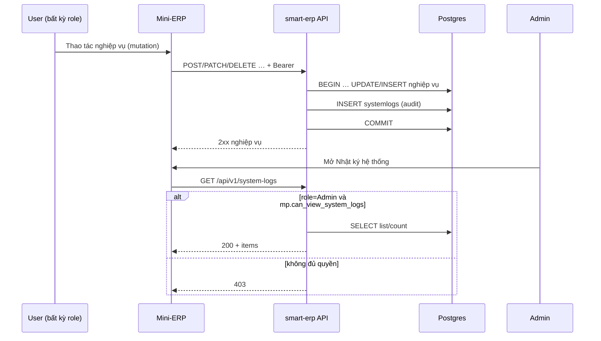

# SRS — Nhật ký hệ thống: ghi toàn phạm vụ + chỉ Admin xem — PRD mở rộng Task086

> **File (Spring / `smart-erp`):** `backend/docs/srs/SRS_PRD_system-audit-unified-admin-view.md`  
> **Người soạn:** Agent BA (theo `backend/AGENTS/BA_AGENT_INSTRUCTIONS.md`)  
> **Ngày:** 02/05/2026  
> **Trạng thái:** `Approved`  
> **PO duyệt (khi Approved):** Owner ủy quyền chốt kỹ thuật theo PRD — **02/05/2026**

---

## 0. Đầu vào & traceability

| Nguồn | Đường dẫn / ghi chú |
| :--- | :--- |
| PRD (phiên làm việc Owner + Planner) | Mục tiêu: (1) ghi nhật ký cho **các thao tác nghiệp vụ có side effect** do mọi user thực hiện; (2) màn **Nhật ký hệ thống** và API tra cứu chỉ **Admin**; (3) mở rộng trên bảng `systemlogs` và repo ghi hiện có; (4) FE: menu + route guard theo quyền + role Admin. |
| SRS nền (list/detail/delete policy) | [`SRS_Task086_system-logs.md`](SRS_Task086_system-logs.md) — **Approved**; tài liệu này **amend** persona xem log (§6) và phạm vi **ghi** log (trước đây Task086 ghi *out-of-scope* cho phần mở rộng ghi). |
| API catalog | `API_Task086` / `087` / `088` — đã đồng bộ RBAC **Admin-only** + bỏ GAP JWT cũ. |
| Envelope | [`../../../frontend/docs/api/API_RESPONSE_ENVELOPE.md`](../../../frontend/docs/api/API_RESPONSE_ENVELOPE.md) |
| Flyway | [`../../smart-erp/src/main/resources/db/migration/V1__baseline_smart_inventory.sql`](../../smart-erp/src/main/resources/db/migration/V1__baseline_smart_inventory.sql) — DDL `SystemLogs` (PostgreSQL: `systemlogs`) |
| Seed quyền xem log | **V30** (Admin + Owner = true) + **V43** [`../../smart-erp/src/main/resources/db/migration/V43__prd_system_logs_view_admin_only.sql`](../../smart-erp/src/main/resources/db/migration/V43__prd_system_logs_view_admin_only.sql) — chỉ **Admin** = `can_view_system_logs` true; Owner/Staff false |
| Mã đọc/ghi log | `SystemLogsController` / `SystemLogsService` / `SystemLogsJdbcRepository` (package `settings/systemlogs`); `SystemLogJdbcRepository` (`auth/repository` — các `insert*`) |
| JWT menu permissions | `MenuPermissionClaims.java` — key `can_view_system_logs` |
| UI index | [`../../../frontend/mini-erp/src/features/FEATURES_UI_INDEX.md`](../../../frontend/mini-erp/src/features/FEATURES_UI_INDEX.md) — `/settings/system-logs` → `LogsPage` |
| Menu / guard FE | `Sidebar.tsx` + `menuPermissions.ts` — **đồng bộ triển khai** theo §5.2: `can_view_system_logs` + `adminOnly` + guard route (không còn `always: true` cho Nhật ký) |

---

## 1. Tóm tắt điều hành

- **Vấn đề:** Nhật ký hệ thống mới chỉ được **ghi thủ công** tại vài luồng (đăng nhập/đăng xuất, reset mật khẩu, patch tồn, một phần phiếu nhập). Phần lớn mutation catalog / sales / finance / settings **không** có dòng `systemlogs`. Trước V43, **Owner** từng có `can_view_system_logs` (V30) — đã **thu hồi**; chỉ **Admin** xem được.
- **Mục tiêu nghiệp vụ:** (1) Sau mỗi thao tác nghiệp vụ **in-scope** (§3.1), hệ thống ghi một bản ghi audit vào `systemlogs` với `module` / `action` / `message` / `context_data` an toàn; (2) chỉ user có **role Admin** (và có quyền menu tương ứng) tra cứu được qua API + UI; (3) không cho xóa log (giữ policy Task086).
- **Đối tượng:** **Admin** (xem); mọi user đã xác thực (tác nhân ghi log khi thực hiện mutation).

### 1.1 Giao diện Mini-ERP

| Nhãn menu (Sidebar) | Route | Page (export) | Component / vùng chính | File (dưới `frontend/mini-erp/src/features/`) |
| :--- | :--- | :--- | :--- | :--- |
| Cài đặt → Nhật ký hệ thống | `/settings/system-logs` | `LogsPage` | `LogTable`, toolbar lọc/tìm | `settings/pages/LogsPage.tsx` · `settings/components/LogTable.tsx` |

**Yêu cầu UI (bổ sung so Task101/Sidebar hiện tại):** mục menu chỉ hiển thị khi **`role` = `Admin`** và JWT `mp.can_view_system_logs === true`; route `/settings/system-logs` có **guard** (không cho deep link bởi Staff/Owner).

---

## 2. Bóc tách nghiệp vụ (capabilities)

| # | Capability | Kích hoạt bởi | Kết quả mong đợi | Ghi chú |
| :---: | :--- | :--- | :--- | :--- |
| C1 | Ghi audit sau mutation thành công | Service/controller xử lý POST/PUT/PATCH/DELETE in-scope | Một dòng `INSERT` vào `systemlogs` trong **cùng transaction** nghiệp vụ (đã chốt §4 **OQ-3**) | Chuẩn hóa `module`, `action` (mã máy đọc) |
| C2 | Không ghi dữ liệu nhạy cảm | Mọi luồng ghi log | `context_data` không chứa mật khẩu, refresh token, secret; PII tối thiểu | BR-1 |
| C3 | Giới hạn kích thước ngữ cảnh | Ghi log | JSON `context_data` tối đa **16384 byte** UTF-8 (§4 **OQ-2**, **BR-5**) | Tránh bloat DB |
| C4 | Tra cứu danh sách log (đã có) | Admin mở `LogsPage` | `GET /api/v1/system-logs` 200 theo Task086 | Hình dạng JSON giữ nguyên §8.1 |
| C5 | Tra cứu chi tiết log (đã có) | Admin mở chi tiết | `GET /api/v1/system-logs/{id}` 200 | Theo code hiện `SystemLogsController.getDetail` |
| C6 | Từ chối xem nếu không phải Admin | Owner/Staff gọi API list/detail | **403** với message chức năng (không lộ nội bộ) | Đồng bộ §6 + migration |
| C7 | Từ chối xóa log (đã có) | Mọi role | `DELETE` / `bulk-delete` → **403** policy | `SRS_Task086` OQ-1 |
| C8 | Lộ trình ghi theo domain | Triển khai từng module | Mỗi mutation “chính” trong SRS/API tương ứng có AC “có dòng system log” | Ưu tiên theo milestone PM |

---

## 3. Phạm vi

### 3.1 In-scope

- **RBAC xem:** Chỉ **Admin**: JWT **`role` = `Admin`** **và** **`mp.can_view_system_logs === true`** (`SystemLogsService.requireCanView`); seed **V43** đặt Owner/Staff `false`. Defense-in-depth **bắt buộc** (đã chốt §4 **OQ-4**).
- **FE:** Cập nhật `Sidebar`, `MenuPermissions`, parser JWT, **route guard** `LogsPage` / layout Settings.
- **Ghi log:** Mở rộng từng **mutation** REST (hoặc service tương đương) cho các domain: **catalog** (categories, products, suppliers, customers), **sales** (orders, retail checkout, hủy/điều chỉnh theo SRS hiện có), **inventory** (tồn, nhập, xuất, kiểm kê, điều chỉnh — bổ sung chỗ còn thiếu), **finance** (thu chi, ledger nếu có mutation), **settings** (nhân viên, cảnh báo, cửa hàng, roles nếu có API), **auth** (giữ luồng login/logout/reset đã có; không ghi refresh dày đặc).
- **API nội bộ ghi chuẩn:** Một service/repo method thống nhất (ví dụ `recordBusinessAudit(...)`) delegate xuống `INSERT INTO systemlogs` — refactor các `insert*` hiện có dần về API này.

### 3.2 Out-of-scope (giai đoạn 1)

- Ghi log cho **GET** danh sách/chi tiết thuần (trừ khi PO mở rộng: ví dụ export báo cáo → một action `EXPORT_*`).
- **Realtime** stream / websocket log.
- **Partition / purge** tự động theo retention (chỉ ghi NFR; job purge là phase sau).
- Thay đổi schema `systemlogs` (thêm cột mới) — **không** trong phạm vi release này; `requestId` / `correlationId` dùng trong **`context_data`** khi cần (đã chốt §4 **OQ-5**).

---

## 4. Quyết định kỹ thuật (đã chốt — đồng bộ hệ thống)

> Các mục dưới đây thay thế vòng OQ Draft; Owner ủy quyền BA chốt theo PRD và kiến trúc JWT hiện hành (`role` + `mp`).

| ID | Chủ đề | Quyết định | Ngày |
| :--- | :--- | :--- | :--- |
| **OQ-1** | Ai được **xem** system logs? | Chỉ **Admin**: `roles.permissions.can_view_system_logs` = **true** chỉ role `Admin`; **Owner** và **Staff** = **false**. Flyway **V43**. | 02/05/2026 |
| **OQ-2** | Giới hạn `context_data` | Tối đa **16384 byte** (UTF-8) serialized JSON trước khi `INSERT`; nếu vượt → cắt bớt / bỏ field mảng lớn (Dev triển khai tại lớp ghi audit). | 02/05/2026 |
| **OQ-3** | Transaction ghi log | Ghi **trong cùng transaction** với mutation nghiệp vụ (cùng `commit` / `rollback`) — nhất quán với **BR-2**. | 02/05/2026 |
| **OQ-4** | Kiểm JWT `role` | **Có**, **bắt buộc:** `role` claim = **`Admin`** **và** `mp.can_view_system_logs === true` trong `SystemLogsService` (defense nếu DB seed lệch). | 02/05/2026 |
| **OQ-5** | Cột `request_id` riêng | **Không** thêm cột/index riêng trong release này; dùng **`context_data.requestId`** / **`correlationId`** (text) khi endpoint có idempotency. | 02/05/2026 |

---

## 5. Phân tích scope tệp & bằng chứng

### 5.1 Tài liệu đã đối chiếu (read)

- `BA_AGENT_INSTRUCTIONS.md`, `SRS_TEMPLATE.md`, `SRS_Task086_system-logs.md`, PRD unified audit, `API_Task086` (đầu file), `V1` DDL `SystemLogs`, `V30`, `SystemLogJdbcRepository.java`, `SystemLogsService.java`, `Sidebar.tsx`, `menuPermissions.ts`, `FEATURES_UI_INDEX.md`.

### 5.2 Mã / migration dự kiến (write / verify)

- **Flyway:** [`V43__prd_system_logs_view_admin_only.sql`](../../smart-erp/src/main/resources/db/migration/V43__prd_system_logs_view_admin_only.sql) (đã thêm).
- **Java:** `SystemLogsService.requireCanView` — kiểm **`role` = Admin** + **`mp.can_view_system_logs`** (đã triển khai); tiếp theo: `ApplicationAuditService` / mở rộng `SystemLogJdbcRepository` + wiring từng domain.
- **FE:** `Sidebar.tsx`, `menuPermissions.ts`, guard route — **theo milestone** (SRS đã mô tả yêu cầu).
- **API / SRS_Task086:** đã đồng bộ §2 Task086, §0.1 + §6 Task086, `API_Task087` §3.

### 5.3 Rủi ro phát hiện sớm

- **Sót endpoint:** mutation không gọi audit → lỗ hổng tuân thủ; cần checklist theo domain + review PR.
- **Hai nguồn sự thật RBAC:** chỉ sửa DB mà không sửa FE → Owner vẫn thấy menu nhưng API 403 (hoặc ngược lại).
- **Khối lượng INSERT** làm chậm API — theo dõi p95; giữ ghi trong transaction (OQ-3).

---

## 6. Persona & RBAC

| Vai trò / điều kiện | Xem `GET /api/v1/system-logs` · `GET /api/v1/system-logs/{id}` | Ghi `systemlogs` (mutation) |
| :--- | :--- | :--- |
| **Admin** | **Được** khi **`role` = `Admin`** và **`mp.can_view_system_logs === true`** | Mọi user (gồm Owner/Staff) vẫn là tác nhân **ghi** log khi mutation |
| **Owner** | **403** — cùng message Task086 | Được phép nghiệp vụ khác; mutation vẫn **ghi** `user_id` Owner |
| **Staff** | **403** | Tương tự |

> **Đồng bộ `SRS_Task086`:** đã thêm **§0.1** + cập nhật §1, §2, §6, §7 trong [`SRS_Task086_system-logs.md`](SRS_Task086_system-logs.md).

---

## 7. Actor & luồng nghiệp vụ

### 7.1 Danh sách actor

| Actor | Mô tả |
| :--- | :--- |
| End user (Staff/Owner/Admin) | Thực hiện nghiệp vụ mutation |
| Client | Mini-ERP SPA |
| API `smart-erp` | Xử lý nghiệp vụ + ghi audit |
| Database | PostgreSQL `systemlogs`, `users`, … |

### 7.2 Luồng chính (narrative) — ghi log

1. User thực hiện thao tác nghiệp vụ (ví dụ tạo sản phẩm).  
2. API vào transaction, thực hiện INSERT/UPDATE domain.  
3. Trước commit (khuyến nghị), API gọi lớp audit → `INSERT INTO systemlogs` với `user_id`, `module`, `action`, `message`, `context_data` (tuỳ chọn), `log_level` = `INFO`.  
4. Commit transaction.  
5. Admin sau đó mở Nhật ký → `GET /api/v1/system-logs` thấy dòng mới.

### 7.3 Luồng từ chối xem (Owner)

1. Owner mở URL `/settings/system-logs` (nếu FE chưa ẩn).  
2. Client gọi `GET /api/v1/system-logs`.  
3. API: không phải **Admin** (`role`) hoặc thiếu **`mp.can_view_system_logs`** → **403**, message chức năng.

### 7.4 Sơ đồ



---

## 8. Hợp đồng HTTP & ví dụ JSON

> **Không tạo endpoint REST mới** cho “ghi audit” — ghi nội bộ server. Hợp đồng **đọc** log bám [`SRS_Task086`](SRS_Task086_system-logs.md) §8 và `API_Task086` / detail. Mẫu **403** áp dụng cho **Owner**, **Staff**, hoặc Admin thiếu quyền.

### 8.1 `GET /api/v1/system-logs` (không đổi shape thành công)

| Thuộc tính | Giá trị |
| :--- | :--- |
| Method + path | `GET /api/v1/system-logs` |
| Auth | Bearer JWT |

**Response thành công (`200`)** — giữ nguyên ví dụ đầy đủ tại `SRS_Task086` §8.1.2 (items có `id`, `timestamp`, `user`, `action`, `module`, `description`, `severity`, `ipAddress`).

**403 — không có quyền xem** (Owner, Staff; hoặc JWT không phải **Admin**; hoặc thiếu `mp.can_view_system_logs`)

```json
{
  "success": false,
  "error": "FORBIDDEN",
  "message": "Bạn không có quyền xem nhật ký hệ thống.",
  "details": {}
}
```

**401 — phiên không hợp lệ**

```json
{
  "success": false,
  "error": "UNAUTHORIZED",
  "message": "Phiên đăng nhập đã hết hạn. Vui lòng đăng nhập lại.",
  "details": {}
}
```

### 8.2 `GET /api/v1/system-logs/{id}`

- **200 / 404:** bám `SRS_Task086` và triển khai hiện tại (`SystemLogDetailData` gồm `stackTrace`, `context`/`contextData`).
- **403:** cùng envelope như §8.1.

### 8.3 `DELETE` / bulk-delete

- Giữ policy **403 cấm xóa** — ví dụ đầy đủ trong `SRS_Task086` §8.2–8.3.

### 8.4 Schema logic ghi nội bộ (không phải REST) — tham chiếu Dev

| Field DB | Kiểu | Bắt buộc | Ghi chú |
| :--- | :--- | :---: | :--- |
| `log_level` | `INFO` / … | Có | Mặc định `INFO` cho hành thường |
| `module` | varchar | Có | Chuẩn domain: `AUTH`, `catalog`, `inventory`, `sales`, `finance`, `settings`, … |
| `action` | varchar | Có | Mã ổn định: `PRODUCT_CREATE`, `STOCK_RECEIPT_APPROVE`, … |
| `user_id` | int / null | Không | FK `users`; null = job/system |
| `message` | text | Có | Tiếng Việt, ngắn |
| `context_data` | jsonb | Không | `clientIp`, `entityType`, `entityId`, … — **BR-1** |
| `stack_trace` | text | Không | Chỉ lỗi hệ thống nếu có chính sách ghi |

---

## 9. Quy tắc nghiệp vụ (bảng)

| Mã | Điều kiện | Hành động / kết quả |
| :--- | :--- | :--- |
| **BR-1** | Ghi `context_data` | Không chứa mật khẩu, access/refresh token, API key, nội dung file nhạy cảm; không log full body request nếu có PII không cần thiết |
| **BR-2** | Mutation failed / rollback | **Không** insert audit cho nghiệp vụ đó (cùng transaction — đã chốt **OQ-3**) |
| **BR-3** | Trùng lặp do retry client | Khuyến nghị đưa `idempotencyKey` vào `context_data` nếu endpoint đã có khái niệm này |
| **BR-4** | `module` / `action` | Phải thuộc bảng chuẩn hoá trong code (enum/constants) để FE filter `module` ổn định |
| **BR-5** | Serialized JSON `context_data` | Trước `INSERT`, độ dài UTF-8 **≤ 16384 byte**; vượt → cắt bớt an toàn (OQ-2) |

---

## 10. Dữ liệu & SQL tham chiếu (phối hợp Agent SQL)

### 10.1 Bảng / quan hệ

| Bảng (Flyway DDL) | Tên vật lý PostgreSQL | Read / Write |
| :--- | :--- | :--- |
| `SystemLogs` | `systemlogs` | **Write:** mọi luồng audit; **Read:** `SystemLogsJdbcRepository` list/detail |

Cột: `id`, `log_level`, `module`, `action`, `user_id`, `message`, `stack_trace`, `context_data`, `created_at` — `V1__baseline_smart_inventory.sql`.

### 10.2 SQL — ví dụ INSERT (Dev)

```sql
INSERT INTO systemlogs (log_level, module, action, user_id, message, context_data)
VALUES (
  'INFO',
  'catalog',
  'PRODUCT_CREATE',
  :user_id,
  'Tạo mới sản phẩm',
  CAST(:context_json AS jsonb)
);
```

### 10.3 Index & hiệu năng

- Hiện có: `idx_syslog_created_at`, `idx_syslog_level`.  
- SQL Agent đánh giá thêm index theo filter `module`, `(created_at DESC, module)` khi volume tăng; search `context_data` theo `SRS_Task086` OQ-5.

### 10.4 Kiểm chứng dữ liệu cho Tester

- Sau mutation X, truy vấn `SELECT id, module, action, user_id, left(message,80) FROM systemlogs ORDER BY id DESC LIMIT 5` thấy dòng tương ứng.  
- Owner: sau migration, `GET /api/v1/system-logs` → 403.  
- Admin: 200 và có dòng mới.

---

## 11. Acceptance criteria (Given / When /Then)

```text
Given Owner đã đăng nhập và seed đã cập nhật (can_view_system_logs = false cho Owner)
When Owner gọi GET /api/v1/system-logs
Then HTTP 403 và message chức năng (không tiết lộ nội bộ server)
```

```text
Given Admin đã đăng nhập và mp.can_view_system_logs = true
When Admin gọi GET /api/v1/system-logs?page=1&limit=20
Then HTTP 200 và data.items là mảng, có meta page/limit/total
```

```text
Given một API mutation catalog in-scope đã triển khai audit
When Staff tạo mới thực thể thành công
Then Một dòng systemlogs tồn tại với user_id = Staff, module catalog, action chuẩn, message tiếng Việt
```

```text
Given mutation nghiệp vụ trả 409/400 và không commit
When Client nhận lỗi
Then Không có dòng systemlogs mới ghi nhận thành công nghiệp vụ đó (theo BR-2)
```

```text
Given User mở /settings/system-logs không phải Admin
When SPA load
Then Redirect hoặc thông báo không có quyền; không gọi API hoặc gọi và xử lý 403 gọn
```

```text
Given DELETE /api/v1/system-logs/{id}
When bất kỳ role nào
Then HTTP 403 theo policy không xóa log
```

---

## 12. GAP & giả định (trạng thái sau Approved)

| GAP / Giả định | Trạng thái |
| :--- | :--- |
| **GAP-1** `API_Task086` §2 | **Đã đóng** — §2 mô tả Admin + `role` + V43 |
| **GAP-2** `SRS_Task086` §6 | **Đã đóng** — §0.1 + §6 đã amend |
| **GAP-3** V30 Owner | **Đã đóng** — **V43** |
| **GAP-4** FE `MenuPermissions` | **Còn việc Dev FE** — thêm key + parse JWT (không chặn Approved SRS BE/DB) |
| **GAP-5** Sidebar `always: true` | **Còn việc Dev FE** — `perm` + `adminOnly` + route guard |

---

## 13. PO sign-off (Approved)

- [x] Đã chốt **§4** (RBAC Admin-only, transaction, `context_data` limit, kiểm `role`, không cột `request_id`)
- [x] Phạm vi ghi mutation §3.1 / out-of-scope §3.2 đã ghi nhận
- [x] Đồng bộ `API_Task086`, `API_Task087`, `SRS_Task086` §0.1, Flyway **V43**, `SystemLogsService`

**Chữ ký / nhãn PR:** Approved — SRS_PRD_system-audit — 02/05/2026
