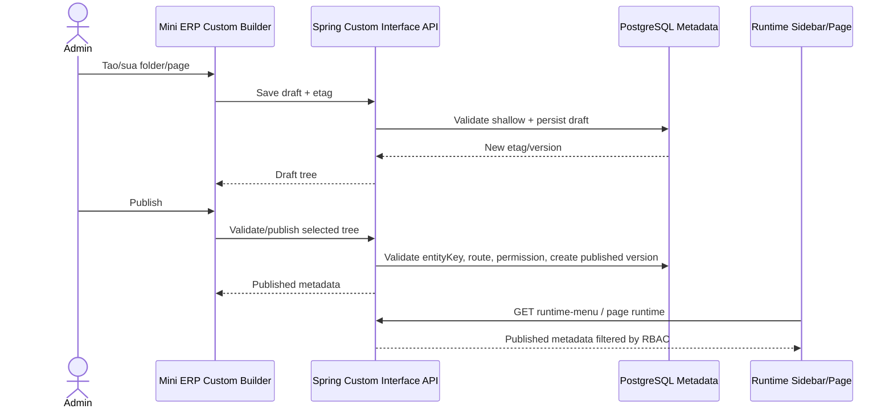

# SRS - Task001 Custom Interface Builder Backend Contract

> File: `docs/backend/srs/003_custom-interface-builder-task1.md`  
> Agent: SRS_WRITER  
> Ngay tao: 03/06/2026  
> Trang thai: DRAFT_FOR_PO_REVIEW  
> Pham vi: Backend/API contract de bien prototype Custom Builder menu/interface thanh cau hinh that co draft, publish, RBAC, version va runtime resolver.

---

## 1. Input And Traceability

| Nguon | Noi dung su dung |
| :--- | :--- |
| `docs/dev/common/001_custom-builder-program-overview.md` | Nguyen tac metadata-driven, backend authoritative, frontend route/menu static la GAP, khong cho SQL/script/code dong |
| `docs/dev/common/002_custom-builder-phase1-entity-record-foundation.md` | Entity/view/record foundation, route `/settings/custom-builder`, `/custom/:entityKey`, permission `can_manage_custom_builder`, `can_use_custom_entities` |
| `docs/frontend/srs/010_custom-builder-menu-interface-design.md` | UI folder/file builder, runtime sidebar merge, route resolver, suggested API list |
| `frontend/mini-erp/src/features/custom-builder/pages/CustomBuilderPage.tsx` | Prototype folder/page builder voi field `key`, `label`, `routePath`, `entityKey`, `pageType`, `status`, `version`, `etag`, validation client |
| `frontend/mini-erp/src/features/custom-builder/runtime/customMenuRuntime.ts` | Mock runtime catalog va filter role/permission cho custom folder/page |
| `frontend/mini-erp/src/features/custom-builder/pages/CustomRuntimePage.tsx` | Runtime resolver placeholder cho `/custom/:pageKey` va safe 403/404 state |
| `frontend/mini-erp/src/components/shared/layout/Sidebar.tsx` | Static menu + merge mock custom menu bang `getRuntimeCustomMenuForUser` |
| `frontend/mini-erp/src/App.tsx` | Route `/settings/custom-builder`, `/custom/:pageKey`, `/custom/:pageKey/:recordId` da ton tai |
| `backend/smart-erp/src/main/java/com/example/smart_erp/auth/support/MenuPermissionClaims.java` | JWT `mp` hien chua co `can_manage_custom_builder`, `can_use_custom_entities` |
| `frontend/mini-erp/src/features/auth/types/menuPermissions.ts` | Frontend permission type hien chua co 2 permission custom builder |

CodeGraph:

- `status --json`: initialized, no pending changes sau sync.
- `context "CustomBuilderPage custom builder route Sidebar can_manage_custom_builder custom interface task 1"`: key entry points `CustomBuilderPage`, `Sidebar`.
- `query "CustomBuilderPage App route Sidebar custom-builder permissions"`: xac nhan route/menu/runtime hook lien quan.

---

## 2. Executive Summary

Task 1 khong phai tao full low-code ERP engine. Task nay can backend contract cho lop `Menu taxonomy / Custom Interface Builder`:

- Owner/Admin tao folder menu cha va page menu con dang draft.
- Page lien ket toi `entityKey` cua custom entity foundation.
- Backend validate/publish metadata va tao immutable published version.
- Runtime sidebar/page chi doc published version theo quyen user.
- Frontend prototype hien tai bo mock local va goi API that.

Root cause cua khoang trong hien tai: frontend da co prototype va route runtime, nhung backend chua co source of truth. Neu chi tiep tuc sua UI, custom menu se van la mock, khong co RBAC backend, khong chong ghi de khi nhieu Admin sua, va khong co published version on dinh cho runtime.

---

## 3. Scope

### 3.1 In Scope

- API CRUD draft cho custom menu folder va custom menu page.
- API reorder folder/page.
- API validate va publish.
- API runtime menu theo user hien tai.
- API runtime page resolver theo `pageKey`.
- Database metadata cho folder/page draft va published version.
- RBAC backend cho builder va runtime.
- Version conflict bang `etag` hoac `version`.
- Audit event co ban cho create/update/reorder/publish/archive.

### 3.2 Out Of Scope

- Tao SQL table vat ly tu UI.
- User viet SQL, JavaScript, Groovy, SpEL, custom endpoint.
- Full field/view/record CRUD cua custom entity, tru phan reference toi `entityKey`.
- Workflow, connector, inventory effect.
- AI Copilot implementation. AI chi la extension point; neu lam sau phai giu LangGraph = orchestrator, Harness = executor/validation boundary, tools = scoped integration.
- Sua source runtime trong `ai_python/`.

---

## 4. GAP / Source Conflict Analysis

| ID | GAP | Evidence | Requirement |
| :--- | :--- | :--- | :--- |
| GAP-BE-01 | Chua co backend module/API cho custom menu/interface | `rg` khong thay controller/service/table custom menu trong backend | Tao package/API va migration cho Task 1 |
| GAP-BE-02 | UI dang dung mock local | `CustomBuilderPage.tsx` dung `initialFolders`; `customMenuRuntime.ts` dung `customRuntimeCatalog` | FE se thay bang API trong Tech Spec/Coding sau |
| GAP-BE-03 | Runtime route da co nhung resolver chua authoritative | `App.tsx` co `/custom/:pageKey`; `CustomRuntimePage.tsx` doc mock | Runtime resolver phai goi backend published metadata |
| GAP-BE-04 | Permission custom builder chua co trong JWT `mp` | `MenuPermissionClaims.MENU_KEYS` chua co `can_manage_custom_builder`, `can_use_custom_entities` | Them seed role + JWT claim + FE parser/type |
| GAP-BE-05 | Program overview noi frontend route/menu static, nhung Sidebar hien da merge mock custom menu | `Sidebar.tsx` merge `getRuntimeCustomMenuForUser` | Backend phai cap `GET /api/v1/custom/runtime-menu` de thay mock |
| GAP-BE-06 | Phase1 SRS dung `/custom/:entityKey`, UI SRS de xuat `/custom/:pageKey` | `002_custom-builder-phase1...` vs UI/current `App.tsx` | Task 1 chot runtime route theo `pageKey`; page luu `entityKey` rieng |

---

## 5. Persona And RBAC

| Persona | Quyen |
| :--- | :--- |
| Owner/Admin | Quan ly builder, save draft, reorder, validate, publish, archive |
| Staff/Warehouse | Khong thay builder mac dinh; chi thay runtime custom folder/page published neu co quyen menu + entity/data |

Permissions can them:

| Permission | Default |
| :--- | :--- |
| `can_manage_custom_builder` | Owner/Admin true, Staff false |
| `can_use_custom_entities` | Owner/Admin true; Staff/Warehouse tuy PO, default true neu duoc truy cap workspace custom |

Backend enforcement:

- Builder write endpoints: `@PreAuthorize("hasAuthority('can_manage_custom_builder')")`.
- Runtime menu/page: authenticated user, filter theo folder/page role/permission va entity permission.
- Endpoint runtime khong duoc tra metadata nhay cam khi user thieu quyen.

---

## 6. Business Flow



---

## 7. Capability Breakdown

| Capability | Mo ta |
| :--- | :--- |
| Folder draft | Tao/sua/archive folder menu cha, 1 cap folder |
| Page draft | Tao/sua/archive page menu con thuoc folder |
| Reorder | Luu sortOrder folder va page, co conflict guard |
| Validate | Validate key, route, entity link, status, RBAC, route collision |
| Publish | Tao published snapshot immutable cho runtime |
| Runtime menu | Tra folder/page published da filter theo user |
| Runtime page | Resolve `pageKey` thanh metadata page + entity/view published reference |
| Audit | Ghi event cho thay doi metadata |

---

## 8. Backend HTTP Contract

Base path: `/api/v1/custom`

### 8.1 Builder APIs

| Method | Path | Permission | Purpose |
| :--- | :--- | :--- | :--- |
| GET | `/menu-tree` | `can_manage_custom_builder` | Lay draft + published summary cho builder |
| POST | `/menu-folders` | `can_manage_custom_builder` | Tao folder draft |
| PATCH | `/menu-folders/{folderKey}` | `can_manage_custom_builder` | Cap nhat folder draft bang `etag` |
| POST | `/menu-pages` | `can_manage_custom_builder` | Tao page draft |
| PATCH | `/menu-pages/{pageKey}` | `can_manage_custom_builder` | Cap nhat page draft bang `etag` |
| POST | `/menu/reorder` | `can_manage_custom_builder` | Luu thu tu folder/page |
| POST | `/menu/validate` | `can_manage_custom_builder` | Validate cau hinh truoc publish |
| POST | `/menu/publish` | `can_manage_custom_builder` | Publish folder/page hop le |
| POST | `/menu/preview` | `can_manage_custom_builder` | Preview menu theo role/user |
| PATCH | `/menu-folders/{folderKey}/archive` | `can_manage_custom_builder` | Archive folder co impact check |
| PATCH | `/menu-pages/{pageKey}/archive` | `can_manage_custom_builder` | Archive page |

### 8.2 Runtime APIs

| Method | Path | Permission | Purpose |
| :--- | :--- | :--- | :--- |
| GET | `/runtime-menu` | authenticated | Lay dynamic custom menu published theo user |
| GET | `/pages/{pageKey}/runtime` | authenticated | Resolve runtime page cho `/custom/:pageKey` |

### 8.3 Request Examples

Create folder:

```json
{
  "key": "kiem_hang",
  "label": "Kiem hang",
  "icon": "folder",
  "description": "Nhom giao dien kiem hang.",
  "visibilityRoles": ["Owner", "Admin", "Warehouse"],
  "sortOrder": 0
}
```

Create page:

```json
{
  "parentKey": "kiem_hang",
  "key": "phieu_kiem_hang_hong",
  "label": "Phieu kiem hang hong",
  "routePath": "/custom/phieu_kiem_hang_hong",
  "entityKey": "damaged_stock_report",
  "pageType": "table_detail",
  "visibilityRoles": ["Owner", "Admin", "Warehouse"],
  "entityPermission": "can_manage_inventory",
  "dataPermission": "can_manage_inventory"
}
```

Patch with conflict guard:

```json
{
  "etag": "page-phieu-kiem-hang-hong-draft-6",
  "label": "Phieu kiem hang hong",
  "description": "Ghi nhan san pham hong."
}
```

Publish:

```json
{
  "scope": "all",
  "etag": "tree-draft-12"
}
```

### 8.4 Response Shape

Builder tree response:

```json
{
  "data": {
    "treeEtag": "tree-draft-12",
    "folders": [
      {
        "nodeType": "folder",
        "id": "folder-quality",
        "key": "kiem_hang",
        "label": "Kiem hang",
        "status": "Draft",
        "sortOrder": 0,
        "version": 4,
        "draftVersion": 4,
        "publishedVersion": 3,
        "hasDraft": true,
        "etag": "folder-kiem-hang-draft-4",
        "children": []
      }
    ]
  }
}
```

Runtime menu response:

```json
{
  "data": {
    "folders": [
      {
        "key": "kiem_hang",
        "label": "Kiem hang",
        "sortOrder": 0,
        "publishedVersion": 3,
        "children": [
          {
            "key": "phieu_kiem_hang_hong",
            "label": "Phieu kiem hang hong",
            "routePath": "/custom/phieu_kiem_hang_hong",
            "entityKey": "damaged_stock_report",
            "pageType": "table_detail",
            "publishedVersion": 5
          }
        ]
      }
    ]
  }
}
```

---

## 9. Error Contract

Client-visible messages must be Vietnamese and not expose stack trace, SQL, class, package, or raw infra detail.

| Status | Case | Message |
| :--- | :--- | :--- |
| 400 | Invalid request | `Du lieu khong hop le. Vui long kiem tra lai cac truong duoc danh dau.` |
| 401 | Expired/invalid token | `Phien dang nhap da het han. Vui long dang nhap lai.` |
| 403 | No builder/runtime permission | `Ban khong co quyen thuc hien thao tac nay.` |
| 404 | Runtime page missing | `Khong tim thay giao dien tuy chinh hoac giao dien chua duoc publish.` |
| 409 | Etag/version conflict | `Cau hinh da duoc cap nhat boi nguoi khac. Vui long tai lai truoc khi luu.` |
| 409 | Duplicate key/route | `Ma hoac route da duoc su dung. Vui long chon gia tri khac.` |
| 422 | Publish validation failed | `Cau hinh chua hop le de publish. Vui long kiem tra cac canh bao.` |

Field-level error shape:

```json
{
  "message": "Du lieu khong hop le. Vui long kiem tra lai cac truong duoc danh dau.",
  "errors": [
    { "field": "key", "message": "Ma chi gom chu thuong, so va dau gach duoi." },
    { "field": "entityKey", "message": "Entity lien ket chua ton tai hoac chua duoc publish." }
  ],
  "correlationId": "..."
}
```

---

## 10. Data And SQL Requirements

Proposed MVP tables:

| Table | Purpose |
| :--- | :--- |
| `custom_menu_folders` | Current draft/latest folder metadata |
| `custom_menu_pages` | Current draft/latest page metadata |
| `custom_menu_folder_versions` | Immutable folder published snapshots |
| `custom_menu_page_versions` | Immutable page published snapshots |
| `custom_menu_events` | Audit trail |

Minimum columns:

```sql
custom_menu_folders:
  id BIGSERIAL PRIMARY KEY
  folder_key VARCHAR(80) NOT NULL UNIQUE
  label VARCHAR(160) NOT NULL
  icon VARCHAR(80)
  description TEXT
  status VARCHAR(30) NOT NULL
  sort_order INT NOT NULL
  visibility_roles JSONB NOT NULL DEFAULT '[]'
  visibility_permissions JSONB NOT NULL DEFAULT '[]'
  draft_version INT NOT NULL DEFAULT 1
  published_version INT
  etag VARCHAR(160) NOT NULL
  created_by INT NOT NULL
  updated_by INT
  created_at TIMESTAMPTZ NOT NULL
  updated_at TIMESTAMPTZ NOT NULL
  archived_at TIMESTAMPTZ

custom_menu_pages:
  id BIGSERIAL PRIMARY KEY
  page_key VARCHAR(80) NOT NULL UNIQUE
  parent_folder_key VARCHAR(80) NOT NULL
  label VARCHAR(160) NOT NULL
  route_path VARCHAR(200) NOT NULL UNIQUE
  entity_key VARCHAR(80) NOT NULL
  page_type VARCHAR(40) NOT NULL
  status VARCHAR(30) NOT NULL
  sort_order INT NOT NULL
  visibility_roles JSONB NOT NULL DEFAULT '[]'
  entity_permission VARCHAR(80)
  data_permission VARCHAR(80)
  draft_version INT NOT NULL DEFAULT 1
  published_version INT
  etag VARCHAR(160) NOT NULL
  created_by INT NOT NULL
  updated_by INT
  created_at TIMESTAMPTZ NOT NULL
  updated_at TIMESTAMPTZ NOT NULL
  archived_at TIMESTAMPTZ
```

Indexes:

- Unique `custom_menu_folders(folder_key)` where `archived_at is null`.
- Unique `custom_menu_pages(page_key)` where `archived_at is null`.
- Unique `custom_menu_pages(route_path)` where `archived_at is null`.
- `custom_menu_pages(parent_folder_key, sort_order)`.
- Published version lookup by `page_key`, `published_version`.

Migration must also seed role permissions:

- Owner/Admin: `can_manage_custom_builder=true`, `can_use_custom_entities=true`.
- Staff: `can_manage_custom_builder=false`; `can_use_custom_entities` default to PO decision.

---

## 11. Business Rules

| ID | Rule |
| :--- | :--- |
| BR-CI-01 | MVP chi ho tro 1 cap folder cha va page con, khong nested folder |
| BR-CI-02 | Folder/page key chi gom lowercase, so va `_` |
| BR-CI-03 | Folder/page key unique trong custom builder |
| BR-CI-04 | Page route phai bat dau bang `/custom/` va khong trung static route trong `App.tsx` |
| BR-CI-05 | Route runtime chot theo `pageKey`; page luu `entityKey` rieng |
| BR-CI-06 | Page draft co the `NeedsConfig`, nhung publish bat buoc co `entityKey` ton tai va publishable |
| BR-CI-07 | Runtime chi doc published snapshots, khong doc draft |
| BR-CI-08 | Save/reorder/publish/archive phai gui `etag` de chong lost update |
| BR-CI-09 | Archive folder co page published phai co impact summary va confirm |
| BR-CI-10 | Backend la source of truth cho validate/publish/RBAC; frontend validation chi de ho tro UX |
| BR-CI-11 | Label/description la untrusted content, khong render HTML unsafe va khong dua sang AI nhu trusted instruction |
| BR-CI-12 | Dynamic menu load fail khong duoc lam mat static menu |

---

## 12. Frontend Specification For API Integration

Frontend prototype can duoc noi API theo nguyen tac:

- `CustomBuilderPage.tsx`: thay `initialFolders` bang TanStack Query `GET /api/v1/custom/menu-tree`.
- Save folder/page/reorder: mutation goi API va refetch/apply server response.
- Publish: goi validate/publish; neu 422 hien `validationSummary` theo section.
- `customMenuRuntime.ts`: thay `customRuntimeCatalog` bang runtime API cache.
- `Sidebar.tsx`: static menu van render; custom menu la optional section.
- `CustomRuntimePage.tsx`: goi `GET /api/v1/custom/pages/{pageKey}/runtime`; 404/403 giu safe state hien tai.
- `menuPermissions.ts` va parser JWT can them `can_manage_custom_builder`, `can_use_custom_entities`.

---

## 13. Non-functional Requirements

| Nhom | Requirement | Verify |
| :--- | :--- | :--- |
| Security | Moi write endpoint co `can_manage_custom_builder` | Security integration tests |
| Security | Runtime endpoint filter theo role + permission va khong expose hidden metadata | 403/404 tests |
| Reliability | Etag/version conflict khong overwrite metadata | 409 integration tests |
| Data integrity | Publish tao immutable snapshot | DB inspection + service tests |
| Performance | Runtime menu query chi tra published item, sorted, khong load draft lon | Repository tests/query plan |
| Audit | Create/update/reorder/publish/archive co event | Integration tests |
| UX contract | Error message tieng Viet, co field errors | Controller tests |

---

## 14. Test Strategy

| Test | Expected |
| :--- | :--- |
| Owner/Admin create folder | 201, folder draft co etag |
| Staff create folder | 403 |
| Duplicate page key | 409 business message |
| Invalid key `Phieu A` | 400 field-level |
| Publish page missing entity | 422 validationSummary |
| Publish valid page | published version tang, runtime menu thay page |
| Runtime menu for Staff without permission | Folder/page bi filter |
| Runtime page missing | 404 safe message |
| Runtime page no permission | 403 safe message, khong tra metadata chi tiet |
| Admin A/B conflict | Request etag cu tra 409 |
| Archive folder with published child | Reject or require confirm token theo Tech Spec |
| JWT claim extraction | New permission keys co trong `mp` va authorities |

---

## 15. Acceptance Criteria

```gherkin
Given Admin co can_manage_custom_builder
When Admin tao danh muc "Kiem hang" va giao dien "Phieu kiem hang hong"
Then backend luu draft metadata va tra etag/version moi
```

```gherkin
Given page custom co route "/custom/phieu_kiem_hang_hong"
When Admin publish page hop le
Then runtime menu API tra page do cho user co quyen
And runtime page API resolve theo pageKey "phieu_kiem_hang_hong"
```

```gherkin
Given Staff khong co quyen xem page custom
When Staff goi runtime menu hoac mo route custom
Then backend khong expose metadata nhay cam
And frontend hien 403/khong hien menu item
```

```gherkin
Given Admin A va Admin B cung sua mot page
When Admin B luu bang etag cu
Then backend tra 409 va khong ghi de thay doi cua Admin A
```

---

## 16. Open Questions

| ID | Cau hoi | Blocker | De xuat mac dinh |
| :--- | :--- | :---: | :--- |
| OQ-CI-01 | Staff co mac dinh `can_use_custom_entities=true` khong? | No | True neu PO muon workspace custom cho nhan vien kho; false neu chi Owner/Admin test phase dau |
| OQ-CI-02 | Page da publish co duoc doi `pageKey`/route khong? | No | Khoa key sau publish; doi route la action rieng co confirm |
| OQ-CI-03 | Dynamic custom menu chen root sidebar hay group rieng? | No | Theo code hien tai chen truoc Settings; neu Product chua chot thi group rieng `Tuy chinh` |
| OQ-CI-04 | Archive folder published can confirm token hay body `confirm=true`? | Yes for Tech Spec | Dung `confirmImpact=true` va backend tra impact summary lan dau |
| OQ-CI-05 | Validate `entityKey` co bat buoc ton tai neu entity foundation chua implement? | Yes for implementation order | Draft cho phep placeholder, publish bat buoc entity published |

---

## 17. Risks And Rollout

| Risk | Impact | Mitigation |
| :--- | :--- | :--- |
| Publish page tro toi entity chua co | Runtime hong | 422 khi publish |
| Permission key khong co trong JWT | FE hien sai menu/BE 403 | Seed Flyway + update `MenuPermissionClaims` + FE parser |
| Route collision voi static app route | User vao sai page | Backend validate prefix `/custom/` va unique route |
| Dynamic menu API loi lam sidebar trong | Mat navigation | FE render static menu doc lap, custom menu optional |
| Metadata label co script/html | XSS/prompt injection | Escape UI, sanitize khi dua vao AI phase sau |

Rollout:

1. Tao migration + permission claim.
2. Them backend module/API behind `CUSTOM_BUILDER_ENABLED`.
3. Noi FE builder voi API.
4. Noi runtime sidebar/page voi API.
5. Bat feature cho Owner/Admin truoc.

---

## 18. PO Sign-off Checklist

- [ ] Chot Task 1 chi gom custom interface/menu backend contract, chua full entity/workflow.
- [ ] Chot route runtime theo `pageKey`.
- [ ] Chot default permission cho Staff/Warehouse.
- [ ] Chot vi tri dynamic custom menu tren sidebar.
- [ ] Chot policy doi key/route sau publish.
- [ ] Chot confirm/archive behavior.

SRS handoff state: `READY_FOR_TECH_SPEC_AFTER_PO_REVIEW`.
