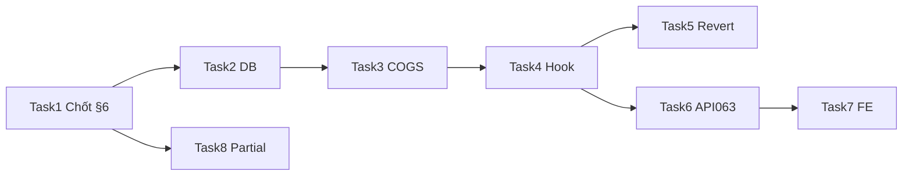

# SRS — PRD: Sổ cái tài chính — nguồn ghi đầy đủ theo nghiệp vụ (xuất kho, đơn hàng, thu chi, nhập kho)

> **File:** `docs/backend/srs/SRS_PRD_finance-ledger-unified-business-postings.md`  
> **Người soạn:** Agent `AI_PLANNER` (theo `AGENTS/AI_PLANNER_AGENT_INSTRUCTIONS.md` §4)  
> **Ngày:** 02/05/2026  
> **Trạng thái:** `Approved`  
> **PO duyệt (khi Approved):** PO — 02/05/2026 (OQ chốt theo §6; kiến trúc **phương án B**)  
> **Lựa chọn kiến trúc:** **Phương án B** — chi tiết §5.3; task breakdown §4.4 theo B.

---

## 0. Traceability & bối cảnh

| Nguồn | Ghi chú |
| :--- | :--- |
| Yêu cầu chủ sở hữu (phiên chat) | (1) Mọi **doanh thu / tiền ra vào** (và **giá trị vốn** liên quan) từ **các nghiệp vụ** phản ánh được trên **Sổ cái tài chính**; (2) **Phiếu xuất kho** khi **hoàn tất** hiện chưa sinh dòng sổ — PRD quy định **COGS** (§FR-1e); (3) Đồng bộ **đa quỹ** / immutability theo Task063 & PRD thu chi đa quỹ. |
| SRS nền — đọc sổ cái | [`SRS_Task063_finance-ledger-get-list.md`](SRS_Task063_finance-ledger-get-list.md) |
| SRS — thu chi & quỹ | [`SRS_PRD_cash-transactions-admin-unified-multi-fund.md`](SRS_PRD_cash-transactions-admin-unified-multi-fund.md) |
| API FE tham chiếu | `docs/frontend/api/API_Task063_finance_ledger_get_list.md` |
| Hiện trạng triển khai (tóm tắt) | Đã có ghi `FinanceLedger` từ: **Thu chi Completed**, **Nhập kho duyệt (PurchaseCost)**, **Đơn bán (SalesRevenue / Refund)**; **Phiếu xuất** — triển khai **COGS** theo §FR-1e / §6 (sau task BE). |
| Khóa trạng thái xuất kho (code) | `ManualDispatchStatuses.DELIVERED = "Delivered"`; phiếu gắn đơn khi hoàn tất có thể là **`Full`** — cùng nhóm “đã hoàn tất xuất” với `DispatchMutationPolicy.isCompletedLockedForMutation` |

---

## 4.1. Project Overview

**Core goal:** Thiết lập **một nguồn sự thật đọc** (`FinanceLedger`) cho **mọi biến động tiền / giá trị kinh tế** phải thấy trên **Sổ cái tài chính**, gồm **COGS khi phiếu xuất hoàn tất** (`Delivered` hoặc `Full` theo §0) và các khoảng trống đã ghi (thanh toán từng phần — **Phase 2** §FR-7), theo **phương án B**, **không** trùng doanh thu với `SalesOrder` đã ghi `SalesRevenue`, **idempotent** theo FR-4, **`fund_id`** theo §6 (OQ-2).

**Target users:** **Admin** (xem sổ cái theo policy JWT đã triển khai); các role có **`can_view_finance`** khi PO mở lại quyền đọc; hệ thống tự động ghi sổ (không UI trong PRD này).

---

## 4.2. Specifications

### 4.2.1 Functional requirements

**FR-1 — Phạm vi “có trên sổ cái”**  
Mỗi nghiệp vụ dưới đây phải có **ít nhất một** bản ghi `FinanceLedger` khi điều kiện kích hoạt thỏa (trừ khi §FR-8 “cấm trùng”):

| Mã | Nghiệp vụ | Điều kiện kích hoạt | `transaction_type` (CHECK hiện tại) | `reference_type` |
| :--- | :--- | :--- | :--- | :--- |
| FR-1a | Thu/chi thủ công | `CashTransactions.status = Completed` | `SalesRevenue` hoặc `OperatingExpense` | `CashTransaction` |
| FR-1b | Nhập kho đã duyệt | Phiếu nhập Approved | `PurchaseCost` | `StockReceipt` |
| FR-1c | Bán lẻ POS | Checkout thành công | `SalesRevenue` | `SalesOrder` |
| FR-1d | Bán buôn / trả hàng | `paymentStatus` tạo/chuyển **Paid** (theo luồng đã triển khai) | `SalesRevenue` / `Refund` | `SalesOrder` |
| FR-1e | **Xuất kho hoàn tất** | `stockdispatches.status` ∈ **`Delivered`**, **`Full`** (đồng bộ `DispatchMutationPolicy.isCompletedLockedForMutation`) | **`OperatingExpense`** (COGS; `amount` **âm**) | **`StockDispatch`** |

**FR-2 — Phiếu xuất (FR-1e) không tạo doanh thu**  
- Chỉ ghi **giá vốn** (COGS), **`amount` âm**.  
- **Không** ghi thêm `SalesRevenue` trên xuất kho (phương án A **loại** khỏi phạm vi Approved).

**FR-3 — Tính COGS cho FR-1e (đã chốt — §6 OQ-1)**  
- COGS = **tổng** (quantity × đơn giá vốn) **chỉ cho các dòng có đủ dữ liệu vốn** trong tầng inventory đã triển khai.  
- Dòng **thiếu** giá vốn: **không** cộng vào tổng; **ghi rõ** trong `description` (danh sách `product_id` / SKU hoặc `orderdetail_id` tối thiểu để tra cứu).  
- Nếu **mọi dòng** đều thiếu vốn: **vẫn** tạo **đúng một** bút `OperatingExpense` với **`amount = 0`**, `description` bắt đầu bằng tiền tố cố định **`[COGS: thiếu giá vốn]`** + mã phiếu xuất (để search/filter sau này).  
- **Không chặn** chuyển trạng thái hoàn tất xuất kho vì thiếu vốn (ưu tiên vận hành kho).

**FR-4 — Idempotency**  
- Mỗi `reference_type = 'StockDispatch'` + `reference_id = dispatch_id` có **tối đa một** bút COGS cho mỗi lần **đạt trạng thái hoàn tất** lần đầu; lặp lại không nhân đôi.  
- Revert / hủy giao: **không** `DELETE`; bù bằng dòng mới (§Task 5).

**FR-5 — Đa quỹ (đã chốt — §6 OQ-2)**  
- **Release 1 (Approved):** mọi dòng COGS từ xuất kho dùng **`fund_id` = quỹ mặc định** `(SELECT id FROM cash_funds WHERE is_default = TRUE ORDER BY id LIMIT 1)` — **cùng pattern** `StockReceipt` / các insert ledger hiện có.  
- **Release sau (ghi chú, không blocker R1):** map `fund_id` theo đơn (`order_id`) hoặc theo PRD đa quỹ POS khi có cột/lookup ổn định trên `salesorders` / dispatch.

**FR-6 — Đọc sổ cái Task063 (đã chốt — §6 OQ-3)**  
- Filter `referenceType` hỗ trợ **`StockDispatch`**.  
- Tham số `search` (ILIKE): áp trên **`fl.description`** và **`transaction_code`** (subquery/CTE hiện tại của list ledger) — **không bắt buộc** join thêm `stockdispatches` trong R1; mã phiếu xuất **phải** được nhúng trong `description` lúc insert COGS để tìm kiếm.

**FR-7 — Thanh toán từng phần (Wholesale)**  
- **Out of scope Release 1**; **Phase 2** — bảng sự kiện thanh toán hoặc tương đương (§4.4 Task 8).

**FR-8 — Trùng doanh thu**  
- Xuất kho gắn đơn đã có `SalesRevenue` trên `SalesOrder`: **chỉ** ghi COGS (B), không ghi thêm doanh thu.

### 4.2.2 Non-functional requirements (NFR)

| ID | Tiêu chí | Mục tiêu đo được |
| :--- | :--- | :--- |
| NFR-1 | `GET /api/v1/finance-ledger` p95 | **< 1 giây** với `limit ≤ 100`, DB dev ≥ 10k dòng, filter 90 ngày. |
| NFR-2 | Nhất quán giao dịch | Ghi sổ trong **cùng transaction** với finalize xuất kho; rollback nếu `INSERT financeledger` lỗi. |
| NFR-3 | Tỷ lệ lỗi server | **5xx** luồng ghi sổ tự động **< 0,1%** (sau release). |
| NFR-4 | Audit (đã chốt — §6 OQ-4) | **`created_by`** = **user thực hiện** thao tác finalize (`userId` từ JWT / policy parse user), **không** dùng user hệ thống ảo cho luồng này trong R1; job nền **không** trong phạm vi MVP. |
| NFR-5 | Immutability | Không `UPDATE/DELETE` `financeledger`; chỉ bù bằng dòng mới. |

---

## 4.3. Tech stack

- **Frontend / UI:** Mini-ERP React — `LedgerPage` / `LedgerTable`: filter + nhãn **`StockDispatch`**, COGS / chi phí vốn.  
- **Backend / business logic:** Spring Boot `smart-erp` — hook sau `finalizeDelivered` / tương đương cho `Full`; service tính COGS.  
- **Database & storage:** PostgreSQL; **`transaction_type`** hiện có đủ **`OperatingExpense`**; không mở CHECK mới trong R1 trừ khi SQL Agent phát hiện bất hợp lệ thực tế.

---

## 5. Kiến trúc — phương án & khuyến nghị

### 5.1 Phương án A — “Doanh thu khi giao hàng”

- **Loại** khỏi phạm vi Approved (trùng doanh thu với đơn Paid).

### 5.2 Phương án C — “Chỉ liên kết, không số tiền”

- **Loại** khỏi phạm vi Approved (không đáp ứng mục tiêu COGS).

### 5.3 Phương án B — “COGS khi xuất; doanh thu theo đơn/thu chi” *(Approved)*

- **Delivered / Full** → **`OperatingExpense`** (COGS), **`amount` âm**; **`reference_type = StockDispatch`**.  
- Doanh thu tiếp tục từ **SalesOrder** / thu chi.  
- **Rủi ro còn lại:** chất lượng nguồn vốn; giảm thiểu bằng §FR-3 + log mô tả.

---

## 4.4. Task breakdown & dependency graph

**Thứ tự phụ thuộc:** §6 đã chốt → DB → COGS domain → hook dispatch → API063 + FE → QA. Phase 2 tách.

- [x] **Task 1 — Chốt OQ (PO Approved)**
  - **Description:** OQ-1…OQ-4 đã ghi tại **§6**; đồng bộ vào FR-3, FR-5, FR-6, NFR-4.
  - **Input/Output:** Input: PRD Draft; Output: bản **Approved** này.
  - **Acceptance Criteria:** Không còn tham chiếu “TBD/OQ” mở trong §4.2–4.4.

- [ ] **Task 2 — DB: `reference_type` + index (nếu cần)**
  - **Description:** Đảm bảo `financeledger.reference_type` nhận `StockDispatch`; index nếu filter theo `reference_type` tăng tải.
  - **Input/Output:** Input: schema hiện tại; Output: Flyway (nếu cần) + rollback.
  - **Acceptance Criteria:** `flyway migrate` OK; CHECK `transaction_type` không phá vỡ.

- [ ] **Task 3 — Domain: tính COGS từ phiếu xuất**
  - **Description:** Service: `dispatchId` → `totalCogs`, danh sách dòng thiếu vốn (theo FR-3).
  - **Input/Output:** Input: ID phiếu hoàn tất; Output: DTO nội bộ.
  - **Acceptance Criteria:** Unit test ≥ 5 case theo FR-3 (đủ vốn, thiếu một phần, toàn thiếu, đa dòng, quantity 0).

- [ ] **Task 4 — Ghi `FinanceLedger` khi dispatch hoàn tất**
  - **Description:** Hook sau finalize; idempotent FR-4; `fund_id` FR-5; `created_by` NFR-4.
  - **Input/Output:** Input: lifecycle dispatch; Output: `financeledger.id`.
  - **Acceptance Criteria:** Integration: `Delivered`/`Full` → đúng 1 dòng COGS; idempotent; rollback khi INSERT fail.

- [ ] **Task 5 — Đảo bút khi revert** *(nếu nghiệp vụ cho phép revert)*
  - **Description:** Dòng bù dấu đối ứng, không DELETE (FR-4 / NFR-5).
  - **Input/Output:** Input: sự kiện revert; Output: dòng sổ mới.
  - **Acceptance Criteria:** Test tổng `amount` theo `dispatch_id` sau revert.

- [ ] **Task 6 — API Task063 + tài liệu amend**
  - **Description:** `referenceType=StockDispatch`; `search` theo FR-6.
  - **Input/Output:** Input: contract Task063; Output: MD API + test.
  - **Acceptance Criteria:** WebMvc filter + search; docs đồng bộ.

- [ ] **Task 7 — FE Sổ cái**
  - **Description:** Nhãn `StockDispatch` / COGS; filter mới.
  - **Input/Output:** Input: API; Output: PR UI.
  - **Acceptance Criteria:** Admin thấy dòng sau xuất hoàn tất trong cửa sổ 90 ngày mặc định.

- [ ] **Task 8 — Phase 2: Thanh toán từng phần (FR-7)**
  - **Description:** Bảng thanh toán từng đợt + ghi `SalesRevenue` theo đợt.
  - **Input/Output:** Input: FR-7; Output: migration + service.
  - **Acceptance Criteria:** Partial→Paid không double full `final_amount`.

**Dependency graph (mermaid):**

---

## 6. Quyết định đã chốt (OQ — Approved)

| ID | Quyết định | Chi tiết triển khai |
| :--- | :--- | :--- |
| **OQ-1** | Thiếu giá vốn | **Không chặn** hoàn tất xuất. Cộng COGS **chỉ** dòng có vốn; mô tả dòng thiếu; nếu **toàn phiếu** thiếu → **một** dòng `amount = 0`, tiền tố **`[COGS: thiếu giá vốn]`** + mã phiếu. |
| **OQ-2** | `fund_id` | **R1:** luôn **quỹ mặc định** (`cash_funds.is_default`, cùng pattern nhập kho). **Sau R1:** map theo đơn / policy đa quỹ (ghi trong FR-5). |
| **OQ-3** | `search` | **R1:** ILIKE trên **`description`** và **`transaction_code`** trong query list ledger; mã phiếu xuất **nhúng trong `description`** khi insert. |
| **OQ-4** | `created_by` | **Luôn** `userId` người thực hiện finalize; **không** system user cho MVP; không job nền R1. |

---

**Tổng kết**

- **Đã làm:** §6 chốt OQ; FR/NFR/Task đồng bộ; trạng thái **Approved** + PO line; Task 1 đánh dấu hoàn thành; FR-1e khóa **`Delivered` / `Full`**.  
- **Còn:** Thực thi Task 2–7 (BE/FE/API); Task 8 Phase 2.  
- **Rủi ro:** COGS phụ thuộc dữ liệu vốn — giảm bằng mô tả thiếu + dòng 0 theo OQ-1.
