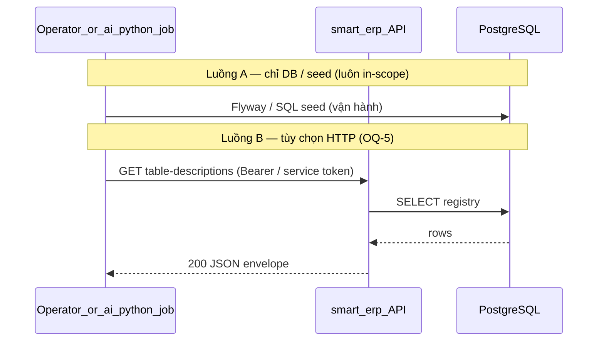

# SRS — Task103 — Registry mô tả bảng PostgreSQL cho AI (Spring sở hữu DDL)

> **File:** `docs/backend/srs/SRS_Task103_ai-table-description-registry.md`  
> **Người soạn:** Agent BA  
> **Ngày:** 11/05/2026  
> **Trạng thái:** Draft  
> **PO duyệt (khi Approved):** *(chưa)*

---

## 0. Đầu vào & traceability

| Nguồn | Đường dẫn / ghi chú |
| :--- | :--- |
| Plan tính năng | [`../../../docs/plans/existing/feature/spring_ai_table_description_registry.plan.md`](../../../docs/plans/existing/feature/spring_ai_table_description_registry.plan.md) |
| API spec (`docs/frontend/api`) | **GAP** — chưa có `API_Task103_*.md`; khi triển khai HTTP, Agent API bổ sung và liên kết ngược vào §0. |
| Consumer (Python / merge schema) | `SchemaArtifact` / `TableMeta` + `ColumnMeta.description` (V45) — [`../../../ai_python/app/graph/dbmeta.py`](../../../ai_python/app/graph/dbmeta.py), [`../../../ai_python/app/graph/pg_schema_context.py`](../../../ai_python/app/graph/pg_schema_context.py); không DDL trong `ai_python`. |
| Flyway | Migration **V44** — [`../../smart-erp/src/main/resources/db/migration/V44__task103_ai_table_description_registry.sql`](../../smart-erp/src/main/resources/db/migration/V44__task103_ai_table_description_registry.sql) |
| Flyway | Migration **V45** — [`../../smart-erp/src/main/resources/db/migration/V45__ai_column_description_registry.sql`](../../smart-erp/src/main/resources/db/migration/V45__ai_column_description_registry.sql) |
| Envelope JSON | [`../../../docs/frontend/api/API_RESPONSE_ENVELOPE.md`](../../../docs/frontend/api/API_RESPONSE_ENVELOPE.md) |

---

## 1. Tóm tắt điều hành

- **Vấn đề:** Pipeline SQL trong `ai_python` cần **mô tả nghiệp vụ theo từng bảng** trong prompt, nhưng LLM **không** được kết nối trực tiếp PostgreSQL. Mô tả cần nguồn dữ liệu **do hệ thống ERP sở hữu** (DDL, quyền, vận hành).
- **Mục tiêu:** `smart-erp` tạo và duy trì **một bảng registry** (tối thiểu: khóa chính + tên bảng + `description` text), **unique** trên tên bảng, **index** phục vụ lookup; quyền DB đọc phù hợp; **tùy chọn** endpoint nội bộ bảo vệ trả JSON cho job merge YAML/schema. **Không** đặt migration tạo bảng này trong `ai_python`.
- **Đối tượng:** DevOps/Backend (Flyway), team AI/Python (tiêu thụ hoặc gọi API nội bộ), PO (chốt tên vật lý + RBAC API).

### 1.1 Giao diện Mini-ERP

**§1.1 không áp dụng** — không có màn hình `mini-erp` trong phạm vi plan; chỉ persistence backend và (tuỳ chọn) API nội bộ / handoff vận hành.

---

## 2. Bóc tách nghiệp vụ (capabilities)

| # | Capability | Kích hoạt bởi | Kết quả mong đợi | Ghi chú |
| :---: | :--- | :--- | :--- | :--- |
| C1 | Tạo cấu trúc registry trong PostgreSQL | Flyway migrate | Bảng tồn tại; UNIQUE + CHECK lowercase — **V44** | `public.ai_table_description` |
| C2 | Đảm bảo tối đa một dòng mô tả cho mỗi tên bảng nghiệp vụ | INSERT/UPDATE (seed hoặc SQL) | Unique vi phạm → từ chối ở tầng DB | Cột `table_name` chỉ chữ thường (CHECK) — join YAML nên dùng `name` lowercase |
| C3 | Đọc toàn bộ (hoặc subset) registry trong ứng dụng Spring | Service / repository read-only | Dữ liệu đủ cột tối thiểu để merge mô tả | Không bắt buộc JPA nếu team chọn JDBC |
| C4 | (Tuỳ chọn) Xuất JSON có xác thực | Client nội bộ / `ai_python` job | 200 + envelope §8; 401/403 nếu không đủ auth | OQ-5 — có thể lùi sang v2 |
| C5 | Seed hoặc hướng dẫn vận hành | Migration / `data.sql` / runbook | ≥1 dòng mẫu **hoặc** tài liệu INSERT mẫu | Nghiệm thu plan |
| C6 | Handoff cho Python | Tài liệu trong repo | Một nguồn ghi rõ **tên bảng vật lý**, **tên cột join**, ví dụ JSON (nếu có API) | Todo `docs-handoff` trong plan |

---

## 3. Phạm vi

### 3.1 In-scope

- Migration Flyway trong `backend/smart-erp` tạo bảng registry + unique + index.
- Entity/repository hoặc tương đương **read-only** cho use case đọc danh sách.
- Bảo mật: không public không auth; nếu có HTTP export thì **nội bộ** + Spring Security (role hẹp và/hoặc service token — PO chốt).
- Tài liệu handoff: join với `SchemaArtifact.tables[].name` (field `name` trong [`TableMeta`](../../../ai_python/app/graph/dbmeta.py)).

### 3.2 Out-of-scope

- LangGraph, `gen_sql`, triển khai `SchemaLoader` / merge YAML trong Python (plan AGENT_SQL riêng).
- Thay đổi hợp đồng executor SQL read-only hiện có (`AiDbReadonlyController` / MCP) **trừ** khi task tách được review và traceability cập nhật.

### 3.3 Registry cột `ai_column_description` (V45)

- **Mục tiêu:** mô tả nghiệp vụ **theo cột** `(table_name, column_name)` — bổ sung cho `ai_table_description` (cấp bảng).
- **Ràng buộc:** `table_name`, `column_name` **chữ thường**, `UNIQUE (table_name, column_name)`; `FOREIGN KEY (table_name) REFERENCES ai_table_description(table_name) ON DELETE CASCADE`.
- **Consumer:** `ai_python` đọc qua DSN metadata (`build_schema_artifact_from_postgres`), merge vào `ColumnMeta.description`, hiển thị trong `format_schema_block` khi bật enriched schema (`SQL_ENRICHED_SCHEMA_PROMPT`).
- **Vận hành:** seed tối thiểu trong Flyway V45; mở rộng bằng `INSERT` idempotent hoặc script nội bộ. REST CRUD **ngoài** phạm vi V45.

---

## 4. Câu hỏi làm rõ cho PO (Open Questions)

| ID | Câu hỏi | Ảnh hưởng nếu không trả lời | Blocker? |
| :--- | :--- | :--- | :---: |
| OQ-1 | **Schema + tên bảng vật lý** cuối cùng? (vd. `public.ai_table_description` vs schema riêng `ai_meta`) | Migration + doc handoff không chốt được | ~~Có~~ → **Đã chốt V44:** `public.ai_table_description` |
| OQ-2 | Tên cột khóa join: `table_name` hay tên khác? | Contract JSON/SQL không thống nhất | ~~Có~~ → **Đã chốt V44:** `table_name` |
| OQ-3 | So khớp `TableMeta.name`: **phân biệt hoa thường** hay chuẩn hóa `lower()` (Python `allowlist_table_names()` dùng lowercase)? | Merge sai bảng hoặc miss mô tả | ~~Có~~ → **Đã chốt V44:** lưu **chỉ lowercase** (`CHECK (table_name = lower(table_name))`) |
| OQ-4 | Kiểu PK: `bigserial` vs `uuid`? | Chi tiết migration | ~~Không~~ → **Đã chốt V44:** `BIGSERIAL` |
| OQ-5 | V1 có **HTTP export** không? Nếu có: **JWT role** (vd. Admin) vs **service token** vs chỉ **SQL/ACL mạng**? | §6, §8, Security config | **Có** nếu ship API trong cùng epic |
| OQ-6 | Ghi/sửa mô tả: chỉ qua SQL/migration hay cần **REST admin CRUD** trong epic này? | Scope Dev | Không |
| OQ-7 | Giới hạn độ dài `description`: chỉ app, `CHECK` SQL, hay không giới hạn? | Validation + UX nếu có form sau này | Không |
| OQ-8 | Đường dẫn consumer plan ngoài repo (trong frontmatter plan) — có **mirror** vào `docs/` hoặc `docs/ai-python` không? | Traceability CI | Không |

**Trả lời PO (điền khi chốt):**

| ID | Quyết định PO | Ngày |
| :--- | :--- | :--- |
| OQ-1 | Schema `public`, bảng `ai_table_description` — Flyway V44 | 11/05/2026 |
| OQ-2 | Cột khóa join: `table_name` (`VARCHAR(128)`) | 11/05/2026 |
| OQ-3 | Chuẩn hóa lowercase tại DB; YAML/Python dùng `tables[].name` trùng **chữ thường** tên vật lý PG | 11/05/2026 |
| OQ-4 | PK: `id BIGSERIAL` | 11/05/2026 |
| OQ-5 | *(pending — API tùy chọn)* |  |

---

## 5. Phân tích scope tệp & bằng chứng (Evidence scope)

### 5.1 Tài liệu đã đối chiếu (read)

- `docs/plans/existing/feature/spring_ai_table_description_registry.plan.md`
- `ai_python/app/graph/dbmeta.py` (`SchemaArtifact`, `TableMeta.name`)
- `docs/frontend/api/API_RESPONSE_ENVELOPE.md`
- `V44__task103_ai_table_description_registry.sql` (đã tạo)
- `V45__ai_column_description_registry.sql` (registry cột; consumer `ColumnMeta.description`)

### 5.2 Mã / migration dự kiến (write / verify)

- `backend/smart-erp/src/main/resources/db/migration/V44__task103_ai_table_description_registry.sql` (**đã có**).
- `backend/smart-erp/src/main/resources/db/migration/V45__ai_column_description_registry.sql` (**đã có** — merge prompt trong `ai_python`).
- `backend/smart-erp/src/main/java/com/example/smart_erp/**` — entity/repository/service (read); tuỳ chọn controller + DTO.
- `JwtResourceServerWebSecurityConfiguration` (hoặc tương đương) nếu thêm route cần JWT/role.
- `application*.properties` nếu cần feature flag hoặc profile.
- Handoff: cập nhật `docs/plans/existing/feature/…` hoặc `docs/backend/…` theo quy ước team.

### 5.3 Rủi ro phát hiện sớm

- Endpoint dưới `/api/v1/ai/db` hiện có pattern **POST** và cân nhắc `permitAll` cho Python — registry **không** được copy nhầm pattern “mở” nếu PO yêu cầu auth chặt (mâu thuẫn với relay SSE) — cần path + security **riêng** theo OQ-5.
- Drift **casing** giữa Postgres `table_name` và YAML `tables[].name`.

---

## 6. Persona & RBAC

| Vai trò | Quyền / điều kiện | HTTP (khi có API) |
| :--- | :--- | :--- |
| Chưa xác thực / JWT hết hạn | — | **401** (`UNAUTHORIZED`) |
| Đã xác thực nhưng không đủ quyền export (theo OQ-5) | — | **403** (`FORBIDDEN`) |
| Service nội bộ / role được PO chỉ định | Đọc registry | **200** |

**Ghi chú:** Claim cụ thể (`role` vs `mp` / `can_*`) ghi vào đây sau khi OQ-5 được điền; đồng bộ với file `API_Task103_*` khi tạo.

---

## 7. Actor & luồng nghiệp vụ

### 7.1 Danh sách actor

| Actor | Mô tả ngắn |
| :--- | :--- |
| Operator / job `ai_python` | Tiêu thụ danh sách mô tả để merge schema offline hoặc gọi API (tuỳ chọn) |
| API (`smart-erp`) | (Tuỳ chọn) xác thực + đọc DB + trả JSON |
| Database | PostgreSQL — bảng registry |
| DBA / Dev | Chạy Flyway, seed |

### 7.2 Luồng chính (narrative)

1. Flyway áp dụng migration → bảng registry tồn tại kèm unique/index.
2. Seed (migration hoặc script) bổ sung ít nhất một dòng hoặc runbook INSERT.
3. (Tuỳ chọn) Client có credential gọi `GET` endpoint nội bộ → nhận danh sách `{ tableName, description }` (tên field JSON có thể chốt trong `API_Task103_*`).
4. Python merge theo quy ước OQ-3 vào artifact YAML / bộ nhớ `SchemaArtifact`.

### 7.3 Sơ đồ



---

## 8. Hợp đồng HTTP & ví dụ JSON

> **Phạm vi:** Mục §8 chỉ bắt buộc triển khai khi PO chọn **có** API export (OQ-5). Nếu v1 chỉ có DB + handoff SQL, Dev/Test dùng AC §11 (DB) và bỏ qua assert HTTP cho đến khi có spec `API_Task103_*`.

### 8.1 Tổng quan endpoint (đề xuất — chờ OQ-5 / API doc)

| Thuộc tính | Giá trị đề xuất |
| :--- | :--- |
| Method + path | `GET /api/v1/ai/internal/table-descriptions` *(path cuối có thể đổi khi tạo `API_Task103_*`)* |
| Auth | Bearer JWT (role/service theo OQ-5) — **không** `permitAll` công khai |
| Content-Type | `application/json; charset=UTF-8` |

### 8.2 Request — schema logic

| Field / param | Vị trí | Kiểu | Bắt buộc | Validation | Ghi chú |
| :--- | :--- | :--- | :---: | :--- | :--- |
| — | — | — | — | GET không body | Phân trang có thể bổ sung sau (query `page`/`limit`) |

### 8.3 Request — ví dụ JSON

Không có body cho `GET`.

### 8.4 Response thành công — **ví dụ JSON đầy đủ** (`200`)

```json
{
  "success": true,
  "data": {
    "items": [
      {
        "tableName": "products",
        "description": "Danh mục hàng hóa master, SKU và giá niêm yết."
      },
      {
        "tableName": "inventory_stock",
        "description": "Tồn kho theo kho và sản phẩm."
      }
    ]
  },
  "message": "Thao tác thành công"
}
```

| Field trong `data.items[]` | Kiểu | Bắt buộc | Ghi chú |
| :--- | :--- | :---: | :--- |
| `tableName` | string | Có | Giá trị join với `SchemaArtifact.tables[].name` theo OQ-3 |
| `description` | string | Có | Nguồn từ cột `description` (hoặc tên cột chốt OQ-2) |

### 8.5 Response lỗi — **ví dụ JSON đầy đủ**

**401 — chưa đăng nhập / token hết hạn**

```json
{
  "success": false,
  "error": "UNAUTHORIZED",
  "message": "Phiên đăng nhập đã hết hạn. Vui lòng đăng nhập lại."
}
```

**403 — không đủ quyền**

```json
{
  "success": false,
  "error": "FORBIDDEN",
  "message": "Bạn không có quyền thực hiện thao tác này."
}
```

**500 — lỗi không lường trước**

```json
{
  "success": false,
  "error": "INTERNAL_SERVER_ERROR",
  "message": "Không thể hoàn tất thao tác. Vui lòng thử lại sau hoặc liên hệ quản trị viên."
}
```

### 8.6 Ghi chú envelope

- Bám [`API_RESPONSE_ENVELOPE.md`](../../../docs/frontend/api/API_RESPONSE_ENVELOPE.md) §2 (thành công) / §3 (lỗi).  
- **GAP:** Chưa có `docs/frontend/api/API_Task103_*.md` — cần bổ sung trước khi coi hợp đồng HTTP là nguồn sự thật cho FE/bridge.

---

## 9. Quy tắc nghiệp vụ (bảng)

| Mã | Điều kiện | Hành động / kết quả |
| :--- | :--- | :--- |
| BR-1 | Cùng một giá trị tên bảng (theo quy ước OQ-3) | Không quá một dòng trong registry (unique DB) |
| BR-2 | Tiêu thụ cho AI | Chỉ dùng mô tả **nghiệp vụ**; không thay thế allowlist cột / kiểm tra SQL |

---

## 10. Dữ liệu & SQL tham chiếu (phối hợp Agent SQL)

> **Sự thật triển khai:** Flyway **V44** (`V44__task103_ai_table_description_registry.sql`).

### 10.1 Bảng / quan hệ

| Bảng | Read / Write | Ghi chú |
| :--- | :--- | :--- |
| `public.ai_table_description` | App: read; vận hành: INSERT/UPDATE (SQL/admin sau) | `id BIGSERIAL`, `table_name VARCHAR(128) NOT NULL` + `UNIQUE` + `CHECK` lowercase + nonempty trim, `description TEXT NOT NULL DEFAULT ''`, `created_at` / `updated_at` |

### 10.2 SQL / ranh giới transaction

```sql
-- Đọc toàn bộ cho merge (ví dụ; tên bảng/cột theo migration cuối cùng)
SELECT table_name, description
FROM ai_table_description
ORDER BY table_name;
```

### 10.3 Index & hiệu năng

- `UNIQUE (table_name)` — PostgreSQL tạo unique index; đủ cho lookup theo tên bảng.

### 10.4 Kiểm chứng dữ liệu cho Tester

- Sau migrate: bảng `ai_table_description` tồn tại; seed **V44** chèn mô tả cho các bảng nghiệp vụ chính (idempotent `WHERE NOT EXISTS` theo `table_name`).
- Thử `INSERT` trùng `table_name` hoặc vi phạm `CHECK` (chữ hoa) → từ chối.

---

## 11. Acceptance criteria (Given / When /Then)

```text
Given môi trường dev PostgreSQL và chuỗi Flyway hợp lệ
When chạy migration Task103
Then bảng registry tồn tại với UNIQUE trên cột tên bảng và index theo SRS/migration
```

```text
Given seed hoặc INSERT mẫu theo handoff
When SELECT toàn bộ registry
Then trả về đủ cột để map sang SchemaArtifact.tables[].name (theo OQ-3)
```

```text
Given PO đã chọn triển khai API (OQ-5 = có)
When gọi GET endpoint không kèm JWT hợp lệ
Then HTTP 401 và envelope lỗi khớp §8.5
```

```text
Given PO đã chọn triển khai API và JWT hợp lệ nhưng thiếu quyền export
When gọi GET endpoint
Then HTTP 403 và envelope lỗi khớp §8.5
```

```text
Given PO đã chọn triển khai API và caller được phép
When gọi GET endpoint
Then HTTP 200, success true, data.items là mảng các object có tableName và description
```

```text
Given tài liệu handoff đã merge vào repo
When team Python áp dụng merge mô tả
Then không mâu thuẫn với quy ước casing OQ-3
```

---

## 12. GAP & giả định

| GAP / Giả định | Tác động | Hành động đề xuất |
| :--- | :--- | :--- |
| Chưa có `API_Task103_*.md` | FE/bridge không có spec chính thức | Tạo API markdown khi OQ-5 = có HTTP |
| Đường dẫn consumer plan ngoài repo | Traceability | Mirror hoặc link trong `docs/ai-python` / `docs/plans/existing` |

---

## 13. PO sign-off (chỉ điền khi Approved)

- [ ] Đã trả lời / đóng các **OQ blocker** (OQ-1…OQ-4 đã chốt bằng V44; **OQ-5** nếu ship API)
- [ ] JSON / DB handoff khớp ý đồ sản phẩm
- [ ] Phạm vi In/Out đã đồng ý

**Chữ ký / nhãn PR:** *(pending)*
