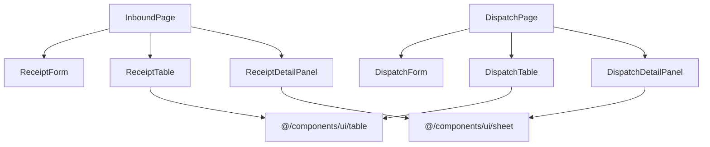

# CODEBASE ANALYSIS REPORT - Task039: Inbound & Dispatch CRUD

**Status: Completed**
**Author:** Agent CODEBASE_ANALYST

## 1. Introduction
Phân tích codebase sau khi implement CRUD + workflow cho Phiếu Nhập Kho (Inbound) và Phiếu Xuất Kho (Dispatch). Toàn bộ 12 Use Cases (UC01-UC12) đã được implement đầy đủ UI, Logic và Test.

## 2. Inventory & Entry Points (Phase 1)
- **Primary Pages**:
  - `mini-erp/src/features/inventory/pages/InboundPage.tsx` — Phiếu nhập kho
  - `mini-erp/src/features/inventory/pages/DispatchPage.tsx` — Phiếu xuất kho
- **Core Components**:
  - `ReceiptForm.tsx`: Form tạo/sửa phiếu nhập
  - `ReceiptTable.tsx`: Danh sách phiếu nhập
  - `ReceiptDetailPanel.tsx`: Sheet chi tiết + workflow actions
  - `DispatchForm.tsx`: Form tạo/xác nhận phiếu xuất
  - `DispatchTable.tsx`: Danh sách phiếu xuất
  - `DispatchDetailPanel.tsx`: Sheet chi tiết xuất kho

## 3. Module Mapping & Dependencies (Phase 2)

## 4. Business Logic Extraction (Phase 3 & 4)
- **Inbound Workflow**: Draft → Pending → Approved (cộng tồn) / Rejected
- **Dispatch Workflow**: Pending → Full (trừ tồn) / Partial (Backorder) → Cancelled
- **RBAC**: Owner có quyền Approve/Reject/Delete; Staff chỉ tạo/sửa Draft và Submit
- **Inventory**: Tự động cập nhật khi Approve (inbound) hoặc Confirm (dispatch)
- **Audit**: Mọi thay đổi được ghi vào `inventory_logs`

## 5. Contract Surfaces (Phase 6)
- **ReceiptForm Contract**: Input `StockReceiptFormData`, Output `onSubmit(data)`
- **DispatchForm Contract**: Input `DispatchFormData`, Output `onConfirm(data)`
- **DetailPanel Contract**: Input `{ receipt, isOpen, onClose, canApprove }`

## 6. Brittleness Hotspots (Phase 7)
- **CSS Coupling**: Sticky header phụ thuộc `overflow-y-auto` của container cha
- **Window Reload**: UI dùng `window.location.reload()` cho demo — cần thay bằng invalidation
- **Hardcoded RBAC**: `canApprove` được hardcode `true` trong InboundPage — cần kết nối Auth store

## 7. Test Assessment (Phase 8 & 9)
- **Unit Tests**: 12 UCs đã implement UI + Logic test
- **E2E Tests**: Script sẵn sàng cho Playwright (dispatch, inbound specs)
- **Gaps**: Chưa test RBAC enforcement trên button visibility

## 8. Recommendations (Phase 10)
1. Thay `window.location.reload()` bằng `queryClient.invalidateQueries()`
2. Kết nối `canApprove` với Auth store thay vì hardcode
3. Tách workflow stepper thành component riêng cho Sales Order

---
**CODEBASE_ANALYST done.** Brittle zones: 2 (CSS sticky, window reload). Risks: 1 (Hardcoded RBAC).
