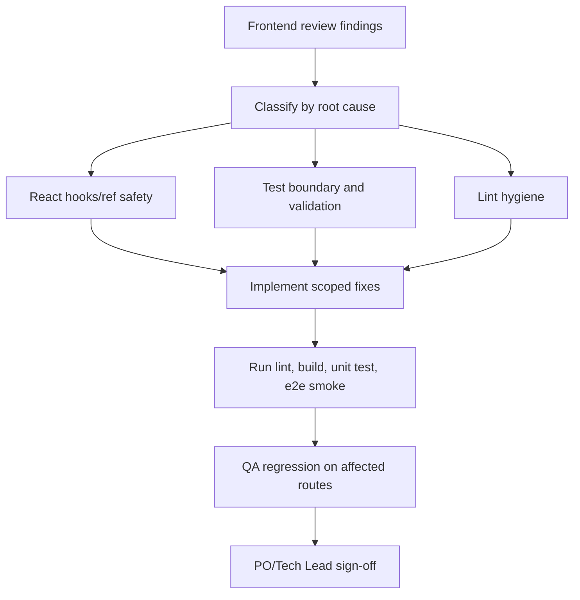

# SRS - Task083: Frontend Quality Gate Fixes

> **File**: `docs/frontend/srs/SRS_Task083_frontend-quality-gate-fixes.md`  
> **Scope**: Frontend Mini-ERP  
> **Nguoi viet**: Agent BA / Tech Lead  
> **Ngay cap nhat**: 30/05/2026  
> **Trang thai**: Draft  
> **PO approval**: Pending

---

## 0. Input & Traceability

| Source | Path / note |
| :--- | :--- |
| Brief / ticket | "Doc toan bo frontend va do tim loi" + ket qua review loi frontend |
| UI index | `docs/frontend/mini-erp/features/FEATURES_UI_INDEX.md` |
| Frontend app | `frontend/mini-erp` |
| Lint config | `frontend/mini-erp/eslint.config.js` |
| Vite/Vitest config | `frontend/mini-erp/vite.config.ts` |
| Unit tests | `frontend/mini-erp/src/**/*.test.ts` |
| Playwright tests | `frontend/mini-erp/e2e/*.spec.ts` |
| Affected pages/components | `settings/components/EmployeeDetailDialog.tsx`, `product-management/pages/*Page.tsx`, `orders/hooks/*Query.ts`, `approvals/pages/*Page.tsx`, `cashflow/pages/TransactionsPage.tsx`, `inventory/**` |

### 0.1 GAP / Source Conflicts

| ID | Conflict | Evidence A | Evidence B | SRS handling |
| :--- | :--- | :--- | :--- | :--- |
| GAP-1 | Unit test validation khong dung source of truth production | `customers.test.ts`, `suppliers.test.ts` tu dinh nghia `validateCustomer` / `validateSupplier` | Form thuc te dung Zod schema trong `CustomerForm.tsx`, `SupplierForm.tsx` | Chuyen validation rule dung chung sang module testable hoac export schema co kiem soat |
| GAP-2 | Vitest dang thu chay Playwright spec | `npm test -- --run` fail o `e2e/*.spec.ts` voi loi `Playwright Test did not expect test() to be called here` | `vite.config.ts` khong co `test.include/exclude`; `package.json` khong co script e2e rieng | Tach unit test va e2e test bang config/scripts |
| GAP-3 | Task numbering sau Task082 chua co ticket chinh thuc trong repo | SRS gan nhat la `SRS_Task082_standardize-product-ui.md` | Khong co task tracker noi bo trong workspace | Dung `Task083` tam thoi, PO co the doi ma task truoc khi approve |

---

## 1. Executive Summary

- **Problem**: Frontend hien tai build production van pass, nhung quality gate khong pass: ESLint co nhieu loi React rule, unit test fail, va Vitest bi cau hinh quet nham Playwright e2e.
- **Business goal**: Dam bao Mini-ERP co pipeline kiem thu on dinh truoc khi sua tiep cac tinh nang ERP, giam nguy co white screen/runtime crash va false confidence tu test.
- **Primary users**: Dev, QA, Tech Lead; gian tiep la Owner/Admin/Staff su dung cac man Mini-ERP.
- **Expected outcome**: `npm run build`, `npm run lint`, unit test va e2e test co ranh gioi ro rang; cac loi React hook/ref nguy hiem duoc xu ly theo pattern dung.
- **Explicitly not included**: Khong thay doi business API backend, schema DB, RBAC server-side, AI LangGraph/Harness runtime, hoac UI redesign.

---

## 2. Scope

### 2.1 In Scope

- Fix loi hook-order co nguy co crash trong `EmployeeDetailDialog`.
- Fix pattern ghi `ref.current` trong render o Product Management pages.
- Tach Vitest unit test khoi Playwright e2e tests.
- Sua unit test validation phone format bi fail va giam duplicate validation logic trong test.
- Xu ly hoac chuan hoa cac loi `react-hooks/set-state-in-effect` lap lai theo nhom state/filter/pagination.
- Cap nhat ESLint ignore cho generated artifacts nhu `coverage`, neu can.
- Giu lai hanh vi UI hien tai, chi sua loi va quality gate.

### 2.2 Out of Scope

- Them endpoint backend moi.
- Sua database migration, table, index, seed data.
- Doi role/permission cua Owner/Admin/Staff.
- Doi AI orchestration, Harness tool boundary, SQL executor, STT/TTS.
- Toi uu bundle/code splitting ngoai muc can thiet cho quality gate.

### 2.3 Affected Modules

| Layer | Affected? | Notes |
| :--- | :---: | :--- |
| Frontend Mini-ERP | Yes | React/Vite/Vitest/ESLint, UI state, tests |
| Backend Spring | No | Khong doi API contract |
| Database | No | Khong doi schema/data |
| AI Python | No | Khong doi LangGraph/Harness/tools |
| External service | No | Khong doi LLM/STT/TTS/storage |

---

## 3. Capability Breakdown

| ID | Capability | Actor | Trigger | Expected outcome |
| :--- | :--- | :--- | :--- | :--- |
| C1 | Quality gate pass | Dev/CI | Run lint/build/unit test | Pipeline tra ve exit code 0 cho pham vi da cau hinh |
| C2 | Runtime hook safety | User | Mo/dong Employee detail dialog | Khong crash do hook order |
| C3 | Ref safety | User | Xoa item dang duoc mo detail/edit | Dialog/form dong dung ma khong ghi ref trong render |
| C4 | Test boundary | Dev/QA | Run unit test | Vitest chi chay unit/integration tests trong `src` |
| C5 | E2E boundary | QA | Run Playwright test | Playwright chi chay `e2e/*.spec.ts` voi dev server ro rang |
| C6 | Validation consistency | Dev/QA | Test phone validation customer/supplier | Test kiem tra logic production hoac shared validator |

---

## 4. Persona, Role & RBAC

| Actor / role | Permission condition | Allowed actions | Denied when | UI behavior |
| :--- | :--- | :--- | :--- | :--- |
| Dev | Local repo access | Run lint/build/test, fix source | N/A | CLI exits meaningful |
| QA | Local/test environment access | Run unit/e2e regression | N/A | Reports pass/fail ro rang |
| Owner/Admin/Staff | Existing app roles | Su dung cac man co san | Theo RBAC hien tai | Khong thay doi thong diep 403/API |

### 4.1 Auth / Session Rules

- Task nay khong thay doi auth.
- Tat ca thong diep 401/403 hien co van do module/API hien tai xu ly.
- Neu manual QA can login de chay e2e, dung tai khoan test hien co cua moi role; khong hard-code credential moi vao SRS nay.

---

## 5. Business Flow

### 5.1 Narrative

1. Dev nhan task sua loi quality gate.
2. Dev chay lint/build/unit/e2e de tai hien loi.
3. Dev sua root cause theo nhom: hooks, refs, test config, validation, state reset.
4. Dev chay lai quality gates.
5. QA chay regression cac route bi anh huong va xac nhan UI khong doi business behavior.

### 5.2 Flow Diagram



---

## 6. Frontend Specification

### 6.1 Route / Page / Component

| Area | Route | Page / component | File |
| :--- | :--- | :--- | :--- |
| Settings employees | `/settings/employees` | `EmployeeDetailDialog` | `frontend/mini-erp/src/features/settings/components/EmployeeDetailDialog.tsx` |
| Product list | `/products/list` | `ProductsPage` | `frontend/mini-erp/src/features/product-management/pages/ProductsPage.tsx` |
| Suppliers | `/products/suppliers` | `SuppliersPage` | `frontend/mini-erp/src/features/product-management/pages/SuppliersPage.tsx` |
| Customers | `/products/customers` | `CustomersPage` | `frontend/mini-erp/src/features/product-management/pages/CustomersPage.tsx` |
| Orders | `/orders/retail`, `/orders/wholesale`, `/orders/returns` | `useSalesOrdersListQuery`, `useRetailSalesHistoryListQuery` | `frontend/mini-erp/src/features/orders/hooks/*.ts` |
| Approvals | `/approvals/pending`, `/approvals/history` | `PendingApprovalsPage`, `ApprovalHistoryPage` | `frontend/mini-erp/src/features/approvals/pages/*.tsx` |
| Cashflow | `/cashflow/transactions` | `TransactionsPage` | `frontend/mini-erp/src/features/cashflow/pages/TransactionsPage.tsx` |
| Inventory | `/inventory/stock` and related dialogs | Stock/audit/manual edit components | `frontend/mini-erp/src/features/inventory/**` |

### 6.2 Required UI States

| State | Requirement |
| :--- | :--- |
| Loading | Existing loading indicators must remain stable after state refactor |
| Empty | Existing empty/list fallback behavior must remain unchanged |
| Error | Existing toast/error panels must remain unchanged unless fixing duplicate/noisy messages |
| Dialog closed | Dialog components must not conditionally skip hooks after being mounted once |
| Delete current item | If selected/editing item is deleted, related detail/form closes deterministically |
| Filter changed | Page resets to first page without extra render loop or stale query key |

### 6.3 API Integration

- No new API endpoint.
- TanStack Query keys and invalidation semantics must remain compatible.
- Existing mutation success/error behavior must not change except where required to avoid stale UI.

### 6.4 Implementation Requirements

| ID | Requirement |
| :--- | :--- |
| FE-1 | In `EmployeeDetailDialog`, all React hooks must be called before any conditional return. If `employee` is null, render `null` after hook declarations or split inner content into child component. |
| FE-2 | Do not assign `*.current = state` during render. Use event-local variables, mutation callbacks with closure-safe state, or `useEffect` only when a ref is truly required. |
| FE-3 | Pagination/filter reset must be modeled without synchronous `setState` in effect where feasible. Prefer setter wrappers (e.g. setting filter also resets page), derived page normalization, or reducer state. |
| FE-4 | Vitest config must include only unit/integration tests, e.g. `src/**/*.{test,spec}.{ts,tsx}`, and exclude `e2e/**`, `dist/**`, `coverage/**`. |
| FE-5 | Playwright tests must have a dedicated script/config and must not be imported or run by Vitest. |
| FE-6 | Validation tests must assert production validation logic, not duplicate inline functions in test files. If schemas cannot be exported directly, create shared validator modules under the feature. |
| FE-7 | ESLint generated artifacts must be ignored (`dist`, `coverage`, optionally `test-results`) to keep quality signal focused on source code. |

---

## 7. Backend API Contract

Not applicable.

- No endpoint added/changed.
- No request/response envelope changed.
- No RBAC contract changed.

---

## 8. Business Rules

| ID | Condition | Result |
| :--- | :--- | :--- |
| BR-1 | A dialog receives `null` entity | Component must close/render nothing without violating hooks |
| BR-2 | User changes filter/search/sort/date range | List page resets to page 1 exactly once and fetches data with current filters |
| BR-3 | Deleted item is currently selected or being edited | Detail dialog/form is closed and stale selected/editing state is cleared |
| BR-4 | Unit test validates phone format | Test must use same source-of-truth as form validation or shared validator |
| BR-5 | E2E spec exists under `e2e/` | It must run only under Playwright, not Vitest |

### 8.1 Concurrency / Transaction

- Frontend-only task; no DB transaction.
- UI state updates must be deterministic when multiple mutation callbacks resolve close together.
- Query invalidation must avoid stale detail dialogs after delete/update.

---

## 9. Data & SQL

Not applicable.

- No database table read/write contract changes.
- No Flyway migration.
- No SQL query change.

---

## 10. AI Agentic Flow

Not applicable for implementation.

This task does not change `ai_python`, LangGraph orchestration, Harness execution boundary, or tool integration. If future AI-agentic bugs are discovered while fixing frontend quality gates, classify them separately:

| Layer | Responsibility |
| :--- | :--- |
| Orchestrator | LangGraph state/routing/retry |
| Executor | Harness deterministic execution and validation |
| Tools | Scoped backend/SQL/draft integrations |

No AI code should be edited for this task unless PO creates a separate AI-specific ticket.

---

## 11. Non-Functional Requirements

| Group | Requirement | Verify by |
| :--- | :--- | :--- |
| Reliability | No React hook-order crash in affected dialogs/pages | React manual QA + lint |
| Maintainability | Shared validation logic avoids duplicated test-only validators | Code review + unit tests |
| Testability | Unit/e2e test runners have separate scope | `npm test -- --run`, Playwright command |
| Developer UX | Lint output excludes generated artifacts | `npm run lint` |
| Performance | State reset refactor must not introduce duplicate fetch loops | Query devtools/manual network observation |
| UX | Existing loading/error/success UI remains unchanged | Manual QA on affected routes |

---

## 12. Testing Strategy

### 12.1 Automated Checks

| Test | Goal |
| :--- | :--- |
| `npm run lint` | No ESLint errors in source scope |
| `npm run build` | Production build still passes |
| `npm test -- --run` | Vitest runs only unit/integration tests and passes |
| Playwright e2e script | E2E specs run under Playwright only |

### 12.2 Unit Tests

| Case | Expected |
| :--- | :--- |
| Customer invalid phone `123` | Returns/displays phone format error |
| Supplier invalid phone `123` | Returns/displays phone format error |
| Empty phone where required | Required-field error remains distinct from format error |
| Valid phone `0912345678` | No phone validation error |

### 12.3 Manual QA

| Route | Case | Expected |
| :--- | :--- | :--- |
| `/settings/employees` | Open/close employee detail with null/selected state transitions | No white screen or hook error |
| `/products/list` | Delete selected/editing product | Detail/form closes if item removed |
| `/products/suppliers` | Bulk delete includes open supplier | Detail/form closes if item removed |
| `/products/customers` | Delete open customer | Detail/form closes if item removed |
| `/orders/*` | Change filters while on page > 1 | Page resets to 1 and list fetches once |
| `/approvals/*` | Change date/search/type filters | Page resets to 1 and table remains stable |
| `/cashflow/transactions` | Change status/type/search filter | Page resets to 1 and selection behavior remains sane |
| `/inventory/stock` | Change filters/selection | Selected IDs clear only when intended |

---

## 13. Acceptance Criteria

```gherkin
Given the frontend repository is clean and dependencies are installed
When a developer runs npm run lint
Then ESLint finishes with exit code 0 for source files
And generated coverage artifacts are not linted
```

```gherkin
Given Vitest is run through npm test -- --run
When the test runner discovers test files
Then it runs only unit/integration tests under src
And it does not execute e2e/*.spec.ts Playwright files
```

```gherkin
Given a user opens the employee detail dialog
When the selected employee becomes null and later another employee is selected
Then the UI does not throw a React hook-order error
And the dialog content renders correctly for the new employee
```

```gherkin
Given a product/customer/supplier detail or edit form is open
When the underlying item is deleted successfully
Then stale selected/editing state is cleared
And the related dialog/form is closed without writing refs during render
```

```gherkin
Given a list page is currently on page 3
When the user changes search/filter/sort criteria
Then the page becomes 1
And the list query uses the new criteria without cascading render warnings
```

```gherkin
Given phone validation tests are run
When phone is "123"
Then customer and supplier validation both report the agreed phone format error
And the assertion is based on production validation logic or a shared validator
```

---

## 14. Open Questions

| ID | Question | Impact | Blocker? | Decision |
| :--- | :--- | :--- | :---: | :--- |
| OQ-1 | PO/Tech Lead co xac nhan ma task `Task083` khong? | Anh huong ten file/ticket only | No | Pending |
| OQ-2 | Phone validation chuan la `^0\\d{9}$` hay chap nhan 10-20 ky tu nhu form hien tai? | Anh huong schema Customer/Supplier va message hien thi | Yes for validation fix | Pending |
| OQ-3 | E2E chay tren port 3000 hay 5173? Hien e2e co ca hai URL. | Anh huong Playwright config va CI script | Yes for e2e stabilization | Pending |
| OQ-4 | React Compiler lint rules co duoc coi la blocking cho task nay hay chi warnings? | Anh huong pham vi fix `watch()`/incompatible-library | No | Pending |

---

## 15. Risks & Mitigation

| Risk | Impact | Mitigation |
| :--- | :--- | :--- |
| Refactor state reset lam doi hanh vi filter/pagination | User thay list fetch sai trang | Viet/manual QA tren cac route co filter; giu query key hien tai |
| Export schema/form validators tao import cycle | Build fail hoac bundle tang khong can thiet | Tach module `validation.ts` gan feature, khong import component vao test |
| Playwright config yeu cau dev server | E2E fail local/CI | Them script ro rang va document baseURL/port |
| Sua lint hang loat lam tang blast radius | Regression UI | Uu tien P0/P1 truoc, commit theo nhom nho |

---

## 16. Implementation Handoff

### 16.1 Files Expected To Read

- `frontend/mini-erp/eslint.config.js`
- `frontend/mini-erp/vite.config.ts`
- `frontend/mini-erp/package.json`
- `frontend/mini-erp/src/features/settings/components/EmployeeDetailDialog.tsx`
- `frontend/mini-erp/src/features/product-management/pages/ProductsPage.tsx`
- `frontend/mini-erp/src/features/product-management/pages/SuppliersPage.tsx`
- `frontend/mini-erp/src/features/product-management/pages/CustomersPage.tsx`
- `frontend/mini-erp/src/features/product-management/components/CustomerForm.tsx`
- `frontend/mini-erp/src/features/product-management/components/SupplierForm.tsx`
- `frontend/mini-erp/src/features/product-management/*.test.ts`
- `frontend/mini-erp/src/features/orders/hooks/*.ts`
- `frontend/mini-erp/src/features/approvals/pages/*.tsx`
- `frontend/mini-erp/src/features/cashflow/pages/TransactionsPage.tsx`
- `frontend/mini-erp/src/features/inventory/**`
- `frontend/mini-erp/e2e/*.spec.ts`

### 16.2 Files Expected To Edit

- `frontend/mini-erp/eslint.config.js`
- `frontend/mini-erp/vite.config.ts`
- `frontend/mini-erp/package.json`
- `frontend/mini-erp/src/features/settings/components/EmployeeDetailDialog.tsx`
- Product Management pages/forms/tests listed above
- Orders/Approvals/Cashflow/Inventory files with `set-state-in-effect` only where required to pass lint without weakening rules

### 16.3 Rollout Notes

- Migration required: No
- New env var: No
- Backend deploy required: No
- AI service deploy required: No
- Recommended PR structure:
  1. Test runner/config fixes
  2. React hook/ref safety fixes
  3. Validation source-of-truth fixes
  4. Remaining lint hygiene

---

## 17. PO Sign-off

- [ ] Blocker OQs answered.
- [ ] Unit/e2e boundary approved.
- [ ] Phone validation rule approved.
- [ ] Affected UI routes smoke-tested.
- [ ] No backend/DB/AI changes included.

**Signature / PR label**: `Task083/frontend-quality-gate-fixes`
