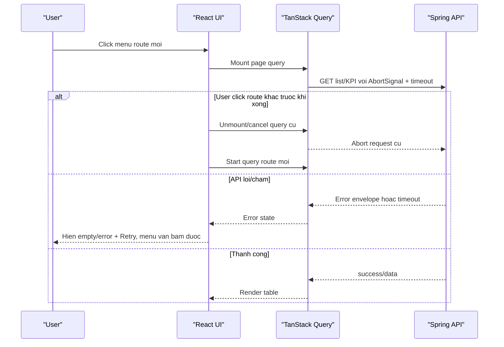

# SRS - Dieu tra va sua loi menu navigation lam giao dien gan nhu bi do

> Agent: SRS_WRITER  
> Ngay tao: 01/06/2026  
> Pham vi: Frontend chinh, Backend/API la dependency bat buoc de xac minh  
> Trang thai: Draft - can Tech Spec

## 1. Input va traceability

- User report: khi click cac giao dien tren menu, trang web gan nhu bi do va khong bam duoc gi.
- CodeGraph preflight:
  - `codegraph status --json`: initialized, pendingChanges = 0.
  - `codegraph context "frontend menu navigation freezes page unclickable route change Smart ERP" --format json`.
  - `codegraph query "Sidebar App routes Header auth navigation" --json`.
- Runtime check:
  - Dev server `http://127.0.0.1:3000` chay duoc.
  - Playwright headless voi API mock nhanh: menu dieu huong duoc qua cac route, khong co console error.
  - Playwright headless voi API that/proxy: nhieu route vao trang thai `Dang tai...`; console co loat API 502/401 tuy tinh trang backend/auth.
- Evidence files:
  - `frontend/mini-erp/src/App.tsx` - dinh nghia route menu.
  - `frontend/mini-erp/src/components/shared/layout/Sidebar.tsx` - click menu dung `navigate(path)`.
  - `frontend/mini-erp/src/components/shared/layout/MainLayout.tsx` - mobile overlay, da kiem tra desktop overlay `display:none`.
  - `frontend/mini-erp/src/components/shared/layout/Header.tsx` - global notifications query/refetch.
  - `frontend/mini-erp/src/main.tsx:8` - `QueryClient` retry mac dinh.
  - `frontend/mini-erp/src/lib/api/http.ts:89` - `apiJson`; `http.ts:106` fetch khong timeout/abort policy rieng.
  - `frontend/mini-erp/src/lib/api/refreshAccessToken.ts:17` - refresh fetch khong timeout.
  - `frontend/mini-erp/vite.config.ts:25` - `/api` proxy toi `127.0.0.1:8080`, timeout/proxyTimeout 600s.
  - `frontend/mini-erp/src/features/inventory/pages/StockPage.tsx:99` - `useInfiniteQuery`; `StockPage.tsx:434` hien `Dang tai tu server...`.
  - `frontend/mini-erp/src/features/inventory/pages/InboundPage.tsx` va `DispatchPage.tsx` - infinite query + error toast.
  - `docs/dev/frontend/mini-erp/features/FEATURES_UI_INDEX.md` - route/UI index thuc te.

## 2. GAP va phan tich xung dot

| ID | GAP | Tac dong |
| :-- | :-- | :-- |
| GAP-1 | Skill yeu cau doc `docs/frontend/mini-erp/features/FEATURES_UI_INDEX.md`, nhung file thuc te nam o `docs/dev/frontend/mini-erp/features/FEATURES_UI_INDEX.md`. | Can cap nhat docs path hoac agent skill de tranh doc sai nguon. |
| GAP-2 | `apiJson` nhan `RequestInit` nhung cac `queryFn` hien khong truyen `signal` cua TanStack Query vao API function. | Khi user doi route nhanh, request cu co the tiep tuc chay, gay backlog network/proxy va UI loading dai. |
| GAP-3 | Vite proxy `/api` dat timeout 600s. | Neu backend treo/cham, FE dev co the cho rat lau thay vi fail-fast. |
| GAP-4 | Mot so page chi toast khi error, nhung loading/error surface trong table khong dong nhat. | User co cam giac trang bi do vi thay `Dang tai...`, button disabled, khong co hanh dong retry ro rang. |

## 3. Executive summary

Hanh vi menu khong co dau hieu bi chan boi Sidebar hay overlay tren desktop. Khi API duoc mock tra nhanh, route/menu van click duoc. Khi goi API that qua proxy/backend, cac man hinh co `useQuery/useInfiniteQuery` de vao trang thai loading/error dai, console co loi API. Nguyen nhan goc can xu ly theo huong cross-layer:

1. FE request layer chua co timeout/abort/cancel route transition day du.
2. TanStack query functions chua nhan va truyen `AbortSignal`.
3. Vite dev proxy timeout qua dai, khien loi backend/proxy bieu hien nhu treo.
4. UI loading/error state chua dam bao khong khoa thao tac menu va khong co fallback retry thong nhat.
5. BE/API can xac minh response time, 401/403/error envelope va cac endpoint list duoc goi khi vao route.

## 4. Scope

### In scope

- Dieu tra va sua UX freeze khi click menu qua cac route chinh.
- Ap dung cho cac route co query list/KPI/global notification:
  - Kho hang: `/inventory/stock`, `/inventory/inbound`, `/inventory/dispatch`.
  - San pham/khach/NCC/danh muc.
  - Don hang/POS.
  - Dong tien.
  - Cai dat co API.
  - Header notifications.
- Chuan hoa FE network timeout, abort, error state, retry policy.
- Xac minh BE/API khong treo va tra envelope loi dung chuan.

### Out of scope

- Khong redesign UI table/menu.
- Khong thay doi nghiep vu data.
- Khong sua AI runtime tru khi route `/ai/chat` co bang chung cung loi.
- Khong doi permission/RBAC ngoai viec hien thi loi 401/403 dung.

## 5. Persona/RBAC

- Owner/Admin/Staff/Warehouse dang nhap hop le phai chuyen menu duoc trong vong muc tieu hieu nang.
- User het phien hoac token loi phai thay thong bao ro rang: `Phien dang nhap da het han. Vui long dang nhap lai.`
- User thieu quyen phai thay: `Ban khong co quyen truy cap man hinh nay.`

## 6. Business flow



## 7. Functional requirements

| ID | Requirement |
| :-- | :-- |
| FR-1 | Click menu phai cap nhat route ngay, khong bi khoa boi loading state cua page cu. |
| FR-2 | Moi API GET/list/KPI duoc goi tu TanStack Query phai nhan `AbortSignal` va truyen xuong `fetch`. |
| FR-3 | `apiJson` va `apiFormData` phai co timeout mac dinh cho request thuong; timeout phai tra message tieng Viet, khong lo raw proxy/backend. |
| FR-4 | Refresh token flow phai co timeout rieng va khong duoc lam treo request goc vo han. |
| FR-5 | Khi route unmount, request cua route cu phai duoc cancel hoac bo qua ket qua, khong tiep tuc lam UI route moi bi anh huong. |
| FR-6 | Cac page list phai co error panel trong vung noi dung thay vi chi toast; panel co nut `Thu lai`. |
| FR-7 | Cac button menu/sidebar/header khong duoc disabled do `isPending/isFetching` cua page content. |
| FR-8 | Header notifications khong duoc refetch lam anh huong click menu; neu notifications loi, chi hien loi trong dropdown/toast nhe. |
| FR-9 | 401 sau refresh that bai phai logout/redirect hoac hien yeu cau dang nhap lai theo policy, khong retry lap lai tren moi page. |
| FR-10 | 403 phai dung route hien tai va hien loi khong co quyen; khong de trang loading vo han. |

## 8. Backend/API requirements

| ID | Requirement |
| :-- | :-- |
| BE-1 | Tat ca endpoint list/KPI duoc menu route goi phai tra envelope JSON dung chuan trong ca success/error. |
| BE-2 | 401/403 khong duoc tra HTML/body rong neu co the; neu body rong, FE van phai map message an toan. |
| BE-3 | Endpoint list phai co response time muc tieu p95 <= 1500ms voi dataset demo/local. |
| BE-4 | Cac query DB cho list/KPI phai co index/limit va khong full-scan bat thuong khi page load. |
| BE-5 | Neu API phu thuoc AI/external service, route menu binh thuong khong duoc bi block boi dependency do. |

## 9. Non-functional requirements

| ID | NFR |
| :-- | :-- |
| NFR-1 | Sau click menu, breadcrumb/path hien route moi trong <= 300ms tren local. |
| NFR-2 | Neu API cham, UI phai fail hoac hien retry trong <= 10s voi request thuong. |
| NFR-3 | Rapid navigation 10 lan lien tiep khong tao hon 3 request pending cu cung luc cho route da roi. |
| NFR-4 | Khong co long task > 200ms do render/menu navigation trong Chrome Performance khi API bi slow. |
| NFR-5 | Console khong co uncaught error khi backend 401/403/500/502/timeout. |

## 10. Horizontal analysis

| Scope | Pattern can kiem tra |
| :-- | :-- |
| Inventory | `StockPage`, `InboundPage`, `DispatchPage` dung `useInfiniteQuery`, sentinel infinite scroll, loading table. |
| Product management | Products/Categories/Suppliers/Customers co list/detail query va bulk actions. |
| Orders/POS | POS product search, sales order list/history co nhieu query song song. |
| Cashflow | Transactions/Ledger/Debt co query list + funds/detail. |
| Settings | Store info/employees/alerts/logs/interface settings co query/mutation. |
| Header | Notifications refetch interval 12s co the cong don voi route query. |
| Auth | 401 -> refresh -> retry can timeout va single-flight de tranh nhieu refresh song song. |
| Dev proxy | Vite proxy 600s lam loi backend trong local bieu hien nhu treo. |

## 11. Acceptance criteria

```gherkin
Given backend phan hoi cham hon timeout
When user click tu "Ton kho" sang "Phieu nhap kho"
Then route va breadcrumb doi sang "Phieu nhap kho" trong 300ms
And menu van bam duoc
And request cua "Ton kho" bi abort hoac khong con anh huong UI
```

```gherkin
Given backend tra 502 hoac proxy loi
When user mo mot man hinh list
Then table hien error panel tieng Viet va nut "Thu lai"
And khong hien loading vo han
```

```gherkin
Given access token het han va refresh token khong hop le
When user click bat ky menu nao can auth
Then FE chi thu refresh theo policy mot lan
And hien thong bao het phien hoac dieu huong dang nhap
And khong lap vo han nhieu request refresh
```

```gherkin
Given user click nhanh 10 muc menu lien tiep
When do so request pending
Then request cua route cu duoc cancel/abort
And UI route cuoi cung van co the thao tac duoc
```

## 12. Test strategy

- Unit:
  - `apiJson` timeout va abort mapping.
  - Refresh token timeout va single-flight.
  - Error envelope mapping cho 401/403/500/body rong/HTML.
- Component:
  - Moi page list render loading, error panel, retry.
  - Sidebar click khong bi disabled khi page query pending.
- Integration:
  - Mock API slow 30s, click route khac, assert request bi abort.
  - Mock API 502/500/401/403, assert khong loading vo han.
  - Header notifications fail nhung menu van click duoc.
- E2E/Playwright:
  - Rapid navigation across inventory/product/orders/cashflow/settings.
  - Backend down/proxy 502 scenario.
  - Expired token + failed refresh scenario.
- Backend:
  - Measure p95 local for list endpoints.
  - Verify envelope and status code consistency.

## 13. Open questions

| ID | Cau hoi | Blocker |
| :-- | :-- | :-- |
| OQ-1 | Timeout FE mac dinh nen la 8s, 10s hay 15s cho request list? | Yes - can PO/Tech Lead chon. |
| OQ-2 | Khi refresh token fail, app logout ngay hay hien modal het phien truoc? | Yes - anh huong UX/auth. |
| OQ-3 | Vite proxy timeout 600s co phai chi phuc vu AI SSE khong? | Yes - can tach timeout `/api/v1/ai/chat/stream` va API thuong. |
| OQ-4 | Co endpoint nao backend dang cham that trong moi truong user gap loi khong? | No - can log/Network tab de uu tien. |

## 14. Risks va rollout

- Risk: giam timeout qua thap co the lam request hop le bi cat trong moi truong cham.
- Risk: abort request can phan biet voi error that de tranh toast sai khi user chu dong doi route.
- Risk: refresh single-flight thay doi auth flow, can test ky 401 dong thoi.
- Rollout:
  1. Them diagnostics/logging dev-only cho pending request.
  2. Sua network layer timeout/abort.
  3. Cap nhat route list query truyen signal.
  4. Chuan hoa error panel.
  5. Chay E2E slow/down backend.

## 15. PO sign-off

- Can PO/Tech Lead xac nhan OQ-1 den OQ-3 truoc khi coding.
