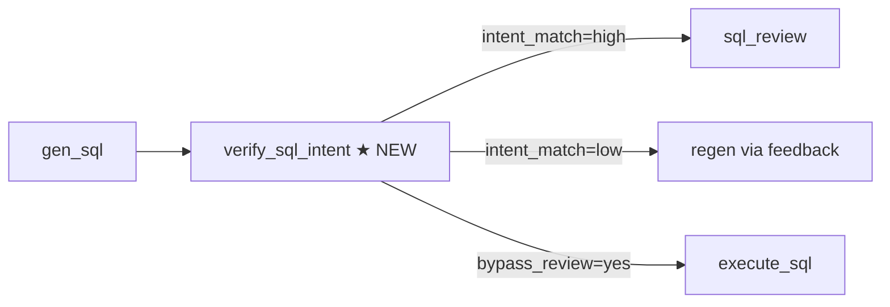

# SQL Intent Quality Improvement

> **Goal:** Improve SQL generation accuracy in `sql_query` tool — ensure generated SQL matches user intent, and empty results are correctly classified (wrong SQL vs legit no data).

---

## 1. Problems

| Problem | Symptom | Root Cause |
|---------|---------|------------|
| Wrong fact table | Query tồn kho dùng `stockreceipts` thay vì `inventory` | Prompt không đủ mạnh về domain→table mapping |
| Wrong join path | Cartesian product, sai column join | LLM tự suy diễn join path |
| Wrong filter | Thiếu channel filter, sai enum, sai date range | Prompt thiếu hướng dẫn cụ thể |
| Wrong metric | `COUNT` thay vì `SUM`, sai business logic | Thiếu business context trong prompt |
| Empty result misclassified | SQL đúng nhưng 0 rows bị coi là lỗi | `SelfCorrectingSqlRunner` không phân biệt đc "SQL sai" vs "legit no data" |

---

## 2. Architecture Changes

### 2.1 New: `verify_sql_intent` node

Chèn node mới vào `sql_subgraph` giữa `gen_sql` và `sql_review`:



**`verify_sql_intent` behavior:**

- Calls LLM (lightweight, `sql_gen` role) với prompt ngắn
- LLM trả JSON: `{intent_match: bool, confidence: str, reason: str, action: 'proceed'|'regen'|'bypass_review'}`
- `proceed`: pass thẳng xuống `sql_review`
- `regen`: ghi feedback "sql_fix" với lý do cụ thể, quay lại `gen_sql`
- `bypass_review`: skip `sql_review` khi intent_match=high AND SQL đơn giản (1 table, WHERE đơn giản, không CTE/subquery). Giảm latency cho câu query cơ bản.

### 2.2 Updated: `gen_sql.md` system prompt

Bổ sung structured reasoning section:

```text
## Intent Reasoning (before SQL)
1. Xác định domain: inventory | receipt | dispatch | ledger | catalog_price | generic
2. Chọn fact table chính (bắt buộc theo domain)
3. Xác định dimensions (GROUP BY columns)
4. Xác định filters (time range, channel, status, etc.)
5. Xác định join path chính xác
```

### 2.3 Updated: `sql_review.md` system prompt

Bổ sung intent alignment check:

```text
## Intent Alignment Check
- SQL có dùng đúng fact table cho domain không?
- SQL có thiếu filter bắt buộc không?
- SQL có dùng đúng metric/aggregation không?
- Nếu SQL đúng cấu trúc nhưng WHERE quá hẹp → ok=true (không phải lỗi)
```

### 2.4 Updated: empty-result handling

Trong `SelfCorrectingSqlRunner.run()`:
- Phân biệt 2 cases khi `rows == []`:
  - **SQL sai cấu trúc** (sai table, sai join) → regen SQL với hint từ review
  - **SQL đúng nhưng legit 0 rows** → return success với observation "không có dữ liệu phù hợp"
- Deterministic heuristic (khi LLM verify không available):
  1. Domain mapping: fact table trong SQL có khớp với domain không? (inventory→inventory table, ledger→financeledger)
  2. Table existence: tất cả tables trong FROM đều có trong allowlist
  3. Join validation: các JOIN dùng column names có tồn tại trong schema không
  4. Filter合理性: filter value không quá hẹp (không filter cứng `= 'non_existent_value'`)
  - Nếu pass cả 4 → legit 0 rows. Nếu fail bất kỳ → SQL sai, regen.

### 2.5 Updated: `_format_rows_observation()`

Thay đổi observation text khi 0 rows:

```text
Before: "SQL query returned 0 rows. The query ran fine..."
After: 
  - Nếu SQL sai: "Câu SQL không phù hợp với câu hỏi. {lý do}"
  - Nếu legit 0 rows: "Không có dữ liệu phù hợp với điều kiện bạn yêu cầu."
```

---

## 3. Module Map

| File | Change |
|------|--------|
| `app/prompts/agents/gen_sql.md` | Thêm "Intent Reasoning" section |
| `app/prompts/agents/sql_review.md` | Thêm "Intent Alignment Check" section |
| `app/graph/sql_prompts.py` | Cập nhật `build_gen_sql_user_prompt()` nếu cần |
| `app/graph/nodes/sql_pipeline.py` | Thêm node `make_verify_sql_intent_node()` |
| `app/graph/sql_subgraph.py` | Thêm `verify_sql_intent` vào StateGraph |
| `app/graph/tools/sql_query.py` | Cập nhật `_format_rows_observation()` + `SelfCorrectingSqlRunner.run()` |
| `app/graph/verify_sql_intent.py` | **NEW** — prompt + logic cho verification node |

---

## 4. Data Flow

```
User question
  → gen_sql (LLM sinh SQL + reasoning JSON)
  → verify_sql_intent (LLM check intent alignment)
    ├─ intent OK → sql_review (LLM check safety)
    │                ├─ review OK → execute_sql
    │                └─ review fail → regen
    ├─ intent fail → regen with feedback
    └─ bypass_review → execute_sql (skip review để giảm latency)
  → execute_sql
    ├─ rows OK → format + return
    └─ 0 rows → SelfCorrectingSqlRunner phân loại:
       ├─ SQL sai → regen
       └─ legit 0 rows → return success + observation
```

---

## 5. Error Handling

| Scenario | Response |
|----------|----------|
| verify_sql_intent LLM fails | Fallback: deterministic heuristic check table names vs domain |
| bypass_review + execute_sql fails | Fallback: run sql_review anyway |
| legit 0 rows but user insists data exists | Observation khuyên user kiểm tra lại filter value |
| Intent mismatch but SQL happens to run | observation_text báo "SQL có thể không đúng câu hỏi" |

---

## 6. Testing

| Test case | File |
|-----------|------|
| verify_sql_intent detects wrong fact table | `test_verify_sql_intent.py` |
| verify_sql_intent approves correct SQL | `test_verify_sql_intent.py` |
| Empty result: legit 0 rows vs wrong SQL | `test_sql_self_correct_budget.py` |
| gen_sql produces reasoning before SQL | Integration test |
| Regression: all existing tests pass | Full suite |

---

## 7. Out of Scope

- Không thay đổi cơ chế tool registration
- Không thay đổi SQL executor (Spring endpoint)
- Không thay đổi chart pipeline
- Không thay đổi Harness orchestrator
