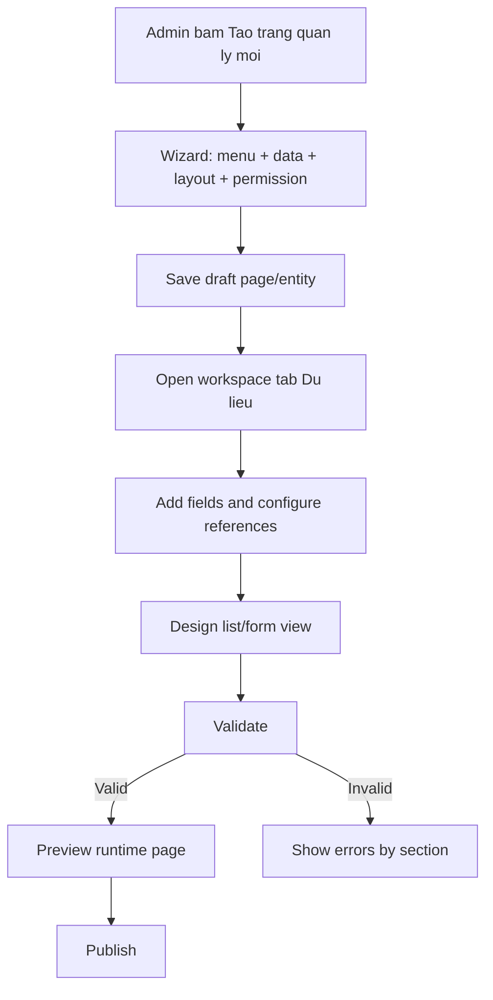
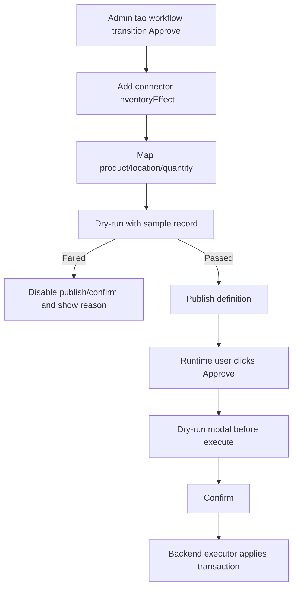
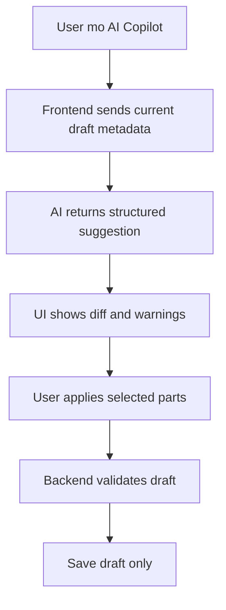

# SRS - Custom Builder UI Gap Plan

> File: `docs/frontend/srs/011_custom-builder-ui-gap-plan.md`  
> Agent: SRS_WRITER  
> Ngay tao: 03/06/2026  
> Trang thai: DRAFT_FOR_PO_REVIEW  
> Pham vi: Tong hop 8 task Custom Builder, SRS menu da thu gon va UI hien co de lap plan thiet ke giao dien con thieu.

---

## 1. Muc Tieu

Tai lieu nay khong thay the 8 SRS phase trong `docs/dev/common`. Muc tieu la tao mot ban SRS frontend bo sung, chi ra giao dien Custom Builder hien co da dap ung den dau va con thieu gi de user co the:

- Tao menu cha va giao dien menu con.
- Tao entity, field, view va record runtime.
- Thiet ke workflow, connector, inventory effect bang UI an toan.
- Dung AI nhu copilot dong hanh, chi suggest/diff/draft, khong tu publish hay mutate du lieu rui ro.

Ket qua mong muon: Tech Spec co the dung tai lieu nay de thiet ke lai man hinh Custom Builder theo tung stage ma khong tron lan giua menu taxonomy, entity metadata, workflow, connector, inventory executor va AI.

---

## 2. Tai Lieu Va Code Da Doi Chieu

| Nguon | Ket luan ap dung |
| :--- | :--- |
| `docs/dev/common/001_custom-builder-program-overview.md` | Can metadata-driven, backend authoritative, UI guardrail, AI safety, route/menu dynamic |
| `docs/dev/common/002_custom-builder-phase1-entity-record-foundation.md` | Can UI tao entity, field, view, record list/form, reference polymorphic, scale/index warnings |
| `docs/dev/common/003_custom-builder-phase2-workflow.md` | Can UI state/transition builder, lock edit, transition permission, pending guardrail |
| `docs/dev/common/004_custom-builder-phase3-logic-connector.md` | Can visual connector trigger/source/operation/target, dry-run, cycle warning |
| `docs/dev/common/005_custom-builder-phase4-inventory-effect.md` | Can UI dry-run/confirm effect, khong optimistic update, high-risk permission |
| `docs/dev/common/006_custom-builder-phase5-ai-builder-copilot.md` | Can AI panel, structured diff, apply tung phan, khong publish |
| `docs/dev/common/007_custom-builder-phase6-ai-custom-query.md` | Can UI/metadata cho AI-safe schema va query visibility theo permission |
| `docs/dev/common/008_custom-builder-phase7-ai-custom-draft.md` | Can UI hien AI-created draft, user review/edit/submit bang flow thuong |
| `docs/frontend/srs/010_custom-builder-menu-interface-design.md` | Da bao phu kha tot menu folder/page, dynamic sidebar/route contract, version, preview, guardrail |
| `frontend/mini-erp/src/features/custom-builder/pages/CustomBuilderPage.tsx` | UI hien co la mock local state, co explorer, create folder/page, basic form, preview menu, save/publish mo phong |
| `frontend/mini-erp/src/features/custom-builder/pages/CustomRuntimePage.tsx` | Runtime page moi la placeholder resolver, chua co table/form record theo metadata |
| `frontend/mini-erp/src/features/custom-builder/runtime/customMenuRuntime.ts` | Dynamic menu hien la catalog hard-code, co permission filter mo phong |
| `frontend/mini-erp/src/App.tsx` | Da co `/settings/custom-builder`, `/custom/:pageKey`, `/custom/:pageKey/:recordId` |
| `frontend/mini-erp/src/components/shared/layout/Sidebar.tsx` | Da merge static menu voi custom menu mock, chua load tu backend API |

CodeGraph evidence: `codegraph status --json` sach, `codegraph context` tim thay entry points `CustomBuilderPage`, `CustomRuntimePage`, `customMenuRuntime`.

---

## 3. Ket Luan Nhanh

UI hien tai dap ung duoc `menu taxonomy MVP`:

- Tao danh muc menu cha.
- Tao giao dien menu con.
- Chon item trong explorer.
- Sua thong tin co ban.
- Preview cay menu.
- Mock save/publish.
- Mock runtime route va sidebar dynamic.

UI hien tai chua dap ung duoc `Custom Builder end-to-end`:

- Chua co entity/field/view builder that su.
- Chua co record runtime table/form theo metadata.
- Chua co workflow designer.
- Chua co connector/formula builder.
- Chua co inventory effect dry-run/confirm UI.
- Chua co AI copilot diff panel.
- Chua co AI custom draft review surface.
- Chua co API-backed loading, conflict, permission matrix, validation summary theo section.

Root cause khong phai thieu mot vai button. Root cause la man hinh hien tai dang gom tat ca vao mot detail form co ban, trong khi custom builder can mot layout theo stage va boundary ro: `Menu`, `Data`, `View`, `Workflow`, `Logic`, `Inventory`, `AI`.

---

## 4. Scope Cua SRS Nay

### 4.1 In Scope

- Thiet ke bo sung UI gap-plan cho Custom Builder.
- Xac dinh cac screen/section/tab con thieu.
- Xac dinh luong thao tac cua user theo tung phase.
- Xac dinh guardrail can hien ngay tren UI.
- Xac dinh runtime sidebar/page integration can doi tu mock sang API.
- Xac dinh AI extension point va diff review.

### 4.2 Out Of Scope

- Chua implement code.
- Chua chot endpoint backend cuoi cung.
- Chua thiet ke database chi tiet ngoai cac yeu cau UI can biet.
- Chua cho user viet SQL/JS/script tu do.
- Chua cho AI publish, transition, effect hoac update inventory truc tiep.

---

## 5. UI Information Architecture De Xuat

Custom Builder nen tach thanh 5 vung chinh:

| Vung | Vai tro |
| :--- | :--- |
| Top command bar | Ten builder, status draft/published, save draft, validate, preview, publish |
| Left explorer | Menu folder/page tree, search, filter status, create folder/page/entity |
| Center workspace | Noi thiet ke theo tab/stage dang chon |
| Right inspector | Validation, impact, permission, AI suggestions, selected node detail |
| Bottom safety bar | Dirty state, pending state, conflict, required actions, dry-run result |

Khong nen day tat ca vao mot form doc duy nhat. User can thay minh dang lam o lop nao: menu, du lieu, giao dien, quy trinh, logic, ton kho, AI.

---

## 6. Gap Matrix Theo Phase

| Phase | Current UI | Missing UI | Priority |
| :--- | :--- | :--- | :--- |
| Menu taxonomy | Co explorer, create folder/page, preview | API-backed tree, archive/duplicate/move parent, preview as role, conflict state | P0 |
| Entity/record foundation | Chi co `entityKey` text input | Entity wizard, field designer, reference picker, list/form designer, sample record test | P0 |
| Workflow | Placeholder card | State canvas/list, transition editor, permission, lock flags, timeline preview | P1 |
| Logic connector | Chua co | Trigger/source/operation/target step builder, dry-run, cycle warnings | P1 |
| Inventory effect | Chua co | Effect template editor, stock dry-run preview, confirm risk panel, no optimistic UI | P1 |
| AI builder copilot | Chua co | AI side panel, suggestion diff, apply selected, validation result | P2 |
| AI custom query | Chua co UI boundary | AI-safe metadata visibility, query scope summary, permission explanation | P2 |
| AI custom draft | Chua co | AI-created draft badge, review/edit before submit, normal transition flow | P2 |

---

## 7. Detailed UI Requirements

### 7.1 Builder Home / Overview

Man hinh `/settings/custom-builder` nen mo bang overview thay vi auto-select mock item.

Required:

- Summary cards nho: so menu custom, entity draft, entity published, validation errors.
- CTA: `Tao trang quan ly moi`, `Tao danh muc menu`, `Mo AI copilot`.
- Recent drafts va recent published.
- Empty state neu chua co cau hinh nao.
- Feature flag notice neu workflow/connector/inventory/AI chua bat.

Acceptance:

```gherkin
Given Admin mo Custom Builder lan dau
When chua co custom menu/entity
Then UI hien empty state va huong dan tao trang quan ly moi
And khong auto tao du lieu mock gay hieu nham
```

### 7.2 Menu Explorer

Current UI co tree co ban nhung can bo sung:

- Filter theo `Tat ca`, `Ban nhap`, `Can cau hinh`, `Da publish`, `Ngung hien thi`.
- Context menu cho folder/page: rename, duplicate, move, archive, view impact.
- Badge validation count tren tung item.
- Tooltip ly do item khong publish duoc.
- API loading, empty, error, retry state.
- `Preview as role` cho sidebar visibility.

Rules:

- Khong cho tao page khi chua co folder.
- Khong cho archive folder co page published neu chua xem impact.
- Move page sang folder khac phai la action rieng co confirm.

### 7.3 Page Creation Wizard

Thay vi tao page moi bang mot object mac dinh, can wizard 4 buoc:

| Step | UI |
| :--- | :--- |
| 1. Menu | Ten page, folder cha, route, icon |
| 2. Data | Tao entity moi hoac link entity co san |
| 3. Layout | Chon page type, list/form/table-detail template |
| 4. Permission | Role co the xem/tao/sua/xoa |

Sau wizard, page o trang thai `Draft/NeedsConfig` va mo workspace vao tab `Du lieu`.

### 7.4 Entity / Field Designer

Can mot tab `Du lieu` thuc su, khong chi placeholder.

Required UI:

- Entity info: label, key, description, status, version.
- Field table/list:
  - label, fieldKey, type, required, filterable, sortable, searchable, order.
  - type-specific config panel.
  - reference config `{refType, refEntityKey}`.
  - line_items child field builder.
- Add field button.
- Duplicate field, archive field, impact warning.
- Field validation sidebar.
- Scale warning khi bat filter/sort nhieu field.

Guardrails:

- Field type cua published field khong duoc doi tuy tien.
- Reference target phai la core entity hoac custom entity published.
- `line_items` co row limit va warning neu dung cho inventory effect.
- Filterable/sortable field can hien `index required` warning.

### 7.5 View / Layout Designer

Can tab `Giao dien` de user thiet ke runtime page.

Required UI:

- List/table designer:
  - chon cot hien thi, thu tu, width, align, format.
  - default sort.
  - filter bar fields.
  - row actions.
- Form designer:
  - sections, field order, required marker, helper text.
  - read-only fields.
  - conditional visibility basic theo state/permission.
- Preview:
  - desktop/tablet/mobile.
  - sample record values.
  - empty/loading/error states.

Rules:

- Khong cho publish neu view tham chieu field khong ton tai.
- Khong cho hien action edit/delete neu role khong co permission.

### 7.6 Runtime Page Design

`CustomRuntimePage` hien moi la placeholder. Can SRS yeu cau runtime UI:

- Record list with pagination, search, filter, sort.
- Create record form theo metadata.
- Record detail drawer/page.
- Edit form theo permission va workflow lock.
- Timeline/audit section.
- State badge neu workflow bat.
- Transition buttons neu workflow bat.
- Dry-run modal neu transition co inventory effect.

Runtime route:

- `/custom/:pageKey` render list/form/table-detail theo page definition.
- `/custom/:pageKey/:recordId` render detail hoac drawer route.

### 7.7 Workflow Designer

Can tab `Quy trinh`.

Required UI:

- State list hoac lightweight canvas.
- Add/edit state: key, label, initial, terminal, lock edit.
- Transition list/canvas edge:
  - fromState, toState, label, permission.
  - validation required before transition.
  - has connector/effect indicator.
- Workflow validation panel:
  - exactly one initial state.
  - no duplicate transition.
  - invalid endpoint warning.
- Record state preview.

Guardrails:

- Transition buttons disabled khi pending.
- State lock edit phai hien trong form preview.
- Publish disabled neu workflow invalid.

### 7.8 Logic Connector / Formula Builder

Can tab `Logic` hoac section trong `Quy trinh`.

Required UI:

- Step builder thay vi free-text:
  - Trigger.
  - Source.
  - Operation.
  - Target.
- Operation allowlist: copy, set, add, subtract, multiply, sumLines, inventoryEffect.
- Field/entity picker chi hien declared fields/entities.
- Dry-run voi sample record.
- Cycle/cascade warning.
- Structured JSON preview read-only cho Admin debug.

Forbidden UI:

- Khong textarea cho SQL/JS/script.
- Khong custom API endpoint input.
- Khong direct update `Inventory.quantity`.

### 7.9 Inventory Effect Designer

Inventory effect phai co UI rieng vi rui ro cao.

Required UI:

- Effect type picker: inbound, outbound, transfer, adjust increase/decrease.
- Mapping product/location/quantity fields.
- Multi-line mapping neu source la `line_items`.
- Dry-run preview:
  - product.
  - location.
  - quantity.
  - current stock.
  - projected stock.
  - error neu am kho.
- Confirm modal truoc khi transition/effect.
- Idempotency/audit hint.

Guardrails:

- Confirm disabled neu dry-run failed.
- Request pending disable tat ca transition/effect buttons.
- Sau success refetch record/list/inventory.
- Khong optimistic update.

### 7.10 AI Builder Copilot Panel

AI nen la side panel co the mo/dong, khong thay the form.

Required UI:

- Prompt input de user mo ta trang muon tao.
- Context summary: entity/page/workflow hien tai se gui sang AI.
- Suggestion diff:
  - fields added/changed.
  - workflow states/transitions.
  - connector/effect rules.
  - permissions.
  - warnings.
- Apply selected / apply all.
- Backend validate after apply.
- AI audit/correlation id neu backend cung cap.

Rules:

- AI khong co nut publish.
- AI khong execute transition/effect.
- AI suggestions chi apply vao draft.
- Metadata label/description hien trong AI panel phai sanitize va xem la untrusted content.

### 7.11 AI Custom Query / Draft UI Hooks

Can de san surface cho phase AI runtime:

- Custom page co badge `AI co the hoi du lieu trang nay` neu user co quyen query.
- Show query scope summary: entity, fields visible, row limit.
- AI-created record draft co badge `Tao boi AI`.
- Draft review page cho phep user edit truoc khi submit.
- Submit/approve van dung workflow buttons binh thuong.

---

## 8. API-backed State Requirements Cho Frontend

UI khong duoc tiep tuc dua vao mock catalog khi Tech Spec implementation bat dau.

Required frontend states:

| State | UI behavior |
| :--- | :--- |
| Loading tree | Skeleton explorer va disable destructive actions |
| Load error | Retry, static menu/runtime khong bi mat |
| Save pending | Disable save/publish/archive/reorder |
| Validate pending | Disable publish, show spinner trong validation panel |
| Publish pending | Disable builder mutation va tabs co rui ro |
| 409 conflict | Hien reload/compare, khong ghi de |
| 403 permission | Hide/disable action voi reason |
| 422 validation | Group errors theo tab/section |
| Dry-run failed | Disable confirm/effect |
| Feature disabled | Badge `Chua bat tinh nang` va disable control |

---

## 9. Data Contracts UI Can Backend Cung Cap

### 9.1 Builder Tree

Can API tree gom folder/page + validation summary + version metadata:

```ts
type BuilderMenuNode = {
  id: string
  nodeType: "folder" | "page"
  key: string
  label: string
  status: "Draft" | "Published" | "NeedsConfig" | "Hidden"
  sortOrder: number
  version: number
  draftVersion?: number
  publishedVersion?: number
  hasDraft: boolean
  etag: string
  validationSummary: ValidationSummary
}
```

### 9.2 Page Definition Bundle

Khi chon page, frontend can load mot bundle:

```ts
type BuilderPageBundle = {
  menuPage: BuilderMenuNode
  entityDefinition: EntityDefinitionDraft
  fields: FieldDefinitionDraft[]
  views: ViewDefinitionDraft[]
  workflow?: WorkflowDefinitionDraft
  connectors?: ConnectorDefinitionDraft[]
  inventoryEffects?: InventoryEffectRuleDraft[]
  permissions: PermissionDraft
  validationSummary: ValidationSummary
  etag: string
}
```

### 9.3 Validation Summary

Validation phai group theo UI tab:

```ts
type ValidationSummary = {
  valid: boolean
  errors: { section: "menu" | "data" | "view" | "workflow" | "logic" | "inventory" | "permission" | "ai"; message: string; fieldKey?: string }[]
  warnings: { section: string; message: string; fieldKey?: string }[]
}
```

---

## 10. Interaction Flow

### 10.1 Tao Trang Quan Ly Moi



### 10.2 Thiet Ke Tru Ton Kho An Toan



### 10.3 AI Suggestion



---

## 11. Business Rules Bo Sung

| ID | Rule |
| :--- | :--- |
| BR-UI-GAP-01 | Khong coi UI mock/catalog local la source of truth cho builder/runtime |
| BR-UI-GAP-02 | Moi action save/publish/archive/reorder/effect phai co pending disabled state |
| BR-UI-GAP-03 | Publish disabled neu validation summary co error o bat ky section bat buoc |
| BR-UI-GAP-04 | Runtime chi doc published version, builder moi doc draft |
| BR-UI-GAP-05 | Field/view/workflow/connector/effect phai validate backend truoc khi publish |
| BR-UI-GAP-06 | UI khong expose SQL/JS/script/custom API input |
| BR-UI-GAP-07 | Inventory effect phai dry-run truoc confirm va khong optimistic update |
| BR-UI-GAP-08 | AI suggestion chi apply vao draft sau user review |
| BR-UI-GAP-09 | Metadata label/description la untrusted content trong preview va AI panel |
| BR-UI-GAP-10 | Permission frontend chi de hien/an/disable, backend van enforce moi endpoint |

---

## 12. Implementation Plan Theo UI Stage

### Stage UI-1: Menu Builder Hardening

- Replace mock tree bang API-backed query.
- Them loading/error/retry/empty.
- Them context actions: duplicate, move, archive, impact.
- Them validation badges.
- Them preview as role.
- Sidebar dynamic doi tu mock catalog sang runtime API.

### Stage UI-2: Entity + Field + View Builder

- Build entity wizard.
- Build field designer.
- Build reference picker polymorphic.
- Build list/form layout designer.
- Build sample record preview.
- Add scale/index warnings.

### Stage UI-3: Runtime Record Page

- Render `/custom/:pageKey` bang metadata published.
- Add paginated record list.
- Add create/edit/detail form.
- Add permission/empty/loading/error states.
- Add audit/timeline placeholder.

### Stage UI-4: Workflow + Connector

- Build workflow state/transition designer.
- Build transition permission and lock flags.
- Build connector step builder.
- Add dry-run/cycle warning.

### Stage UI-5: Inventory Effect Safety

- Build effect mapping editor.
- Build dry-run result modal.
- Build high-risk confirm.
- Enforce no optimistic UI and refetch after success.

### Stage UI-6: AI Copilot + AI Runtime Hooks

- Build AI copilot side panel.
- Show structured diff and risk warnings.
- Apply selected parts only to draft.
- Show AI-created draft badge/review flow.
- Add AI query scope summary on runtime page.

---

## 13. Huong Dan Trien Khai UI-first Cho Session Moi

### 13.1 Cach Doc Tai Lieu Nay

Khi mo session moi de trien khai giao dien, agent phai doc tai lieu nay theo cach sau:

1. Day la SRS `UI-first`, khong phai lenh implement backend day du.
2. 8 file trong `docs/dev/common` la phase nang luc he thong; cac `Stage UI-*` trong tai lieu nay la lat cat frontend.
3. Neu user yeu cau "thiet ke giao dien truoc", uu tien prototype frontend co fixture/mock adapter, nhung shape du lieu phai gan voi contract backend tuong lai.
4. Khong sua `ai_python/` hoac backend executor neu task chi yeu cau UI prototype.
5. Khong bien mock thanh source of truth; moi fixture phai nam sau adapter de sau nay thay bang API that.
6. Moi action rui ro trong UI prototype van phai co pending/disabled/confirm/dry-run state du la mock.

### 13.2 Thu Tu Trien Khai Khi Chi Lam Giao Dien

Mac dinh nen trien khai theo thu tu nay:

| Thu tu | Viec can lam | Ket qua mong doi |
| :--- | :--- | :--- |
| 1 | Builder shell | Top command bar, left explorer, center workspace, right inspector, bottom safety bar |
| 2 | Menu builder hardening | Tree, filter, create folder/page wizard, validation badges, preview sidebar |
| 3 | Entity + field designer | Entity info, field list, reference picker, line_items, validation sidebar |
| 4 | View/layout designer | Table columns, form sections, sample record preview, responsive preview |
| 5 | Runtime preview mock | `/custom/:pageKey` render list/form/detail tu metadata fixture |
| 6 | Workflow placeholder/designer | State/transition UI, disabled neu feature flag off |
| 7 | Connector/inventory placeholder | Step builder va dry-run UI mock, khong mutate du lieu |
| 8 | AI copilot placeholder | Side panel, structured diff mock, apply to draft only |

Neu can cat scope cho mot sprint UI dau tien, chi lam muc 1 den 5. Do la phan cho user cam nhan duoc flow tao mot trang quan ly moi ma chua cham cac rui ro workflow/inventory/AI.

### 13.3 Nguyen Tac Fixture / Mock Adapter

Frontend prototype duoc phep dung mock, nhung phai theo cac rule:

- Tao `custom-builder` mock API/adapter rieng, khong rai local state lon trong component.
- Fixture phai co field `status`, `version`, `etag`, `validationSummary`, `permissions` de test guardrail.
- Mutation mock phai simulate loading, success, 400/403/409/422.
- Runtime sidebar/page mock phai doc qua adapter giong API shape, khong hard-code truc tiep trong component moi.
- Ten field reference phai dung canonical `{refType, refEntityKey, refId, labelSnapshot}`.
- Khong tao textarea cho SQL/JS/script du trong prototype.

### 13.4 Compatibility Voi 8 Phase Tasks

| UI stage | Phase task lien quan | Boundary bat buoc |
| :--- | :--- | :--- |
| UI-1 Menu Builder Hardening | Program overview + SRS 010 | Chi harden folder/page/menu; khong tao entity runtime day du neu chua vao UI-2 |
| UI-2 Entity + Field + View | Phase 1 | Chi metadata, field, view, sample record; chua workflow/connector/inventory |
| UI-3 Runtime Record Page | Phase 1 | Render list/form/detail theo metadata; transition/effect neu co thi disabled/placeholder |
| UI-4 Workflow + Connector | Phase 2 + Phase 3 | Co the tach thanh 2 implementation task rieng neu scope lon |
| UI-5 Inventory Effect Safety | Phase 4 | Chi enable khi workflow transition va connector/effect mapping hop le |
| UI-6 AI Copilot + Runtime Hooks | Phase 5 + Phase 6 + Phase 7 | AI chi suggest/diff/draft, khong publish, khong transition, khong effect |

### 13.5 Definition Of Done Cho UI Prototype

Mot UI prototype duoc coi la dat neu:

- User di duoc flow: tao menu/page -> tao entity -> them field -> thiet ke table/form -> xem runtime preview.
- Tat ca button save/publish/archive/reorder/transition/effect co disabled pending state.
- Validation errors hien theo dung section/tab.
- Runtime preview co empty/loading/error/no-permission states.
- Sidebar custom co the hien menu tu fixture theo permission.
- Không co UI cho free SQL/free script/custom endpoint.
- AI panel neu co chi hien diff va apply vao draft mock.
- Co test/manual verification bang browser hoac screenshot cho desktop va mobile.

### 13.6 Workflow Agent De Trien Khai Tu Session Moi

Khi bat dau session moi va user yeu cau implement UI-first, agent phai chay dung workflow repo:

```text
SRS_WRITER -> TECH_SPEC_WRITER -> QA_SPEC_WRITER -> CODING_AGENT -> CODE_REVIEW_AGENT
```

Neu SRS nay da duoc chap nhan, bat dau tu `TECH_SPEC_WRITER` va tao Tech Spec rieng cho scope UI prototype dau tien. Tech Spec phai chi ro:

- Scope stage nao duoc implement.
- File frontend nao se sua.
- Fixture/mock adapter nam o dau.
- API shape nao duoc gia lap.
- Browser verification route nao can chup/test.
- Nhung tab nao disabled/placeholder.

---

## 14. Acceptance Criteria

```gherkin
Given Admin mo Custom Builder
When backend dang tai tree
Then UI hien skeleton explorer
And cac nut publish/archive/reorder bi disabled
```

```gherkin
Given Admin tao trang quan ly moi
When hoan thanh wizard
Then page co folder cha, entity draft, route va permission draft
And workspace mo vao tab Du lieu
```

```gherkin
Given Admin them field reference
When chon target
Then UI luu cau hinh theo dang refType, refEntityKey
And khong dung field type hard-code nhu product_ref lam source chinh
```

```gherkin
Given Admin cau hinh view list
When view tham chieu field da bi archive
Then validation panel hien loi o section Giao dien
And Publish bi disabled
```

```gherkin
Given transition co inventory effect
When user bam transition tren runtime page
Then UI hien dry-run preview
And confirm disabled neu dry-run failed
```

```gherkin
Given AI goi y them field va workflow
When UI hien suggestion
Then user co the apply tung phan vao draft
And khong co action publish tu AI panel
```

---

## 15. Test Plan

| Nhom | Test |
| :--- | :--- |
| Builder shell | Render overview, explorer, workspace, inspector, bottom safety bar |
| Menu API state | Loading/error/retry/empty/tree render |
| Create wizard | Tao page/entity draft dung parent, route, permission |
| Field designer | Required/type/reference/line_items validation |
| View designer | Columns/form sections do not reference missing fields |
| Runtime list | Pagination, search, filter, permission state |
| Workflow | One initial state, invalid transition endpoint, pending buttons |
| Connector | Operation allowlist, no free script, dry-run failure |
| Inventory | Negative stock dry-run disables confirm, no optimistic update |
| AI copilot | Structured diff, apply selected, unsafe publish blocked |
| Conflict | 409 save/publish shows reload/compare and does not overwrite |
| Accessibility | Keyboard reorder, focus visible, buttons have accessible names |

---

## 16. Open Questions

| ID | Cau hoi | De xuat mac dinh |
| :--- | :--- | :--- |
| OQ-UI-GAP-01 | Co can builder overview rieng hay vao thang explorer? | Can overview de giam hieu nham mock/item auto-select |
| OQ-UI-GAP-02 | Page custom route theo pageKey hay entityKey? | Dung pageKey, entityKey la metadata rieng |
| OQ-UI-GAP-03 | Workflow/connector/inventory tabs an hay disabled khi feature flag off? | Disabled co badge ly do |
| OQ-UI-GAP-04 | AI panel nam ben phai hay drawer? | Right inspector/drawer, khong chen vao form chinh |
| OQ-UI-GAP-05 | Preview as role dung role hay user cu the? | Role truoc, user cu the sau |

---

## 17. Handoff

Trang thai handoff: `READY_FOR_TECH_SPEC_AFTER_PO_REVIEW`.

Tech Spec can doc tiep:

- `docs/frontend/srs/010_custom-builder-menu-interface-design.md`
- `docs/frontend/srs/011_custom-builder-ui-gap-plan.md`
- `docs/dev/common/001_custom-builder-program-overview.md`
- `docs/dev/common/002_custom-builder-phase1-entity-record-foundation.md`
- `docs/dev/common/003_custom-builder-phase2-workflow.md`
- `docs/dev/common/004_custom-builder-phase3-logic-connector.md`
- `docs/dev/common/005_custom-builder-phase4-inventory-effect.md`
- `docs/dev/common/006_custom-builder-phase5-ai-builder-copilot.md`
- `docs/dev/common/007_custom-builder-phase6-ai-custom-query.md`
- `docs/dev/common/008_custom-builder-phase7-ai-custom-draft.md`
- `frontend/mini-erp/src/features/custom-builder/pages/CustomBuilderPage.tsx`
- `frontend/mini-erp/src/features/custom-builder/pages/CustomRuntimePage.tsx`
- `frontend/mini-erp/src/features/custom-builder/runtime/customMenuRuntime.ts`
- `frontend/mini-erp/src/components/shared/layout/Sidebar.tsx`
- `frontend/mini-erp/src/App.tsx`
