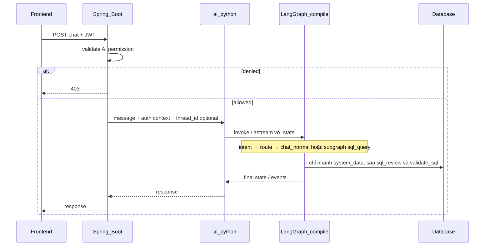
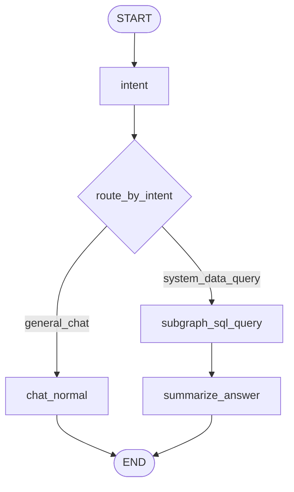
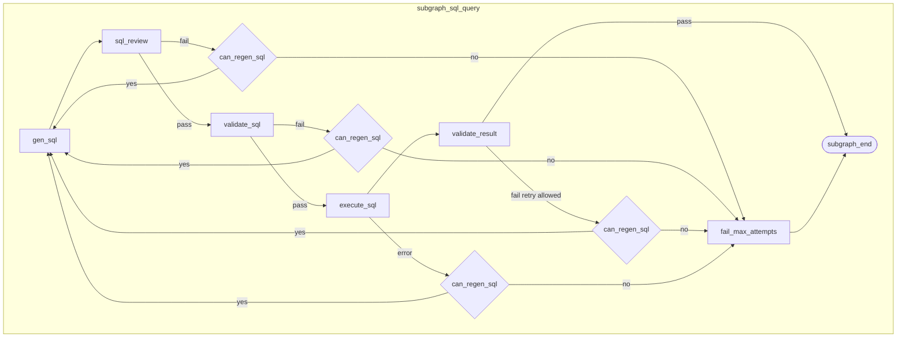

# AI chatbot — yêu cầu đa agent v1 (đặc tả + căn chỉnh LangGraph)

Plan này mô tả **chức năng v1** và **cách ánh xạ sang LangGraph** (state graph, conditional edges, subgraph, retry có giới hạn, checkpointer/streaming tuỳ chọn). Tham chiếu stack tổng quan: các tài liệu `docs/plan/` / phân tích LangChain–MCP trong repo (nếu có).

---

## 1. Mục tiêu v1

- **Hai loại câu hỏi**:
  - **Gắn hệ thống / dữ liệu** (doanh số hôm nay, tồn kho hoạt động, …): pipeline **đọc DB** — SQL do LLM sinh, có **kiểm tra trước/sau execute** và **giới hạn số lần sinh lại SQL**.
  - **Không gắn hệ thống** (giờ, thời tiết, kiến thức chung): node **Agent_Chat_Normal**, **không** gọi tool DB.

- **Cổng Spring**: xác thực user, kiểm tra **được phép dùng AI**, rồi gọi [`ai_python`](../../../ai_python/README.md) (FastAPI) kèm context an toàn.

- **Scale**: thêm intent qua **registry** `intent → subgraph | node handler`, không phình một file điều kiện duy nhất.

---

## 2. Các agent / nhiệm vụ và ánh xạ node LangGraph

| Thành phần | Nhiệm vụ nghiệp vụ | Node / vị trí trong LangGraph |
| :--- | :--- | :--- |
| **Agent_Intent** | Structured output: `system_data_query` \| `general_chat` (và reserved intent sau). | Node `intent` ở **graph gốc**; output ghi vào **state**. |
| **Agent_Chat_Normal** | Trả lời LLM, không DB tool v1. | Node `chat_normal` → `END`. |
| **Agent_DB_Meta** | Quét DB → file schema có **version** (cron/deploy). | **Không** bắt buộc là node mỗi request; là **artifact** đọc bởi node `gen_sql`. |
| **Agent_SQL** | Sinh một câu `SELECT` từ câu hỏi + nội dung schema (theo `schema_version`). | Node `gen_sql` trong **subgraph** `sql_query`. |
| **Agent_SQL_Review** | **Review** SQL vừa sinh có **khớp cấu trúc DB** không: bảng/cột có trong schema snapshot không, join/FK có bảng tham chiếu hợp lệ, alias không che cột “ma”, kiểu/ghi chú domain tối thiểu. Nên dùng **output có cấu trúc** (ví dụ `ok: bool`, `issues: list[str]`) để router rõ ràng. | Node `sql_review` — **sau `gen_sql`, trước `validate_sql`**. Fail → ghi `validation_feedback` (kèm gợ ý sửa) và **không** execute; điều kiện quay `gen_sql` giống các node khác (§2.1). **`sql_attempt_count` chỉ tăng khi vào `gen_sql`**, không tăng tại `sql_review`. |
| **Validate (policy / SQL)** | Kiểm tra câu lệnh **trước** khi chạm DB (lớp **cứng**, có thể pure code): SELECT-only, allowlist bảng/cột, có LIMIT, không DDL/DML, timeout hợp lý. | Node `validate_sql`; fail → ghi `validation_feedback`, điều kiện quay `gen_sql` nếu còn lượt (tăng đếm khi vào `gen_sql`). |
| **Execute** | Chạy query read-only (Python→DB hoặc Python→Spring). | Node `execute_sql`; lỗi runtime (syntax do DB, connection) → feedback tương tự vòng retry. |
| **Validate (kết quả)** | Kiểm tra **sau** execute: số dòng, kích thước payload, empty vs lỗi nghiệp vụ tối thiểu. | Node `validate_result`; fail có thể kích hoạt retry `gen_sql` (cùng cap) nếu kết quả cho thấy truy vấn lệch nghĩa — tuỳ policy; v1 nên **ưu tiên** retry khi lỗi có thể sửa bằng SQL mới (sau `sql_review` / `validate_sql` / execute). |

### 2.1 Ngữ nghĩa retry (chuẩn hoá trong state)

- **`sql_attempt_count`**: số lần **đã gọi** `gen_sql` (khuyến nghị: khởi tạo 0, mỗi lần vào `gen_sql` +1 trước khi gọi LLM).
- **`MAX_SQL_ATTEMPTS` = 3**: tối đa **3 lần sinh SQL** (tối đa 3 lần vào node `gen_sql` và gọi LLM sinh SQL). Fail ở `sql_review` / `validate_sql` / … vẫn **tiêu một lượt** chỉ khi đã quyết định gọi lại `gen_sql`; mỗi lần gọi `gen_sql` mới tăng `sql_attempt_count`. Sau khi đạt giới hạn: trả lỗi có cấu trúc, **không** execute thêm.

Điều này khớp yêu cầu “tối đa 3 lần” và map thẳng tới **conditional edge** trong LangGraph.

**Phân lớp `sql_review` vs `validate_sql`**: `sql_review` (Agent_SQL_Review) tập trung **ngữ nghĩa + khớp schema** (thường LLM + context schema giống `gen_sql`); `validate_sql` là **policy an toàn** deterministic. Thứ tự `gen_sql → sql_review → validate_sql` giúp bắt lỗi “sai tên cột/bảng” sớm trước khi tốn DB round-trip.

---

## 3. Luồng end-to-end (hệ thống)

**Context bắt buộc trong state (hoặc config runtime)**: `correlation_id`, `user_id`, `tenant_id` (nếu có), `schema_version`, `locale` (tuỳ chọn). Spring có thể truyền thêm `thread_id` nếu bật checkpointer.

---

## 4. Đặc tả LangGraph

### 4.1 State schema (gợi ý triển khai)

Một **TypedDict** hoặc **Pydantic BaseModel** (LangGraph hỗ trợ cả hai tùy phiên bản) làm `AgentState`, tối thiểu:

| Trường | Mục đích |
| :--- | :--- |
| `messages` | Lịch sử hội thoại (chuẩn LangChain `messages` + **reducer** append). |
| `intent` | Kết quả `Agent_Intent`: enum string. |
| `user_text` | Tin nhắn hiện tại (hoặc lấy từ `messages[-1]`). |
| `schema_version` | Chọn file schema từ Agent_DB_Meta. |
| `generated_sql` | SQL mới nhất (string). |
| `sql_attempt_count` | Đếm số lần sinh SQL (xem §2.1). |
| `validation_feedback` | Lỗi có cấu trúc từ `sql_review` / `validate_sql` / `execute_sql` / `validate_result` để prompt lại `gen_sql`. |
| `query_result` | Rows dạng serializable (list[dict]) hoặc rút gọn để LLM tóm tắt. |
| `final_answer` | Chuỗi trả về Spring/FE. |
| `correlation_id`, `tenant_id`, … | Metadata; có thể đặt ngoài state nếu dùng `config["configurable"]` theo chuẩn LangGraph. |

**Reducer**: `messages` dùng `add_messages` (hoặc tương đương) để tránh ghi đè nhầm.

### 4.2 Graph gốc (main)

- **`summarize`**: node LLM (tuỳ chọn) nhận `query_result` + câu hỏi → `final_answer` tự nhiên; có thể gộp vào node cuối của subgraph nếu muốn ít node hơn.

### 4.3 Subgraph `sql_query` (đọc dữ liệu)

**`can_regen_sql`**: `true` khi còn lượt sinh SQL mới, tức **`sql_attempt_count < MAX_SQL_ATTEMPTS`** theo cách đếm đã chốt ở §2.1 (thường: sau mỗi lần `gen_sql` hoàn tất thì tăng đếm; trước khi nhảy từ nhánh fail về `gen_sql`, kiểm tra còn lượt; hết lượt → `fail_max_attempts`).

**Ghi chú triển khai**: `validate_sql` là pure (không LLM). **`gen_sql`** và **`sql_review`** có thể cùng dùng một model hoặc model nhỏ hơn cho review; nếu muốn tiết kiệm token, có thể rút `sql_review` thành parser + lookup schema **deterministic** và chỉ gọi LLM khi parser báo ambiguous — v1 có thể giữ LLM cho đơn giản.

**Ghi chú triển khai (retry)**: mọi nhánh fail (`sql_review`, `validate_sql`, `execute_sql`, `validate_result`) đều ghi `validation_feedback` rồi mới nhảy `gen_sql` nếu còn lượt.

### 4.4 Registry mở rộng intent

- `INTENT_HANDLERS: dict[str, Runnable | CompiledGraph]` — sau `intent`, `route` chọn **compiled subgraph** tương ứng (ví dụ sau này `chart_report`, `form_confirm`).
- Graph gốc **không** cần sửa nhiều: chỉ đăng ký thêm key và subgraph.

### 4.5 Checkpointer & `thread_id`

- **V1 khuyến nghị**: bật **checkpointer** (ví dụ memory hoặc SQLite cho dev) + `thread_id` do Spring/FE gửi — để `messages` và state không mất giữa các lượt chat, và chuẩn bị **human-in-the-loop** (interrupt trước khi ghi DB) ở phase sau.
- Nếu mỗi request là **stateless** một shot: có thể `invoke` không saver; khi đó `thread_id` không bắt buộc nhưng vẫn nên log `correlation_id`.

### 4.6 Streaming & quan sát

- Dùng **`astream_events`** hoặc **`astream`** (updates) để FE hiển thị tiến trình (intent đã xong, đang sinh SQL, …) mà không lộ API key (chỉ server Python gọi LLM).
- Gắn `correlation_id` vào metadata log mỗi node để debug.

---

## 5. Rủi ro text-to-SQL và giảm thiểu

- **Cross-tenant / over-fetch**: filter tenant trong SQL hoặc tại execute; allowlist bảng/cột theo tenant/role.
- **Query nặng**: `LIMIT` bắt buộc; timeout; DB user read-only.
- **DDL/DML**: chặn ở `validate_sql` (parser / denylist keyword). Sai khớp schema (bảng/cột): ưu tiên bắt ở `sql_review` trước khi execute.

**Retry** cải thiện đúng cú pháp/schema; **không** thay RBAC. Dài hạn: cân nhắc **execute qua Spring** để một nguồn policy với REST hiện có.

---

## 6. Mở rộng sau v1 (vẫn trong mô hình LangGraph)

- Intent mới = **subgraph mới** hoặc node mới + đăng ký registry.
- **Ghi DB / form xác nhận**: subgraph gọi **API Spring**; dùng **`interrupt`** / HITL khi cần user xác nhận trước khi commit.
- **Rich UI** (form, table, chart): `final_answer` hoặc trường `ui_payload` trong state — phase FE.

---

## 7. Deliverable khi implement

| Thành phần | Việc cần làm |
| :--- | :--- |
| Spring | Endpoint chat AI, quyền, forward JWT/context, (tuỳ chọn) `thread_id`. |
| `ai_python` | Cài `langgraph`, định nghĩa `AgentState`, compile `StateGraph` + subgraph `sql_query` (có node `sql_review`), unit test retry từng loại fail và cap 3. |
| Agent_DB_Meta | CLI/cron cập nhật file schema + version; runtime đọc theo `schema_version`. |
| Observability | Log theo `correlation_id` + tên node; không log full SQL nếu policy cấm. |

---

## 8. Tuân thủ LangGraph — checklist

- [ ] State có schema rõ, `messages` có reducer.
- [ ] Routing sau `intent` là **conditional edge**, không if-else khổng lồ ngoài graph.
- [ ] Nhánh SQL là **subgraph** hoặc ít nhất là nhánh graph có **vòng hữu hạn** với `sql_attempt_count` và `MAX_SQL_ATTEMPTS`.
- [ ] Có node **`sql_review`** (Agent_SQL_Review) giữa `gen_sql` và `validate_sql`.
- [ ] Tách **review schema**, **policy validate**, **sau execute** để giảm tải DB và rủi ro.
- [ ] Registry intent → handler/subgraph để scale.
- [ ] (Khuyến nghị) Checkpointer + `thread_id` cho đa lượt; streaming qua server.

Nếu không dùng thư viện LangGraph, vẫn có thể implement **cùng một máy trạng thái** trong code — nhưng plan này lấy **LangGraph làm đối chiếu chuẩn** để tránh lệch thiết kế.
